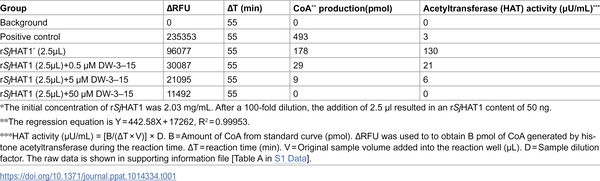
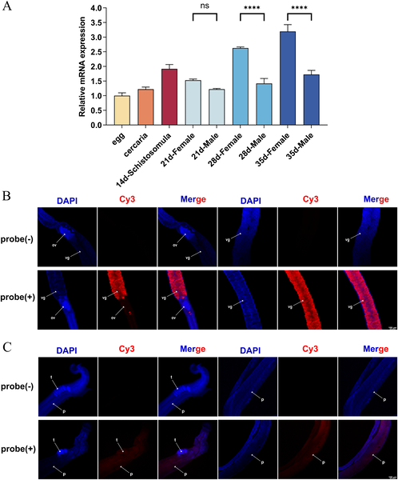
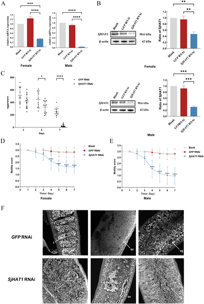

Schistosomiasis, a parasitic disease affecting hundreds of millions worldwide, relies heavily on a single drug, praziquantel, for treatment. However, growing drug resistance threatens control efforts, making the discovery of new therapeutic targets critical. Scientists have now uncovered a key enzyme in Schistosoma japonicum, the parasite responsible for one form of schistosomiasis, that plays a central role in its reproduction and survival. This discovery opens the door to novel drug strategies that could help curb this debilitating disease.

> **TL;DR**
> - The enzyme SjHAT1 in Schistosoma japonicum regulates parasite reproduction and survival by controlling gene expression through histone acetylation.
> - Inhibiting SjHAT1 disrupts chemical communication between male and female worms, drastically reducing egg production and parasite viability, making it a promising drug target.

Schistosomiasis is caused by parasitic flatworms of the genus Schistosoma, with Schistosoma japonicum being a major culprit in Asia. Despite affecting over 250 million people globally, treatment options remain limited. Praziquantel (PZQ) is the only widely used drug, but it does not kill immature parasites and repeated use risks resistance. Researchers have been developing derivatives of PZQ to overcome these limitations. One such compound, DW-3–15, showed strong activity against all parasite stages, especially juveniles, and was found to target a parasite enzyme called histone acetyltransferase 1 (SjHAT1), which had not been well studied before.

To understand SjHAT1’s role, researchers first cloned its full-length gene from S. japonicum and characterized its protein structure and enzymatic activity. They produced recombinant SjHAT1 protein in bacteria and confirmed it had histone acetyltransferase activity, which could be completely blocked by DW-3–15 at certain concentrations, while the human equivalent enzyme remained unaffected. Using fluorescence in situ hybridization, they localized SjHAT1 expression mainly to reproductive tissues in both male and female worms. They then used RNA interference to reduce SjHAT1 levels in worms both in the lab and in infected mice, monitoring effects on survival, egg production, and tissue structure. Finally, RNA sequencing was performed to analyze changes in gene expression pathways linked to reproduction and chemical signaling between sexes.

The study revealed that SjHAT1 is crucial for parasite survival and female egg production. Knocking down SjHAT1 reduced worm survival by over half and suppressed female egg laying by more than 79% in infected animals. The enzyme is predominantly expressed in female vitellaria — tissues responsible for egg formation — and in male tissues near the gynecophoral canal, where males hold females during mating. Transcriptomic analysis showed that reducing SjHAT1 disrupted the synthesis and reception of a key pheromone, β-alanyl-tryptamine (BATT), which males produce to stimulate female sexual development and egg laying. Specifically, genes involved in BATT production in males and signal reception in females were downregulated, revealing a dual-sex regulatory mechanism. These findings position SjHAT1 as a central regulator of schistosome reproductive biology.

This work identifies SjHAT1 as a promising new drug target for schistosomiasis, addressing the urgent need for alternatives to praziquantel. By targeting an epigenetic enzyme that controls parasite reproduction and survival, therapies could effectively reduce egg production — the main driver of disease pathology and transmission. Moreover, the specificity of the inhibitor DW-3–15 for the parasite enzyme over the human counterpart suggests potential for safe, selective drugs. Understanding the dual-sex regulatory mechanism also provides novel insight into schistosome biology, which could inspire innovative approaches to disrupt parasite reproduction and break the infection cycle.

While these findings are encouraging, further research is needed to fully understand SjHAT1’s functions and to develop clinically viable inhibitors. The current studies used RNA interference and a derivative compound in controlled settings; translating this into safe, effective human treatments requires extensive testing. Additionally, the complexity of parasite-host interactions and potential off-target effects must be carefully evaluated. Nonetheless, this study lays a strong foundation for future drug development efforts targeting epigenetic regulation in schistosomes.

## Figures

*Table showing how DW-3-15 affects the activity of the Sj HAT1 enzyme.*

*SjHAT1 gene activity varies by stage and sex in S. japonicum worms, and the protein is found in reproductive organs of both males and females.*

*Reducing SjHAT1 in adult worms lowers gene and protein levels, decreases egg laying and movement, and changes reproductive organ structure.*

## Sources

- [Schistosoma japonicum histone acetyltransferase 1 (SjHAT1): A novel anti-schistosomal drug target](https://journals.plos.org/plospathogens/article?id=10.1371/journal.ppat.1014334)
- DOI: [10.1371/journal.ppat.1014334](https://doi.org/10.1371/journal.ppat.1014334)
