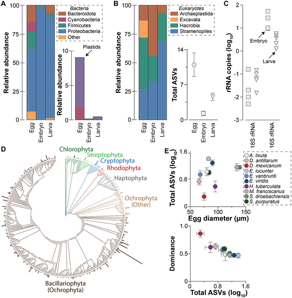
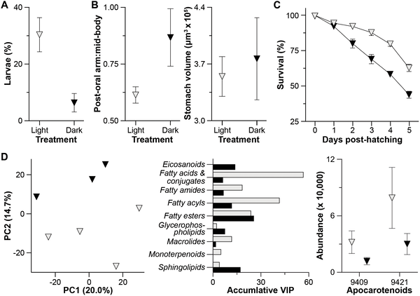
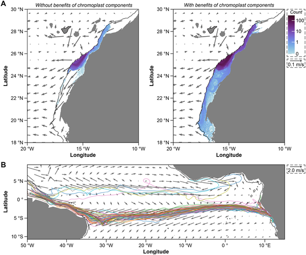

Imagine a sea urchin mother packing tiny, plant-like structures inside her eggs—structures borrowed from algae—that help her offspring grow stronger and survive longer in the vast ocean. This surprising marine strategy, uncovered by researchers studying the sea urchin Arbacia lixula, reveals that these animals incorporate plastids, the photosynthetic powerhouses usually found in plants and algae, into their eggs. These plastid-derived components influence how the larvae develop and even how far they can travel in ocean currents, opening new perspectives on reproduction and survival in marine life.

> **TL;DR**
> - Sea urchin eggs contain plastid-derived carotenoid crystals and DNA from photosynthetic eukaryotes, primarily diatoms, incorporated maternally.
> - These plastid components influence larval development, metabolism, survival, and dispersal, with light exposure enhancing offspring fitness and potential for long-distance travel.

Marine invertebrates like sea urchins typically produce many small, nutrient-poor eggs that develop into larvae relying on filtering food from the ocean. This planktotrophic development often faces high mortality due to limited food availability, especially offshore. Traditionally, it was thought that mothers provide only basic nutrients, leaving larvae to fend for themselves. However, animals often engage in symbiotic relationships with microbes, and some marine invertebrates transmit helpful microbes to their offspring. This study explores a novel twist: instead of just microbes, sea urchin eggs appear to incorporate plastids—specialized structures from photosynthetic organisms—into their eggs, potentially providing developmental advantages.

The research team analyzed the microbial communities associated with the eggs, embryos, and larvae of Arbacia lixula using DNA sequencing techniques targeting the 16S rRNA gene, which detects bacteria and plastids. They found sequences from plastids of photosynthetic eukaryotes, mainly diatoms, consistently present in the eggs but not in later stages. Using microscopy, they identified autofluorescent carotenoid crystals in the eggs, structures typical of chromoplasts, a type of plastid. Metabolomic analyses detected carotenoid-related compounds inside the eggs. To test the functional role of these plastid-derived structures, larvae were raised under light and dark conditions to observe developmental and metabolic differences.

The study found that sea urchin eggs contain plastid DNA and chromoplast-derived carotenoid crystals, indicating maternal provisioning of plastid components rather than whole algal cells. These plastid structures influence offspring development in a light-dependent manner. Larvae raised in light developed faster, showed healthier morphology, and had higher survival rates compared to those raised in darkness. Metabolic profiling revealed shifts in lipid metabolism and increased levels of apocarotenoids—plant hormone-like molecules known to regulate growth and stress responses—in light-exposed larvae. Furthermore, modeling suggested that larvae benefiting from these plastid components could disperse farther across ocean currents, potentially crossing ocean basins.

This discovery challenges the long-standing assumption that non-animal organelles like plastids cannot be passed through the animal germline. Instead, sea urchins appear to selectively incorporate plastid components into their eggs, providing a novel form of maternal provisioning that enhances offspring fitness. The findings have broad implications for understanding marine reproductive strategies, larval survival, and dispersal patterns. They also highlight a previously unrecognized biological partnership between animals and photosynthetic eukaryotes, expanding our knowledge of how life adapts to challenging ocean environments.

While the evidence for plastid-derived structures in sea urchin eggs and their developmental benefits is strong, the precise mechanisms by which these plastids influence metabolism and survival remain to be fully elucidated. The study focused mainly on one species, Arbacia lixula, though similar plastid DNA was found in other sea urchins. Further research is needed to determine how widespread this phenomenon is, how plastids are incorporated and maintained, and whether similar strategies exist in other marine invertebrates. Additionally, the ecological impact of enhanced dispersal mediated by plastid activity requires further investigation.

## Figures

*Sea urchin eggs carry DNA from photosynthetic microbes, suggesting mothers pass plastids, not full cells, to their offspring.*

*Sea urchin larvae raised in light grow better, survive more, and show different metabolism than those raised in dark conditions.*

*Particles released from Tenerife spread farther and cross the Atlantic to Brazil after 181 days, aided by light-driven activity, compared to 102 days without it.*

## Sources

- [Sea urchin eggs contain a plastid-derived structure that contributes to their development](https://journals.plos.org/plosbiology/article?id=10.1371/journal.pbio.3003705)
- DOI: [10.1371/journal.pbio.3003705](https://doi.org/10.1371/journal.pbio.3003705)
