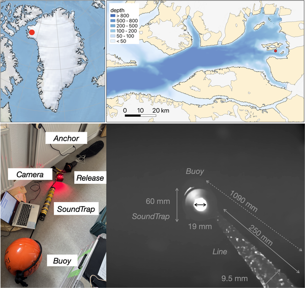
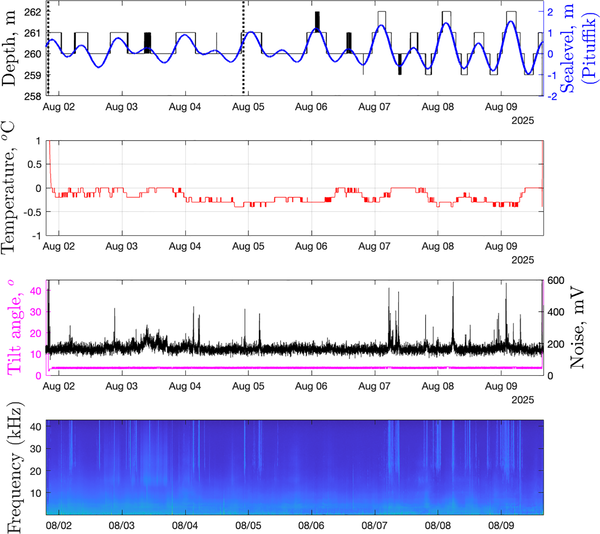
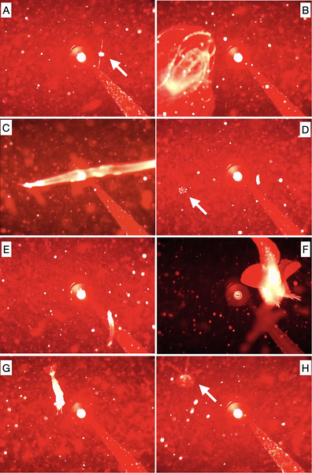
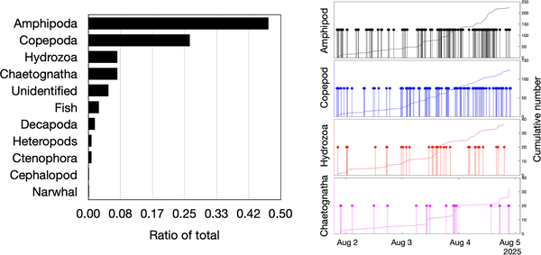

Imagine descending nearly 260 meters beneath the icy waters of a Greenlandic fjord, where sunlight barely penetrates and the seafloor is cloaked in swirling clouds of marine snow — tiny organic particles drifting in the current. In this remote, turbulent environment, a compact underwater setup quietly records life in motion: tiny crustaceans darting about, fish swimming backward, and even the elusive narwhal making a rare appearance. This glimpse into an Arctic seafloor ecosystem, captured through synchronized video and acoustic monitoring, reveals a hidden world teeming with activity and surprises.

> **TL;DR**
> - A novel underwater mooring combining video and hydrophone recordings was deployed on the seafloor of a Greenlandic glacial fjord, capturing high-frequency images and sounds over several days.
> - The data revealed a diverse community dominated by small crustaceans and planktonic animals, unusual fish swimming behaviors, and acoustic evidence of narwhals, demonstrating the power of this technology to explore Arctic seafloor ecosystems.

Arctic glacial fjords are known hotspots of marine biodiversity, yet their seafloor ecosystems remain poorly understood due to their remote, harsh conditions and difficulty of access. Traditional methods like acoustic profilers or bottom trawls either provide indirect data or disturb the environment. Direct visual and acoustic observations near the seafloor can offer richer insights into the biodiversity and behaviors of organisms living in this boundary layer between the ocean floor and overlying water. However, such synchronized video-acoustic monitoring has rarely been attempted in the Arctic, leaving a gap in our understanding of these fragile ecosystems.

To address this, researchers designed a compact mooring system comprising a video camera synchronized with a hydrophone, equipped with red LED lights to minimize disturbance to marine life. This setup was deployed at about 260 meters depth in Inglefield Bredning Fjord, northwest Greenland, for approximately one week. The camera recorded 10-minute video clips every 20 minutes, while the hydrophone continuously captured sound at high sampling rates. The red lighting, chosen to avoid attracting or deterring animals sensitive to other wavelengths, illuminated a limited range but allowed observation of organisms near the seafloor. The team manually reviewed videos to identify animals and used automated image processing to quantify particle abundance and movement. Acoustic data helped detect the presence of species like narwhals through their characteristic vocalizations.

The recordings revealed a highly dynamic and particle-rich environment, with abundant marine snow and fibers swirling in the currents. Among 478 detected organisms, small crustaceans such as amphipods and copepods dominated, alongside jellyfish, arrowworms, shrimp, and comb jellies. Notably, the researchers observed a snailfish exhibiting unusual backward swimming behavior, drifting passively with the current while curling its tail — a rare documented behavior. Acoustic data confirmed the presence of narwhals on most days, though these whales rarely appeared in the camera’s field of view, likely due to the passive nature of the setup. The study also documented how tidal cycles influenced particle flow direction and speed near the seafloor, highlighting the complex physical environment these organisms inhabit.

This study demonstrates the value of combining synchronized video and acoustic monitoring to explore understudied Arctic seafloor ecosystems noninvasively. The technology allowed researchers to document biodiversity and behaviors that are difficult to capture with other methods, offering new perspectives on the interactions between organisms and their environment beneath Greenland’s glaciers. Understanding these ecosystems is increasingly important as climate change alters Arctic habitats. Moreover, the approach provides a useful tool for interpreting acoustic data and monitoring marine life with minimal disturbance, which is crucial for conservation and management of sensitive Arctic species like narwhals.

While the study provides compelling insights, it is limited by the relatively short duration of deployment and the restricted field of view imposed by the red lighting and camera resolution. Taxonomic identification was often limited to broad groups due to image quality constraints. Additionally, the passive setup may not detect all species equally, especially those outside the camera’s range or less vocal. Further deployments with longer durations and complementary methods would help build a more comprehensive understanding of these complex seafloor communities.

## Figures

*Map and photo showing the study site and equipment setup in Inglefield Bredning Fjord, Greenland, with processed underwater camera views.*

*Internal sensors and SoundTrap recorder data compared with sea-level readings during camera operation, showing sound frequencies over time.*

*Photos show various sea creatures like copepods, jellyfish, shrimp, and fish near underwater equipment.*

*Number and timing of the most commonly spotted animals during observations.*

## Sources

- [Seafloor video-acoustic monitoring in a Greenlandic glacial fjord records hyperbenthos, backward-swimming fish, and narwhals](https://journals.plos.org/plosone/article?id=10.1371/journal.pone.0347193)
- DOI: [10.1371/journal.pone.0347193](https://doi.org/10.1371/journal.pone.0347193)
