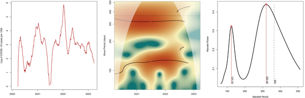
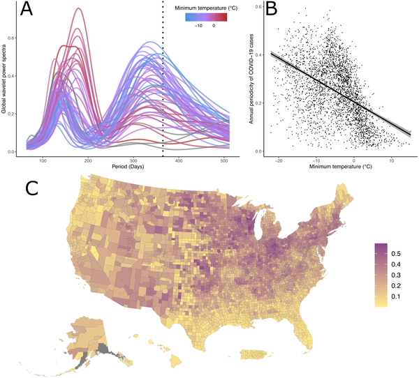
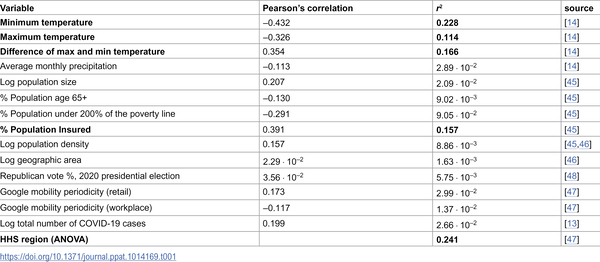
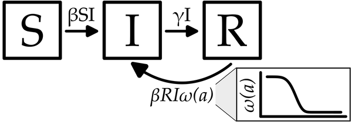

Since the start of the COVID-19 pandemic, many have wondered why the virus didn’t just surge once a year like the flu, but instead hit us with multiple waves—sometimes in winter, sometimes in summer. What drives this unpredictable rollercoaster of infections? New research reveals that it’s not just about the virus evolving or social behavior changes, but a complex dance between the seasons and how our immunity fades over time.

> **TL;DR**
> - COVID-19 waves show both annual and sub-annual (3–6 month) cycles that vary regionally across the U.S., linked closely to local winter temperatures.
> - A mathematical epidemic model incorporating seasonal effects and waning immunity explains how these multiple waves can arise and persist over time.

Many respiratory viruses, like influenza, have well-known seasonal patterns, typically peaking in winter when cold weather and indoor crowding help spread infections. But COVID-19 has defied this pattern, with significant waves occurring not only in winter but also in warmer months. This irregular timing puzzled scientists and public health experts, especially since new virus variants, while important, don’t emerge on a regular schedule that would explain these rhythms. Understanding the underlying causes of COVID-19’s wave patterns is crucial for forecasting future outbreaks and planning vaccination strategies.

Researchers analyzed COVID-19 case data across the United States from early 2020 through early 2023 using a technique called wavelet analysis. Unlike traditional methods, wavelet analysis can detect how the periodicity of infection waves changes over time and across regions. They correlated these patterns with local climate data, focusing on winter temperatures. To dig deeper, the team developed a modified epidemic model that extends the classic SIRS framework by including partial immunity that wanes gradually rather than disappearing abruptly. This model also incorporates seasonal forcing—changes in transmission rates driven by climate and social factors—to simulate how waves might arise and repeat.

The analysis revealed two dominant cycles in COVID-19 cases: an annual cycle roughly every 12 months, and a sub-annual cycle occurring every 3 to 6 months. States with colder winters showed stronger annual cycles, with large winter waves followed by smaller off-season waves. In contrast, warmer states experienced multiple waves each year with less pronounced winter peaks. The model showed that seasonal forcing alone could not fully explain these sub-annual waves. However, when combined with waning immunity—where people gradually lose protection after infection—the model could reproduce the observed multiple waves per year. This suggests that fading immunity plays a key role in sustaining repeated outbreaks beyond what seasonal climate alone would cause.

This work provides a mechanistic explanation for the puzzling pattern of COVID-19 waves seen across different U.S. regions. By showing how the interplay of climate-driven seasonal changes and waning immunity shapes epidemic timing, it offers valuable insights for public health planning. For example, understanding when immunity in the population is likely to decline could help optimize the timing of booster vaccination campaigns. Moreover, recognizing that warmer regions may experience multiple waves annually highlights the need for tailored strategies rather than a one-size-fits-all approach based on traditional winter seasonality.

While the model captures key features of COVID-19’s wave patterns, it simplifies many real-world complexities. Factors such as viral evolution, changes in human behavior, vaccination coverage, and public health interventions also influence epidemic dynamics but were not explicitly modeled here. Additionally, case reporting and testing rates vary over time and geography, which can affect data quality. The study’s climate correlations focus mainly on temperature, but other environmental and social factors may also contribute. Future work integrating these elements will further refine our understanding of COVID-19 seasonality.

## Figures

*Massachusetts COVID-19 cases show yearly and four-month cycles in infection rates, revealed by wavelet analysis of case data.*

*COVID-19 cases show yearly patterns across U.S. regions, linked to local winter temperatures and seasonal changes in each county.*

*This table shows how climate and social factors relate to yearly COVID-19 trends across U.S. counties through 2023.*

*Diagram of a model showing how people move between being susceptible, infected, and recovered, with immunity fading over time.*

## Sources

- [Seasonal forcing and waning immunity drive the sub-annual periodicity of the COVID-19 epidemic](https://journals.plos.org/plospathogens/article?id=10.1371/journal.ppat.1014169)
- DOI: [10.1371/journal.ppat.1014169](https://doi.org/10.1371/journal.ppat.1014169)
