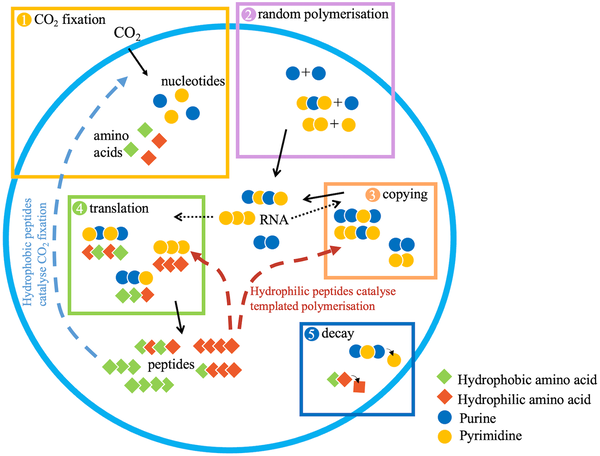

How did life’s first genetic code arise from the chaotic chemistry of early Earth? Scientists have long debated whether metabolism or genetic information came first in the origin of life. A recent study offers a fresh perspective by showing that simple protocells—primitive cell-like structures—had to first evolve the ability to grow before they could develop genetic heredity. This insight helps bridge a critical gap in understanding how life transitioned from random molecules to the complex, information-rich systems we see today.

> **TL;DR**
> - The study uses a mathematical model to show that protocells with random RNA sequences can evolve distinct coding sequences that enhance growth and heredity functions.
> - A key finding is that metabolic growth functions, like CO₂ fixation, must evolve before information-related functions such as RNA copying, meaning growth preceded genetic heredity.

Life as we know it depends on genetic heredity—the ability to pass on information through DNA or RNA sequences. But before genes existed, early protocells were just collections of molecules without reliable information storage or copying mechanisms. Maintaining genetic information is challenging because copying errors were likely frequent, and error-correcting enzymes themselves require long genetic sequences, creating a chicken-and-egg problem known as Eigen’s paradox. Previous models explained how genetic information could be maintained once established inside dividing protocells, but they did not address how these functional genetic sequences first emerged. This study tackles that question by exploring how random RNA polymers inside protocells could evolve sequences that improve two essential functions: metabolism (growth) and heredity (information copying and translation).

The researchers developed an individual-based mathematical model simulating a population of protocells containing random RNA and peptide polymers. These protocells could grow by fixing CO₂ to produce monomers—building blocks for RNA, peptides, and membrane components—and divide once reaching a size threshold. The model tracked five key processes each time step: monomer addition via CO₂ fixation, random polymerization of nucleotides into RNA, copying of RNA sequences, translation of RNA into peptides, and polymer decay. Peptides catalyzed two functions: CO₂ fixation (promoting growth) and templated polymerization (supporting RNA copying and translation). The model assumed that hydrophobic peptides tend to associate with membranes to catalyze CO₂ fixation, while hydrophilic peptides remain in the cytosol to assist copying. By simulating evolution from random sequences, the model tested whether protocells could acquire functional coding sequences that improve growth and heredity.

The simulations revealed that protocells could indeed evolve distinct RNA sequences encoding peptides that enhance either CO₂ fixation or RNA copying. Crucially, the model showed that sequences promoting growth functions like CO₂ fixation must evolve first, as they increase monomer supply and protocell division rates. This metabolic boost allows protocells to explore more sequence space, enabling the later evolution of sequences supporting heredity functions such as RNA copying and translation. The study highlights a fundamental constraint: growth-supporting functions are more readily attained than information-related functions in early protocells, implying that metabolic growth preceded the emergence of genetic heredity.

This work provides a compelling theoretical framework for understanding a pivotal step in the origin of life—the emergence of genetic heredity. By linking protocell growth to the evolution of functional genetic sequences, it offers a parsimonious explanation for how early life could have transitioned from random chemistry to information-based biology. The finding that growth must come before information challenges some traditional views and helps resolve longstanding paradoxes about the origin of genetic systems. Although the model is abstract and theoretical, it lays foundational groundwork for future experimental and computational studies exploring life’s earliest evolutionary steps.

While the model captures essential features of protocell evolution, it relies on simplifying assumptions such as classifying monomers and peptides by hydrophobicity and abstracting polymer sequences without explicit order. The processes of polymer decay and catalysis are idealized, and the model does not simulate detailed molecular interactions or environmental complexities. Additionally, the emergence of translation and copying mechanisms is modeled in a rudimentary form based on hydrophobicity patterns, which may not capture the full biochemical intricacies. Thus, while the findings are insightful, they represent a conceptual framework rather than direct experimental evidence, and further empirical work is needed to validate these hypotheses.

## Figures

*Protocells grow and divide by producing molecules and copying RNA, with processes tracked in a population evolving over time.*

## Sources

- [Selection for growth drives the emergence of genetic heredity in protocells](https://journals.plos.org/plosbiology/article?id=10.1371/journal.pbio.3003544)
- DOI: [10.1371/journal.pbio.3003544](https://doi.org/10.1371/journal.pbio.3003544)
