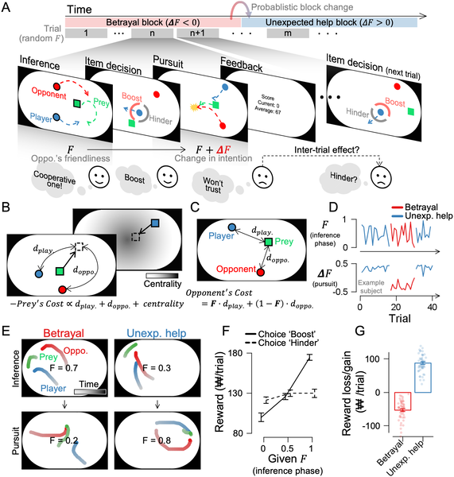
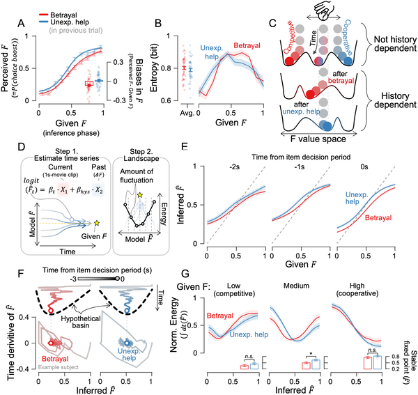
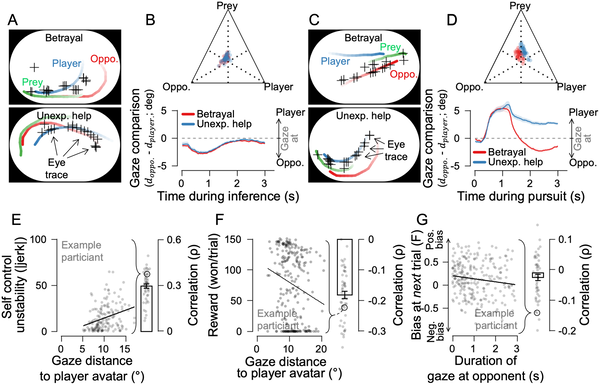

Why do we sometimes misjudge others’ intentions based on what we choose to notice? Imagine watching someone’s gestures but missing their facial expressions, or focusing on a single moment of conflict and ignoring the bigger picture. Our brains don’t have unlimited resources to observe everything, so we selectively attend to certain social cues. But this choice isn’t neutral—it can shape how we interpret others in lasting ways. A recent study dives into this selective observation process, uncovering how past betrayals can skew our social judgments through subtle but persistent biases.

> **TL;DR**
> - People tend to overestimate others’ competitiveness after experiencing betrayal, but don’t show a similar bias after unexpected cooperation.
> - Choosing to focus attention on others rather than oneself intensifies these biases, revealing a trade-off between gathering information and maintaining control.

Social inference—the ability to deduce others’ hidden intentions from their actions—is a fundamental part of human interaction. Traditionally, models of social inference assumed we have full access to all relevant social cues. However, in real life, we only see fragments of others’ behavior and must decide what to observe. This selective observation is constrained by limited attention and cognitive resources. Understanding how these choices influence our judgments is crucial for explaining common social misunderstandings and the persistence of biases, especially after negative experiences like betrayal.

To explore this, researchers designed an interactive game where participants controlled an avatar chasing prey alongside a computerized opponent. The opponent’s hidden intention varied between cooperation—helping the player catch the prey—and competition—intercepting the prey first. Participants watched brief videos of these interactions and then decided whether to boost or hinder the opponent’s speed in the next phase. Unbeknownst to them, the opponent’s behavior shifted unexpectedly, creating scenarios of betrayal (opponent acting more competitively than expected) or unexpected help (more cooperative than expected). Eye-tracking recorded where participants focused their gaze, allowing the team to analyze how selective observation influenced their inferences about the opponent’s intentions.

The study found a striking asymmetry: after betrayal, participants were more likely to infer that the opponent was competitive—overestimating hostility—while unexpected help did not produce a comparable bias toward cooperation. This bias grew stronger the more betrayals participants experienced, showing a path-dependent effect similar to hysteresis in physical systems. Eye-tracking data revealed that participants who focused their attention more on the opponent (rather than their own avatar) exhibited stronger biases, suggesting a trade-off between observing others and controlling one’s own actions. Computational modeling with neural networks supported these findings, showing that shifting observational focus could reverse sensitivity to betrayal.

These results provide a new perspective on social cognition by highlighting how selective observation—not just the observed behavior itself—shapes our understanding of others. The findings explain why negative experiences like betrayal can create lasting biases in social inference, influencing how we interpret future interactions. This work bridges cognitive psychology, neuroscience, and computational modeling, offering a framework that connects attention, decision-making, and internal social models. Beyond advancing theory, these insights could inform approaches in psychology and artificial intelligence aimed at improving social understanding and reducing misunderstandings.

While the study offers compelling evidence of selective observation shaping social inference, it was conducted in a controlled experimental setting with a simplified game and computerized opponents. Real-world social interactions are more complex and involve richer cues. Additionally, the observed asymmetry in bias may vary across individuals and contexts. Future research is needed to explore how these mechanisms operate in naturalistic environments and whether interventions can mitigate the negative effects of selective observation biases.

## Figures

*Participants controlled avatars chasing prey with opponents whose help or betrayal changed unexpectedly during the game.*

*This figure shows how past experiences shape decision-making, with models tracking changing choices and uncertainty over time.*

*Eye-tracking shows people focus more on opponents during key moments, affecting their movement and rewards in the game.*

## Sources

- [Selective observation following betrayal shapes the social inference landscape](https://journals.plos.org/ploscompbiol/article?id=10.1371/journal.pcbi.1014200)
- DOI: [10.1371/journal.pcbi.1014200](https://doi.org/10.1371/journal.pcbi.1014200)
