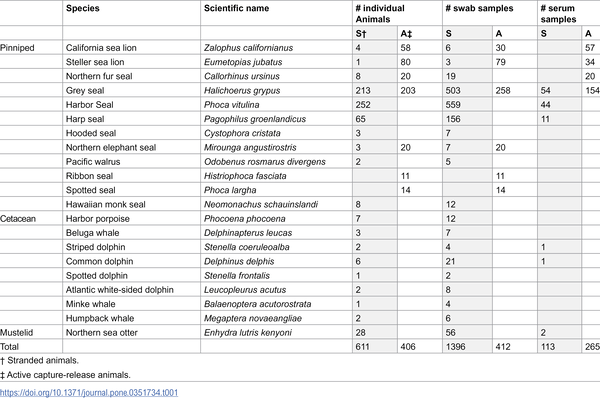
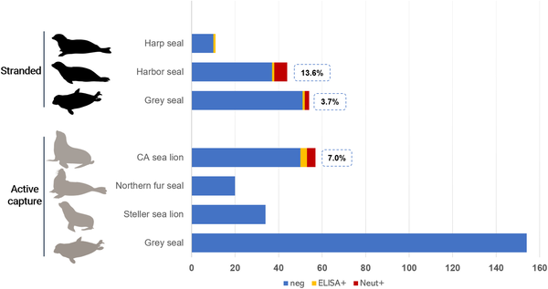
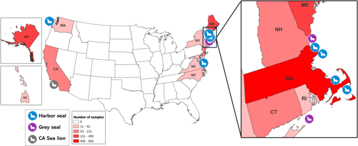

Did you know that some seals and sea lions along the U.S. coasts have been exposed to the virus that causes COVID-19? While much of the pandemic’s focus has been on human health, a recent study has uncovered evidence that marine mammals have encountered SARS-CoV-2, the virus behind COVID-19. This discovery opens new questions about how viruses move between humans and wildlife, especially in ocean environments.

> **TL;DR**
> - Researchers found antibodies to SARS-CoV-2 in three species of marine mammals in the United States, indicating past exposure to the virus.
> - No active infections were detected, but the presence of antibodies highlights the need for ongoing surveillance of wildlife to understand virus transmission risks across species.

SARS-CoV-2, the virus responsible for the COVID-19 pandemic, is known to infect a wide range of animals beyond humans, including pets, farm animals, and wildlife. Scientists have predicted that certain marine mammals, like seals and sea lions, could be susceptible to this virus because their ACE2 receptors—the part of cells the virus uses to enter—are similar to those in humans. Yet, until now, there was no direct evidence that these ocean animals had actually encountered the virus. Understanding if and how SARS-CoV-2 spreads to marine mammals is important because it could affect animal health and create new reservoirs for the virus, potentially influencing future outbreaks.

Between 2020 and 2025, scientists collected over 1,800 swab samples and nearly 380 blood serum samples from 21 species of marine mammals along the U.S. coasts and Alaska. These samples came from animals in rehabilitation centers, stranded individuals, and those captured and released during routine health assessments. The team tested swabs for active SARS-CoV-2 infection using RT-qPCR, a sensitive method that detects viral genetic material. To check for past exposure, they tested serum samples for antibodies against the virus’s spike protein using ELISA and confirmed positive results with virus neutralization assays. This combined approach ensured that only animals with clear evidence of previous infection were counted as exposed.

The study found no evidence of active SARS-CoV-2 infection in any of the marine mammals tested. However, antibodies indicating past exposure were detected in three pinniped species: harbor seals (Phoca vitulina), California sea lions (Zalophus californianus), and grey seals (Halichoerus grypus). Specifically, about 13.6% of harbor seals, 7% of California sea lions, and 3.7% of grey seals tested positive for neutralizing antibodies. These results represent the first serological proof that marine mammals in the United States have been exposed to SARS-CoV-2, suggesting that the virus has crossed into ocean wildlife populations at some level.

This discovery is significant because it expands our understanding of the host range of SARS-CoV-2 to include marine mammals, which had been predicted but not previously confirmed. It raises important ecological and epidemiological questions about how the virus might be transmitted between humans and wildlife in coastal environments. Since marine mammals often live in social groups, exposure could facilitate virus spread within populations. Monitoring these animals can help detect potential reservoirs that might influence future virus dynamics. Moreover, this research underscores the importance of managing human impacts on marine ecosystems, such as wastewater discharge and rehabilitation practices, to reduce the risk of zoonotic spillover.

It is important to note that the study did not find any active infections, only antibodies indicating past exposure. This means the animals were not currently carrying or shedding the virus at the time of sampling. The exact routes of exposure remain unclear, and the implications for marine mammal health are still unknown. Additionally, while the sample size was large and geographically broad, it represents opportunistic sampling rather than systematic surveillance. Continued research is needed to better understand how SARS-CoV-2 moves between humans and marine wildlife, the potential for sustained transmission in these populations, and any health consequences for the animals involved.

## Figures

*Samples from US marine mammals tested for COVID-19 virus and antibodies between 2020 and 2025.*

*Fig 1 shows how scientists detected COVID-19 antibodies in seals and sea lions.*

*Map shows where marine mammals with COVID-19 antibodies were found in the U.S., highlighting three species and sample numbers by state.*

## Sources

- [Serological evidence of SARS-CoV-2 exposure in marine mammals in the United States between 2020 and 2025](https://journals.plos.org/plosone/article?id=10.1371/journal.pone.0351734)
- DOI: [10.1371/journal.pone.0351734](https://doi.org/10.1371/journal.pone.0351734)
