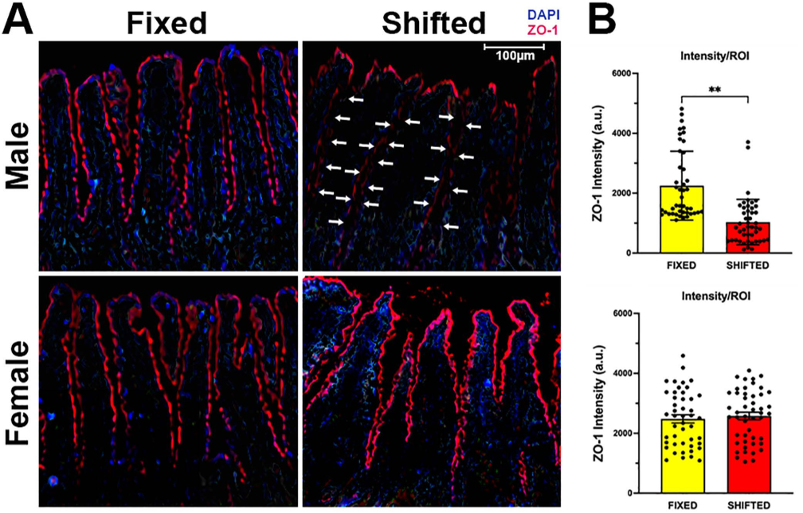
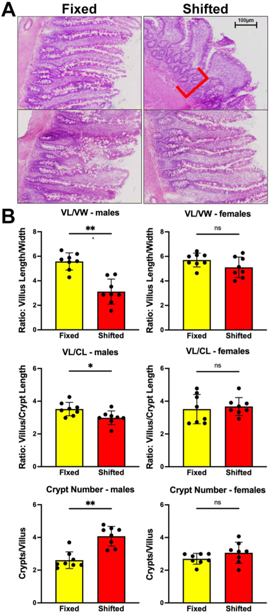
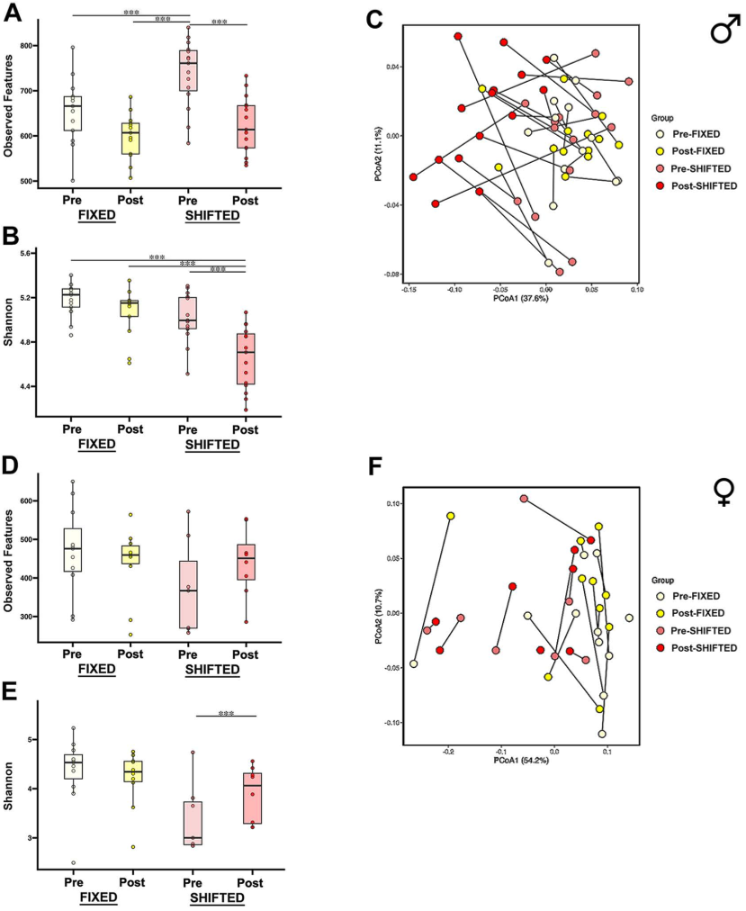

How does working night shifts mess with your gut and brain health? Many people juggle irregular schedules that disrupt their natural sleep-wake cycles, but the consequences go beyond feeling tired. Recent research shows that these disruptions can alter gut bacteria and intestinal barrier function, which may influence the severity of strokes. Intriguingly, men and women appear to respond differently to such circadian rhythm disturbances, highlighting the complex interplay between our internal clocks, gut health, and brain injury.

> **TL;DR**
> - Chronic shifts in light-dark cycles disrupt gut microbiome diversity and intestinal barrier integrity more severely in male rats than females.
> - These gut changes in males are linked to increased inflammation and worse stroke survival, suggesting sex-specific biological responses to circadian disruption.

Our bodies operate on a roughly 24-hour cycle known as the circadian rhythm, which regulates sleep, hormone release, metabolism, and many other physiological processes. When this rhythm is disturbed—such as by shift work, jet lag, or irregular social schedules—it can lead to health problems including vascular diseases like ischemic stroke. Epidemiological studies have connected shift work with higher stroke risk, but it’s challenging to separate the effects of circadian disruption from lifestyle factors like diet or smoking. Animal models allow researchers to isolate the impact of circadian misalignment alone. Previous work showed that male rats exposed to repeated 12-hour advances in their light-dark cycle experienced worse stroke outcomes than females. Since the gut plays a crucial role in immune regulation and inflammation, and both stroke and circadian disruption affect gut health, this study investigated how these factors interact in a sex-specific manner.

Researchers used adult male and female rats exposed for 50 days to either a stable 12-hour light/12-hour dark cycle or a shifted cycle where the lights-on time advanced by 12 hours every five days, mimicking shift work. Two groups of rats were studied: one to analyze gut microbiome composition and stroke survival, and another to examine gut tissue structure, metabolites, and inflammatory markers. Rats’ activity rhythms were monitored with running wheels to confirm circadian disruption. After the exposure period, fecal and blood samples were collected to assess gut bacteria diversity, levels of beneficial metabolites like butyrate, and inflammatory substances such as endotoxin and the cytokine IL-17A. Finally, rats underwent a controlled ischemic stroke procedure, and their survival and gut health were evaluated.

The shifted light-dark cycle caused severe disruption of circadian activity rhythms in both sexes, but only male rats showed significant changes in their gut microbiome. Males had reduced diversity and altered community composition of gut bacteria, including fewer beneficial species linked to stroke survival. These microbial shifts coincided with pathological changes in gut tissue: shorter, blunted villi, longer crypts, and compromised tight junction proteins that maintain the intestinal barrier. Male rats also exhibited lower circulating levels of butyrate, a neuroprotective short-chain fatty acid produced by gut bacteria, alongside elevated endotoxin and proinflammatory IL-17A in their blood. Females showed minimal changes in these gut and inflammatory markers. Importantly, the male-specific gut alterations correlated with higher stroke mortality, suggesting that circadian disruption worsens stroke outcomes through gut-mediated inflammation and barrier dysfunction in a sex-dependent way.

This study highlights how chronic circadian rhythm disruption, similar to what shift workers experience, can differentially affect gut health and stroke risk in males and females. The findings suggest that the gut microbiome and intestinal barrier play a critical role in mediating the harmful effects of circadian misalignment on stroke severity, particularly in males. Understanding these sex-specific mechanisms opens new avenues for targeted therapies or lifestyle interventions to reduce stroke risk among shift workers. For example, strategies that support gut barrier integrity or modulate the microbiome might improve outcomes in vulnerable populations. Moreover, this research underscores the importance of considering biological sex in studies of circadian biology and vascular disease.

While the rat model provides valuable insights into the biological effects of circadian disruption, translating these findings to humans requires caution. Human shift work involves complex lifestyle factors not fully replicated in animal studies. Additionally, the study focused on a specific type of circadian shift and a limited age range of rats, so results may vary with different patterns or in older individuals. The mechanisms linking gut changes to stroke outcomes are complex and not fully elucidated here. Further research is needed to explore how these findings apply to diverse human populations and to develop effective interventions.

## Figures

*Images show less ZO-1 protein in the gut lining of male rats with shifted light cycles, indicating weaker gut barriers compared to females and fixed cycles.*

*Shifted light cycles altered gut structure in rats, causing longer crypts in males and changes in villus and crypt measurements in both sexes.*

*Shifting light-dark cycles changes gut microbes differently in males and females, affecting diversity and community structure over time.*

## Sources

- [Sex differences in the effects of shift work-like schedules on gut microbiome and intestinal barrier in relation to stroke survival](https://journals.plos.org/plosone/article?id=10.1371/journal.pone.0355842)
- DOI: [10.1371/journal.pone.0355842](https://doi.org/10.1371/journal.pone.0355842)
