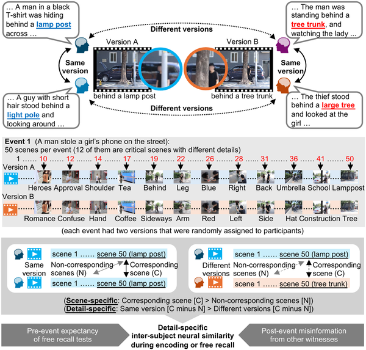
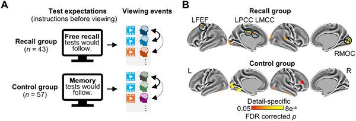
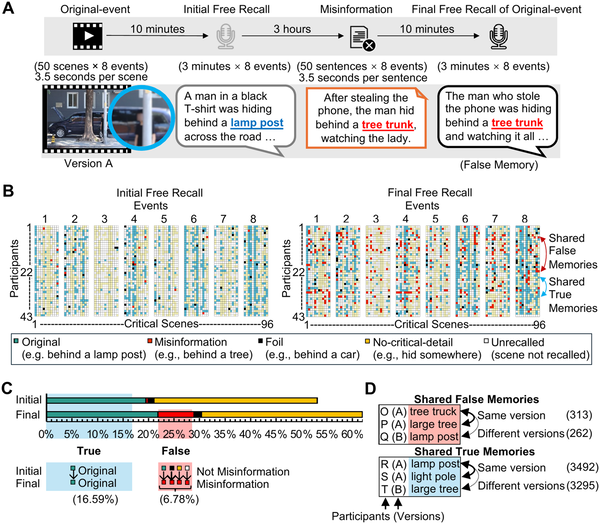
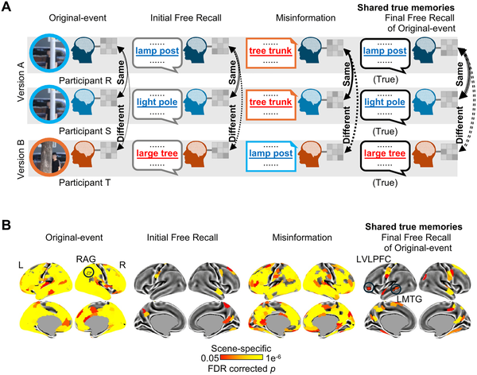

Have you ever wondered how multiple people can remember the same event in similar ways — yet sometimes recall details that turn out to be false? Our memories are not just private snapshots but often shared narratives shaped by what we expect and what we hear afterward. Recent research reveals how specific brain regions respond when people encode and recall event details together, and how misinformation and the anticipation of a memory test can change these shared memories.

> **TL;DR**
> - Expecting a free recall memory test before experiencing an event makes people’s brains encode shared details more similarly, especially in regions related to visual attention.
> - Exposure to misinformation increases the chance of forming shared false memories, which engage different brain areas than those involved in recalling true shared memories.

Eyewitness testimony often relies on multiple people recalling the same event, but even when people witness identical scenarios, their memories can differ in important details. Neuroscience has shown that when people encode or recall the same scenes, their brains exhibit similar activity patterns. However, it was unclear if these shared patterns reflected specific event details and how factors like expecting a memory test or being exposed to misleading information afterward might influence them. Understanding these processes is vital, especially given the impact of misinformation in legal settings and social media.

In this study, 100 participants were divided into two groups and watched one of two versions of several events — both versions had the same plot but differed in key details (for example, a man hiding behind a lamp post versus a tree trunk). Half the participants were told in advance they would take a free recall test, while the others were only told to expect a general memory test. Using functional magnetic resonance imaging (fMRI), researchers recorded brain activity during four stages: watching the events, initial free recall, reading misinformation narratives, and a final free recall. By comparing neural activity patterns across individuals, the team identified which brain regions carried detail-specific shared memories and how these were influenced by test expectations and misinformation.

The study found that participants expecting a free recall test showed greater similarity in brain activity patterns related to specific event details, particularly in regions linked to visual attention such as the left frontal eye fields and medial occipital cortex. When participants were exposed to misinformation after the initial recall, they were more likely to form shared false memories. These false memories were associated with similar activity in the dorsomedial prefrontal cortex during misinformation reading. In contrast, shared true memories corresponded to activity in the inferior parietal lobe during event viewing and in the ventrolateral prefrontal cortex and middle temporal gyrus during final recall. These results highlight that different parts of the brain’s default mode network play distinct roles in encoding and recalling true versus false shared memories.

This research sheds light on the neural mechanisms behind how people collectively remember event details and how these memories can be altered by expectations and misinformation. The findings have important implications for understanding the reliability of eyewitness testimony and the spread of misinformation in society. By identifying specific brain regions involved in true and false shared memories, the study opens avenues for developing strategies to improve memory accuracy and reduce the impact of misleading information.

While the study used a large sample and advanced brain imaging techniques, the events viewed were controlled and simplified compared to real-life experiences. The influence of misinformation and test expectations in more complex, emotionally charged, or longer-term memories remains to be explored. Additionally, the neural patterns identified reflect correlations and do not establish causation. Future research could investigate how these findings translate to practical settings such as legal proceedings or social media contexts.

## Figures

*People tend to remember key scenes and some unique details similarly when watching and recalling the same event, shown by shared brain activity patterns.*

*Expecting a memory test boosts brain activity similarity across people when encoding shared event details.*

*Participants recalled false event details after reading misleading stories, showing how misinformation can create shared false memories.*

*Brain regions show shared patterns when people recall the same true memories, highlighting how details are processed differently across memory stages.*

## Sources

- [Shared memories of event details in the human brain are altered by misinformation and test expectations](https://journals.plos.org/plosbiology/article?id=10.1371/journal.pbio.3003886)
- DOI: [10.1371/journal.pbio.3003886](https://doi.org/10.1371/journal.pbio.3003886)
