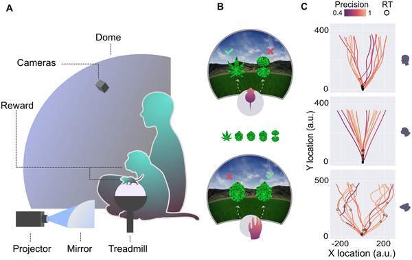
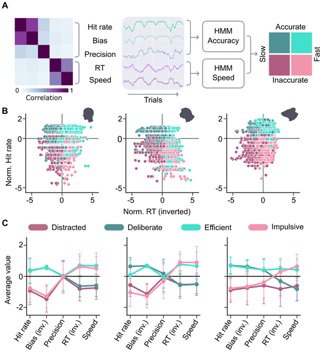
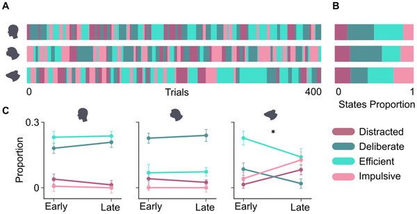
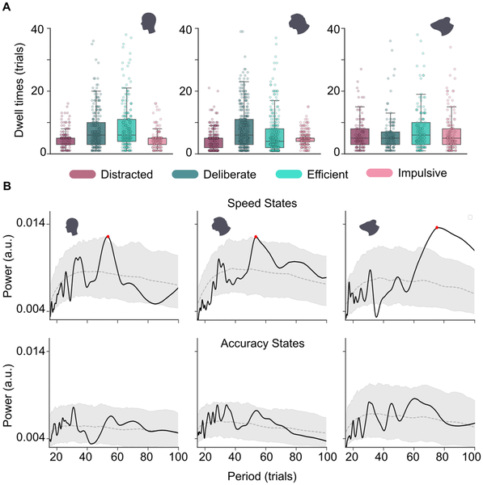

What if the way your attention drifts or sharpens during a task is not uniquely human, but shared with other animals like mice and monkeys? Attention, the mental spotlight that helps us focus on what matters, naturally fluctuates over time. Understanding these fluctuations across species could unlock clues about brain function and disorders such as ADHD. A recent study took a novel approach by placing mice, monkeys, and humans in the same immersive virtual reality environment to explore how their attention waxes and wanes during a naturalistic task.

> **TL;DR**
> - Mice, monkeys, and humans engaged in the same virtual reality perceptual decision-making task showed remarkably similar patterns of attentional fluctuations.
> - Using behavioral data and Hidden Markov Models, researchers identified four distinct attentional states whose dynamics were conserved across species and internally generated rather than driven by task features.

Sustained attention—the ability to maintain focus over time—is crucial for many natural behaviors such as foraging, avoiding predators, or reading a book. Traditionally, attention has been studied using simplified, repetitive tasks that differ widely across species, making direct comparisons difficult. For example, humans often perform continuous performance tasks involving button presses to detect target letters, while rodents might nose-poke in response to lights. These differences in task design and motor demands limit our understanding of whether attentional processes are truly shared across species. To bridge this gap, the researchers designed a naturalistic, intuitive task set in a photo-realistic virtual reality (VR) environment where all three species navigated toward moving targets resembling leaves. This approach allowed for richer behavioral measurements and better cross-species comparisons of attention.

In the study, three mice, two monkeys, and eleven humans participated in a two-alternative perceptual decision task within a VR dome. Mice ran on a spherical treadmill, while monkeys and humans used a hand-operated trackball to move toward one of two leaf-shaped objects—one rewarded target and one distractor. The environment featured naturalistic visuals like grassy fields and mountains, and subjects could freely move their eyes. Researchers recorded detailed behavioral parameters reflecting both accuracy (hit rate, precision, bias) and speed (reaction time, movement speed). To capture attentional states, they applied Hidden Markov Models (HMMs) separately to accuracy and speed data, identifying two states in each dimension. Combining these yielded four distinct attentional states: distracted (low accuracy, low speed), deliberate (high accuracy, low speed), impulsive (low accuracy, high speed), and efficient (high accuracy, high speed).

The analysis revealed that all three species exhibited similar patterns in the dynamics of these four attentional states. The durations spent in each state and the probabilities of transitioning between states were more alike than expected, despite species differences in absolute performance. Notably, attentional fluctuations appeared to be internally generated rather than triggered by task difficulty or stimulus features, suggesting a conserved cognitive mechanism. For example, mice spent more time in the efficient state compared to humans and monkeys, but the overall structure of attentional dynamics was preserved. These results indicate that fundamental attentional processes operate similarly across mammals when engaged in naturalistic tasks.

This study offers a fresh perspective on sustained attention by moving beyond artificial lab tasks to a naturalistic VR setting that is comparable across species. By demonstrating conserved attentional dynamics in mice, monkeys, and humans, it supports the idea that attention is a fundamental, evolutionarily shared cognitive process. This cross-species approach opens new avenues for studying attention-related brain functions and disorders like ADHD, potentially improving translational research from animal models to humans. Moreover, the use of advanced computational modeling to infer attentional states from rich behavioral data provides a powerful tool for future investigations.

While the findings are compelling, the study involved a relatively small number of animals and humans, which may limit generalizability. The VR task, although more naturalistic than traditional tests, still represents a controlled laboratory environment that may not capture all aspects of attention in the wild. Additionally, the behavioral metrics used to infer attentional states, while sophisticated, remain indirect measures. Future research with larger samples and complementary neural recordings will be important to confirm and extend these insights.

## Figures

*Mice, monkeys, and humans used a trackball to navigate a VR task, choosing between two shapes to test decision-making paths and precision.*

*We analyzed attention using five measures of accuracy and speed, grouping data into four states that showed similar patterns in humans, monkeys, and mice.*

*Humans, monkeys, and mice show similar attention patterns, but mice spend less time deliberate and more time efficient during tasks.*

*Humans, monkeys, and mice show similar patterns in how long they stay in certain states and how often these states repeat over trials.*

## Sources

- [Sharing the spotlight: Uncovering common attentional dynamics across species](https://journals.plos.org/ploscompbiol/article?id=10.1371/journal.pcbi.1014191)
- DOI: [10.1371/journal.pcbi.1014191](https://doi.org/10.1371/journal.pcbi.1014191)
