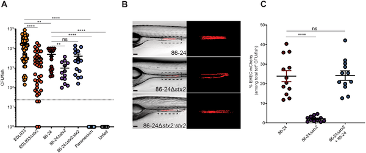
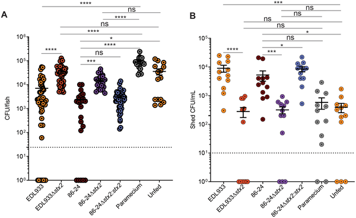
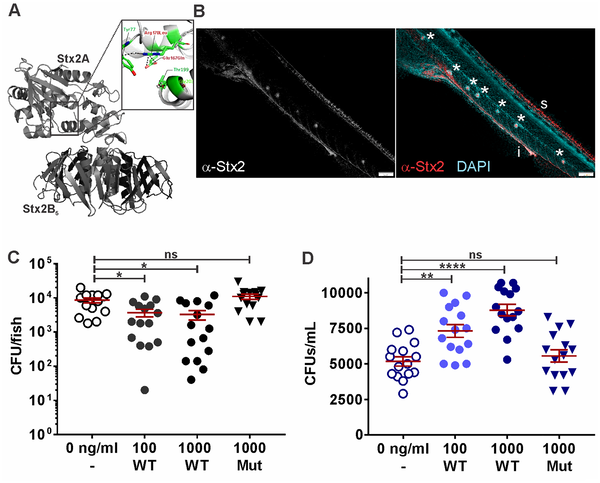

Imagine a microscopic battle raging inside your gut, where harmful bacteria and friendly microbes compete for space and resources. Now, picture a bacterial toxin that doesn’t just harm your cells but also speeds up your gut’s movement to push out the friendly microbes, clearing the way for the invader. This surprising strategy has been uncovered in a recent study using zebrafish, shedding light on how Shiga toxin 2 helps E. coli take over the gut.

> **TL;DR**
> - Shiga toxin 2 (Stx2) helps harmful E. coli colonize the gut by speeding up intestinal transit, which displaces resident beneficial microbes.
> - This toxin-driven acceleration of gut movement leads to increased shedding of certain gut bacteria, altering the microbiome and enhancing pathogen fitness.

Shiga toxin-producing Escherichia coli (STEC) are notorious food-borne pathogens that can cause severe gastrointestinal illness in humans. While the toxin’s role in damaging host cells and causing symptoms like bloody diarrhea is well known, its impact on the bacteria’s ability to colonize the gut has been less clear. Previous studies hinted that Shiga toxin might help E. coli compete with the gut’s resident microbes, but the mechanisms remained a mystery. To explore this, researchers turned to the zebrafish, a small vertebrate whose transparent larvae offer a window into gut dynamics and microbial interactions.

Using a zebrafish larval model, the researchers infected fish with E. coli strains that produce Shiga toxin 2 (Stx2) and compared them to strains lacking the toxin. They also exposed fish directly to purified Stx2 toxin. By analyzing bacterial counts, imaging fluorescently labeled bacteria, and sequencing the gut microbiome, they tracked how Stx2 influenced both the pathogen’s colonization and the resident microbial community. Additionally, they measured intestinal transit rates and tested the effects of a prokinetic drug to mimic accelerated gut movement.

The study found that Stx2 significantly boosts E. coli colonization in the zebrafish gut. Fish infected with toxin-producing strains had lower levels of beneficial resident bacteria, especially Pseudomonas species, compared to those infected with toxin-deficient strains. Direct exposure to purified Stx2 alone was sufficient to reduce resident microbes by speeding up intestinal transit, causing increased shedding of these bacteria into the environment. Importantly, the toxin did not kill the resident bacteria directly but altered host gut movement to displace them. Similar effects were observed when fish were treated with a drug that accelerates gut transit, confirming that faster intestinal movement drives microbial displacement.

This research uncovers a novel role for Shiga toxin beyond its known toxic effects on host cells: it manipulates host physiology to favor pathogen colonization by physically pushing out competing microbes. Understanding this mechanism enriches our knowledge of how bacterial toxins contribute to infection and bacterial fitness within the gut. It also highlights the complex interplay between pathogens, the host, and the microbiome, which could inform future strategies to prevent or treat infections by targeting gut motility or microbial balance.

While the zebrafish model offers valuable insights, differences between fish and human gut physiology mean that further studies are needed to confirm whether similar mechanisms operate in humans. Additionally, the study focused on one toxin variant and specific bacterial species; the broader applicability to other pathogens or microbiome contexts remains to be explored. Finally, although accelerating gut transit helps E. coli colonize in this model, the long-term impacts on host health and microbiome resilience require further investigation.

## Figures

*Shiga toxin 2 helps harmful E. coli bacteria colonize the gut of zebrafish larvae, shown by bacterial counts and glowing images.*

*Shiga toxin 2 helps reduce certain gut bacteria in infected fish larvae compared to controls after 24 hours of infection.*

*Shiga toxin 2 reduces gut bacteria in fish larvae, accumulating in intestines and other tissues after exposure to the toxin.*

## Sources

- [Shiga toxin increases intestinal transit to displace resident microbes and facilitate pathogen colonization](https://journals.plos.org/plospathogens/article?id=10.1371/journal.ppat.1014104)
- DOI: [10.1371/journal.ppat.1014104](https://doi.org/10.1371/journal.ppat.1014104)
