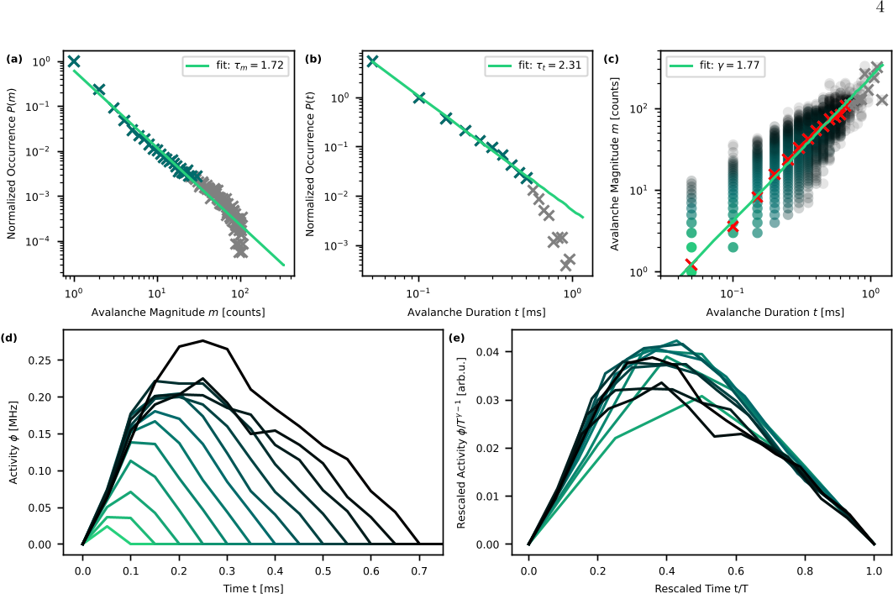

What if a cloud of ultracold atoms could emulate the intricate activity of neurons firing in the brain? Recent advances in quantum physics have opened a fascinating window into this possibility. By harnessing the unique properties of Rydberg gases—ultracold atoms excited to high energy states—scientists have created a controllable platform that simulates how neural networks operate near criticality, a state thought to optimize brain function.

> **TL;DR**
> - Ultracold Rydberg gases can simulate neural network criticality, exhibiting phases of activity and inactivity akin to neurons firing and resting.
> - By adding a mechanism mimicking metabolic resource replenishment, the system stabilizes near criticality, producing dynamic patterns like excitation avalanches and oscillations seen in brain networks.

*Note: this summary is based on a preprint — research shared ahead of formal peer review.*

Neural networks in the brain are believed to function most efficiently when operating near a critical point—a delicate balance between order and chaos where the system can respond dynamically to a wide range of inputs. This criticality manifests in complex patterns of neuron firing, including cascades of activity known as avalanches. However, studying these dynamics directly in biological systems is challenging due to limited experimental control and undersampling. To overcome these obstacles, physicists have turned to highly controllable quantum systems to create physical simulators of neural networks.

The research team used an ultracold gas of rubidium atoms cooled to near absolute zero and excited them into Rydberg states, where atoms exhibit strong interactions over specific distances. These interactions enable a process called Rydberg facilitation, where an excited atom can 'activate' nearby atoms, mimicking how a firing neuron can stimulate connected neurons. The atoms represent neurons that can be either inactive (ground state) or active (excited state). The spatial arrangement and interaction distances naturally form a dynamic network resembling synaptic connections. Crucially, the experiment incorporates a controlled gain mechanism through optical pumping to replenish atoms lost from the system, analogous to metabolic resource replenishment in biological brains. This gain-loss balance allows the system to reach and maintain a non-equilibrium steady state near the critical point.

The system exhibits two distinct phases: an absorbing phase where activity dies out, and an active phase with sustained excitation spreading. By tuning parameters such as atomic density and laser properties, the researchers identified a critical point characterized by power-law distributions of excitation avalanches in size and duration, a hallmark of critical systems. They observed universal scaling behavior in avalanche shapes, confirming self-similarity across events. Temporal correlations peaked at the critical point, and in the active phase, stochastic oscillations and rare, large 'dragon king' avalanches appeared—phenomena predicted for systems operating near criticality. These results demonstrate that facilitated Rydberg gases capture essential features of neural network dynamics, including the interplay between excitation spreading and resource dynamics.

This work establishes ultracold Rydberg gases as a promising experimental platform to study neural network criticality and resource dynamics with unprecedented control. By bridging concepts from neuroscience and quantum physics, it offers a novel approach to investigate how criticality emerges and stabilizes in complex systems. Insights gained here could inform the design of more robust artificial neural networks and deepen our understanding of brain function. Moreover, the ability to simulate long-term dynamics and resource replenishment mechanisms may shed light on how biological neural networks maintain stability amidst constant activity and metabolic constraints.

While the Rydberg gas simulator captures many qualitative features of neural network criticality, it remains a physical model distinct from biological tissue. The system abstracts neurons as atoms and synapses as facilitation processes, omitting biochemical complexities and diverse cell types present in real brains. Additionally, the observed avalanche exponents differ somewhat from theoretical predictions, likely due to dissipation and other experimental factors. Therefore, while the platform provides valuable insights, direct biological validation and further refinement are necessary to fully translate findings to neuroscience. Nonetheless, this approach opens exciting avenues for controlled experimental exploration of criticality in complex adaptive systems.

## Figures

*Avalanches near the critical point show power-law patterns in size, duration, and shape, revealing consistent scaling behavior across events. — Figure from Patrick Mischke et al., [CC BY 4.0](http://creativecommons.org/licenses/by/4.0/), caption edited.*

## Sources

- [Simulating neural network criticality and resource dynamics with Rydberg gases](https://arxiv.org/abs/2607.16368)
- DOI: [10.48550/arxiv.2607.16368](https://doi.org/10.48550/arxiv.2607.16368)

*This article reuses and adapts text and figures from the original research by Patrick Mischke et al., available via arXiv Quantum Physics, under the [CC BY 4.0](http://creativecommons.org/licenses/by/4.0/) license.*
