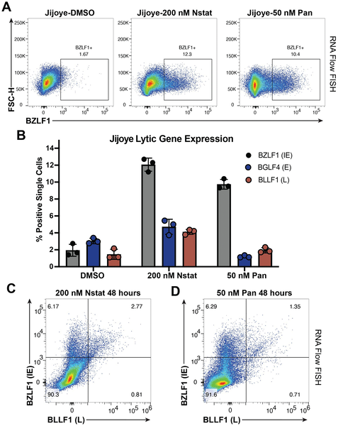

Why do some cancer cells resist viral therapies designed to kill them? Epstein-Barr virus (EBV), a common human herpesvirus linked to several cancers, often hides in a latent state within tumor cells, making it challenging to target. Scientists have tried to 'kick' the virus out of latency using drugs called HDAC inhibitors, aiming to then 'kill' the infected cells with antiviral treatments. Yet, this approach often triggers only partial or abortive viral reactivation in some cells, limiting therapy effectiveness. What causes this uneven response?

> **TL;DR**
> - HDAC inhibitors can induce EBV lytic reactivation in cancer cells, but only a small fraction of cells fully progress through the viral lytic cycle.
> - Single-cell RNA sequencing reveals that abortive viral reactivation is linked to immune signaling pathways, particularly involving the CD137 receptor, which helps some cells resist full viral activation.

Epstein-Barr virus infects about 95% of adults worldwide and is associated with cancers such as Burkitt lymphoma, Hodgkin’s lymphoma, and nasopharyngeal carcinoma. In these cancers, EBV usually remains latent, expressing few viral genes, which makes it difficult to target with drugs. Researchers have developed therapies that attempt to reactivate the virus’s lytic cycle using histone deacetylase (HDAC) inhibitors, drugs that alter gene expression by changing chromatin structure. The idea is that once the virus is active, antiviral drugs can kill the infected cells. However, clinical success has been limited because only some cancer cells respond fully to this reactivation stimulus.

To better understand this variability, the research team studied four EBV-positive cancer cell lines representing different malignancies. They treated these cells with two HDAC inhibitors: panobinostat (a pan-HDAC inhibitor) and nanatinostat (a class I HDAC inhibitor). They measured cell growth, survival, and viral gene expression over time. Crucially, they applied single-cell RNA sequencing to one of the Burkitt lymphoma cell lines after treatment, allowing them to examine gene expression patterns in individual cells. This approach helped identify distinct cell populations based on their viral reactivation status and host response.

The study found that while HDAC inhibitors reduced growth and induced some viral gene expression, only a small subset of cells completed the full lytic cycle. Many cells entered an 'abortive' lytic state, initiating but not completing viral reactivation. Single-cell analysis revealed that these abortive cells upregulated genes linked to immune signaling pathways, especially those downstream of the NF-κB pathway. Notably, the CD137 receptor and its ligand, involved in immune regulation, were more active in abortive cells. Functional experiments using CRISPR-Cas9 to disrupt CD137 confirmed its role in preventing successful viral reactivation. These results suggest that CD137 signaling helps some cancer cells resist viral therapies by blocking full EBV lytic progression.

Understanding why only some cancer cells undergo full viral reactivation has important implications for improving oncolytic therapies targeting EBV-associated cancers. By identifying CD137 as a host factor that limits viral reactivation, this study points to potential new targets to enhance the effectiveness of 'kick and kill' strategies. Enhancing viral reactivation in more tumor cells could make antiviral drugs more effective and improve treatment outcomes for patients with EBV-positive malignancies.

While these findings provide valuable mechanistic insight, they are based on cell line models and in vitro treatments. The complexity of tumors in patients, including the immune environment and variability among cancer types, may influence therapy responses differently. Further studies are needed to validate these mechanisms in clinical samples and to explore how targeting CD137 or related pathways could be safely integrated into treatment regimens.

## Figures

*HDAC inhibitors partially activate EBV virus genes in cells, showing incomplete gene expression after 48 hours of treatment.*

## Sources

- [Single-cell profiling of HDAC inhibitor-induced EBV lytic heterogeneity defines abortive and refractory states in B lymphoblasts](https://journals.plos.org/plospathogens/article?id=10.1371/journal.ppat.1013610)
- DOI: [10.1371/journal.ppat.1013610](https://doi.org/10.1371/journal.ppat.1013610)
