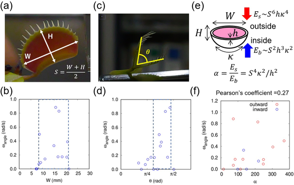
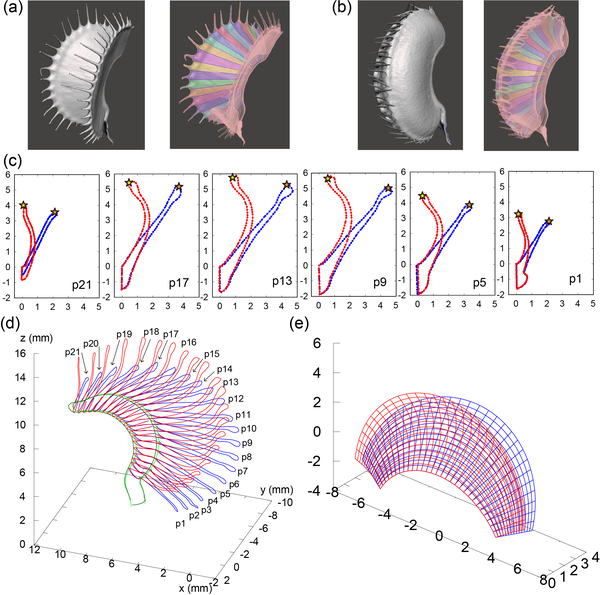
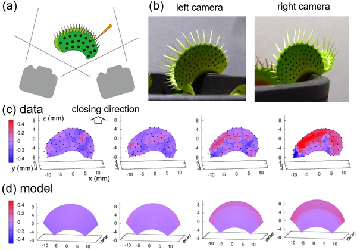
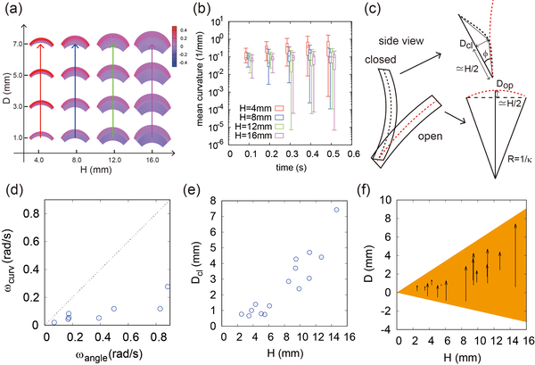

The Venus flytrap is famous for its dramatic, lightning-fast snap that traps unsuspecting insects in less than a second. But what controls the speed and shape of this rapid leaf closure? Recent research using 3D imaging and geometric modeling has uncovered a surprising link between the size of the flytrap’s leaves and their curvature during closure. This discovery not only sheds light on the plant’s remarkable mechanics but also offers inspiration for designing soft, bendable materials in engineering.

> **TL;DR**
> - Venus flytrap leaf closure speed increases with leaf size and curvature, following a specific size–curvature constraint.
> - A two-layer geometric model explains how differential deformation controls leaf bending, offering insights for biomimetic applications.

Unlike animals, plants lack muscles and nervous systems, yet the Venus flytrap can snap its leaves shut in under a second to catch prey. Scientists have long debated the mechanisms behind this rapid movement, considering factors like elastic buckling, hydrostatic pressure, and membrane channel regulation. While previous studies noted that larger traps close faster, the precise relationship between leaf size, shape, and curvature remained unclear. Understanding these geometric and mechanical principles is key to unraveling how the flytrap achieves such speed and efficiency.

Researchers observed the closing motions of Venus flytraps of various sizes, recording their movements with high-speed cameras from multiple angles. They measured leaf dimensions and angles, then used micro–computed tomography (micro–CT) scanning to capture detailed 3D images of traps in both open and closed states. By applying elliptic Fourier transformation to cross-sectional contours, they reconstructed precise geometric models of the leaves. These models incorporated parameters like midrib radius, leaf height, and curvature, allowing the team to quantify changes during closure. They also developed a two-layer model to explain how differential deformation between leaf layers drives bending.

The study revealed that the speed of trap closure correlates strongly with a non-dimensional shape index combining leaf size and curvature. Larger leaves with higher curvature values snap shut faster, a relationship termed the size–curvature constraint. Micro–CT data showed that a key geometric parameter, the curvature perpendicular to the midrib (denoted as D), increases significantly during closure, distinguishing the open and closed states. This curvature arises from differential deformation between the leaf’s inner and outer tissue layers, likely driven by physiological processes such as ion fluxes and water movement. The geometric model successfully captured these changes, providing a framework to predict and control leaf bending.

By uncovering a fundamental geometric rule governing Venus flytrap closure, this research bridges biology and physics to deepen our understanding of rapid plant movements. The size–curvature constraint highlights how physical form and mechanical properties interplay to produce swift action without muscles. Beyond biology, the findings offer a blueprint for biomimetic design—engineers can apply the two-layer curvature model to develop soft, flexible materials and surfaces that bend predictably and rapidly. Such innovations could impact robotics, adaptive architecture, and wearable devices, illustrating how nature’s designs inspire technology.

While the geometric and mechanical models provide valuable insights, the physiological mechanisms linking cellular processes to leaf deformation remain indirect and require further study. Factors like ion signaling and water transport are implicated but not fully elucidated. Additionally, the study focused on mature traps within a certain size range; very small or senescent leaves behave differently. Future work combining molecular biology with biomechanics could clarify these aspects and refine the models, enhancing their applicability across different contexts.

## Figures

*This figure shows how the speed of a trap's movement relates to its size, leaf angle, and the balance between stretching and bending forces in the leaf.*

*3D scans show open (blue) and closed (red) trap shapes, with detailed cross-sections and models from base to leaf tip.*

*3D images show how trap shape and curves change over time from two angles using color to highlight curvature.*

*This figure shows how trap shape and curvature relate to speed, highlighting key measurements and their changes over time.*

## Sources

- [Size–curvature constraint in the closing motion of Venus flytrap leaves](https://journals.plos.org/plosone/article?id=10.1371/journal.pone.0349246)
- DOI: [10.1371/journal.pone.0349246](https://doi.org/10.1371/journal.pone.0349246)
