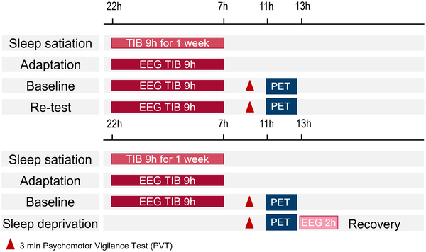
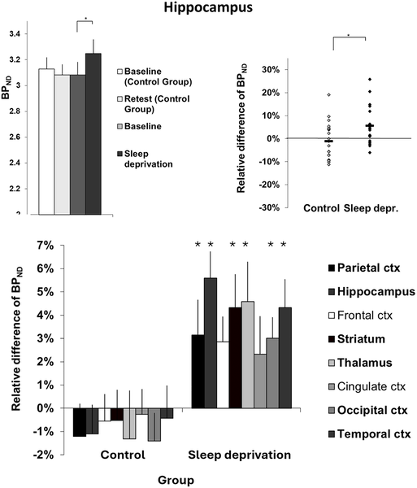

What happens to your brain’s connections when you skip sleep? While we often think of sleep as a time for rest and repair, recent brain imaging research shows that staying awake longer actually increases markers linked to synaptic density in the human brain. This surprising finding sheds light on how sleep and wakefulness dynamically reshape our brain’s wiring.

> **TL;DR**
> - Sleep deprivation leads to increased levels of the synaptic density marker SV2A in multiple brain regions, including the thalamus, hippocampus, and parietal cortex.
> - The increase in synaptic density markers correlates with elevated slow wave activity during recovery sleep, supporting the theory that sleep helps downscale synapses potentiated during wakefulness.

The synaptic homeostasis hypothesis proposes that while we are awake, our brain strengthens synaptic connections as we learn and interact with the environment. However, this synaptic potentiation can saturate the brain’s capacity and increase energy demands. Sleep is thought to counterbalance this by selectively downscaling synapses, preserving energy and optimizing neural networks. Although animal studies have supported this idea, direct evidence in living humans has been limited due to the challenges of measuring synaptic changes noninvasively.

In this randomized study, 40 healthy adults underwent two positron emission tomography (PET) scans using a tracer called [¹⁸F]SynVesT-1 that binds to synaptic vesicle glycoprotein 2A (SV2A), a protein found on synaptic vesicles and commonly used as a proxy for synaptic density. Half of the participants maintained normal sleep, while the other half were kept awake for approximately 28 hours. PET scans were conducted at the same circadian time point for both groups to control for daily rhythms. The researchers then compared SV2A binding levels between the two scans and analyzed correlations with slow wave activity (SWA) measured during recovery sleep, a physiological marker of sleep pressure.

The study found that sleep deprivation caused significant increases in SV2A binding—indicating higher synaptic density—in multiple brain regions, including a 4.6% increase in the thalamus, 5.6% in the hippocampus, and 3.2% in the parietal cortex. In contrast, the control group showed no significant changes, confirming the stability of the measurement technique. Moreover, the magnitude of SV2A increases correlated positively with elevated slow wave activity during recovery sleep, linking synaptic potentiation during wakefulness with subsequent sleep-driven downscaling processes.

These results provide rare in vivo evidence in humans supporting the synaptic homeostasis hypothesis. They suggest that extended wakefulness leads to synaptic strengthening, which is then balanced by sleep-dependent synaptic down-selection. The use of SV2A PET imaging offers a promising tool to noninvasively study synaptic plasticity related to sleep and wake states. Understanding these dynamics has implications for brain health, cognitive function, and potentially for clinical conditions involving sleep disturbances.

While SV2A is a widely accepted proxy for synaptic density, PET imaging cannot distinguish whether changes reflect the number of synapses, vesicle content, or synapse type. The observed increases were modest and measured several hours after waking, which might have attenuated the effects. Additionally, comparisons with animal studies should be made cautiously due to differences in methodology and brain architecture. Further research is needed to explore how these synaptic changes relate to cognitive performance and long-term brain health.

## Figures

*Overview of the study design showing participants' time spent in bed (TIB).*

*Synaptic density changes in the hippocampus show significant group differences, with error bars indicating variability across brain regions.*

## Sources

- [Sleep deprivation increases levels of the synaptic density marker SV2A in the human brain](https://journals.plos.org/plosbiology/article?id=10.1371/journal.pbio.3003816)
- DOI: [10.1371/journal.pbio.3003816](https://doi.org/10.1371/journal.pbio.3003816)
