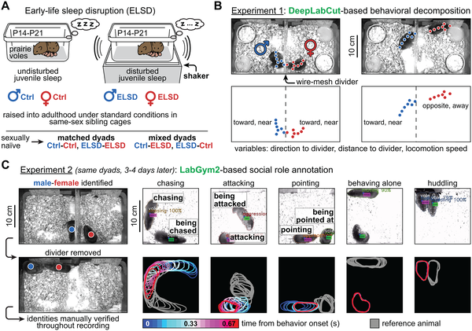

Did you know that the quality of sleep during early life can influence who you get along with later on? While this idea might sound like human psychology, recent research shows that even prairie voles—a species of socially monogamous rodents—exhibit changes in social compatibility based on their early sleep experiences. This study uncovers fascinating parallels between human social affinity and animal behavior, shedding light on how early developmental factors shape adult social interactions.

> **TL;DR**
> - Prairie voles exposed to early-life sleep disruption show altered social behaviors and reduced compatibility when paired with voles raised under normal sleep conditions.
> - Matched pairs of voles—both either sleep-disrupted or control—demonstrate stronger social affinity and less aggression compared to mixed pairs, echoing findings from human studies on neurotype matching.

Human social interactions often feel smoother and more natural when we connect with people who share similar behavioral or neurological profiles, a concept sometimes referred to as 'neurotype matching.' For example, individuals on the autism spectrum often report stronger social affinity with others who share their neurotype. But can this phenomenon be observed in animals? Prairie voles, known for their socially monogamous relationships, provide a unique window into this question. Previous research has linked early-life sleep quality to later social behaviors in these animals, hinting that early developmental experiences might influence social compatibility.

In this study, researchers exposed prairie vole pups to early-life sleep disruption (ELSD) during a critical neurodevelopmental window from postnatal days 14 to 21. This was achieved by gently agitating the pups’ home cages intermittently, disrupting their normal sleep patterns without affecting overall health or parental care. As adults, these voles were paired into opposite-sex dyads with either matched sleep histories (both control or both ELSD) or mixed histories (one control and one ELSD). The pairs were observed in two experimental setups: first, separated by a wire-mesh divider allowing limited interaction, and second, cohabiting without barriers. Advanced behavioral tracking tools, including DeepLabCut for body orientation and LabGym2 for detailed social role classification, were used to analyze interactions over extended periods.

The study found that mixed dyads—pairs with one control and one ELSD vole—showed reduced social affinity compared to matched dyads. Specifically, males in mixed pairs spent more time oriented toward the divider, indicating heightened but possibly conflicted social attention, and exhibited increased aggression. Females in mixed pairs displayed altered locomotion and distance preferences. In contrast, matched pairs showed more harmonious interactions with less aggression and more affiliative behaviors like huddling. These sex-specific and temporal patterns of behavior suggest that early-life sleep disruption creates distinct 'neurotypes' in voles that influence adult social compatibility, paralleling human findings where social affinity is stronger in matched neurotype pairs.

These findings provide a compelling animal model for understanding how early developmental factors like sleep quality can shape social compatibility later in life. By demonstrating that prairie voles exhibit neurotype matching effects similar to those observed in humans, the study bridges human social neuroscience and animal behavior research. This work not only deepens our understanding of the biological underpinnings of social affinity but also lays groundwork for exploring social development and disorders linked to early-life sleep disturbances.

While the results are intriguing, it’s important to recognize that prairie voles are a model species with specific social behaviors that may not fully generalize to humans or other animals. The sleep disruption method, although carefully controlled, represents a simplified model of complex developmental sleep issues. Additionally, the study focused on opposite-sex pairs and did not explore same-sex social dynamics. Future research will need to explore these variables and investigate the neural mechanisms underlying these behavioral changes to better understand the full implications for social development.

## Figures

*Prairie voles raised with early-life sleep disruption show social behavior differences as adults when paired and observed in various interaction setups.*

## Sources

- [Social compatibility in opposite-sex prairie vole pairs is modulated by early-life sleep experience](https://journals.plos.org/plosbiology/article?id=10.1371/journal.pbio.3003434)
- DOI: [10.1371/journal.pbio.3003434](https://doi.org/10.1371/journal.pbio.3003434)
