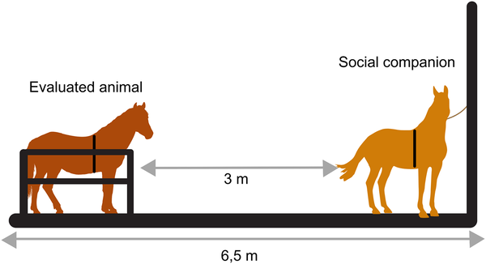
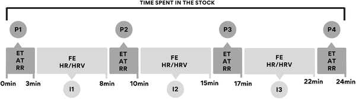

Did you know horses communicate their stress not just through behavior but also through subtle facial expressions? And that simply having a horse friend nearby can soothe a stressed horse’s heart and mind? Recent research combines thermal imaging and a specialized facial coding system to reveal how social enrichment—being near a familiar companion without physical contact—can reduce stress in horses during challenging situations.

> **TL;DR**
> - Horses restrained in a stock show clear signs of stress in their facial expressions and physiological measures such as heart rate and eye temperature.
> - When a familiar horse is nearby but separated by a barrier (social noncontact enrichment), these stress indicators are significantly reduced, demonstrating social buffering effects.

Horses are naturally social animals whose primary defense is flight. Restraining them in stocks—a common practice during veterinary care—can cause short-term stress by limiting their movement. While such procedures are necessary for good animal care, finding ways to reduce the stress they cause is important for horse welfare. Social buffering, where the presence of a conspecific companion helps mitigate stress, is a phenomenon observed in many species. However, the effects of social noncontact enrichment, where horses can see, hear, and smell but not touch a companion, on stress during restraint had not been fully explored.

Researchers studied 11 Pantaneiro horses using a crossover design where each horse experienced two conditions: restraint alone (social isolation) and restraint with a familiar companion nearby but separated by a barrier (social noncontact enrichment). During 24-minute restraint sessions, physiological data including heart rate, heart rate variability, respiratory rate, and eye and ear temperatures were collected using heart monitors and infrared thermography. Simultaneously, facial expressions were analyzed using EquiFACS—a Facial Action Coding System developed specifically for horses—to identify subtle muscle movements linked to stress. Environmental conditions were monitored to rule out heat or weather as confounding factors.

The study found that when horses were restrained alone, they exhibited higher heart rates, faster breathing, and increased eye temperatures—classic signs of stress. Their facial expressions showed more frequent stress-related movements such as nostril dilation, inner brow raising, upper eyelid raising, increased white of the eye, and ear positions associated with alertness or discomfort. In contrast, when a familiar horse was nearby but separated, these physiological and facial stress indicators were significantly reduced. This combination of measures provides strong evidence that social noncontact enrichment helps buffer the horses’ stress response during restraint.

These findings highlight the importance of social factors in managing stress in horses during routine but potentially aversive procedures. By simply allowing a familiar companion to be visible and audible nearby, caretakers can improve horses’ emotional well-being without physical contact. The use of facial coding combined with physiological measures offers a powerful, non-invasive way to assess animal emotions and welfare. This approach could inform better handling practices that respect horses’ social nature and reduce their stress in domestic environments.

While this study provides robust evidence for social buffering through noncontact enrichment, it involved a relatively small sample of a single horse breed under controlled conditions. The effects might vary with different breeds, individual temperaments, or in other stressful contexts. Also, the companion horse was carefully selected for calmness and familiarity, which may influence outcomes. Further research could explore long-term welfare benefits, the role of direct physical contact, and how these findings translate to everyday management on diverse farms and stables.

## Figures

*Diagram showing the test area and positions of the animal and its social companion during data collection.*

*Fig 2 shows how eye and ear temperatures, breathing, facial expressions, heart rate, and heart rate variability were measured in the experiment.*

## Sources

- [Social enrichment mitigates facial expressions and physiological indicators of short-term stress in horses](https://journals.plos.org/plosone/article?id=10.1371/journal.pone.0347571)
- DOI: [10.1371/journal.pone.0347571](https://doi.org/10.1371/journal.pone.0347571)
