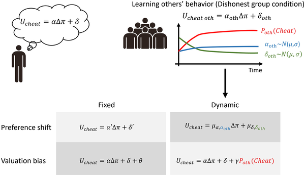
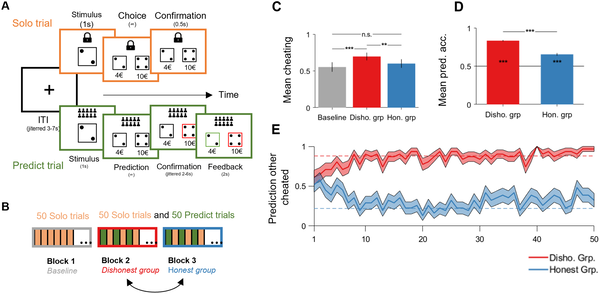
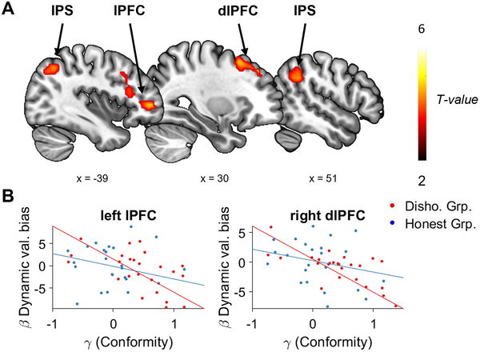

Have you ever noticed how seeing someone else bend the rules can make it a little easier to justify doing the same? Whether it’s a coworker fudging their timesheet or a friend cutting corners, dishonest behavior seems contagious. But what exactly happens in our brains when we observe others cheating? A recent study sheds light on the neurocomputational mechanisms behind this moral contagion, revealing how social learning dynamically biases our subjective valuation of dishonest choices.

> **TL;DR**
> - Observing others cheat increases our own likelihood to cheat by dynamically biasing how we value dishonest actions.
> - Brain imaging reveals that lateral prefrontal cortex activity reflects individual conformity levels during this social learning process, while the posterior superior temporal sulcus tracks others’ cheating behavior.

Dishonest behavior like cheating or corruption isn’t just a personal choice—it’s influenced by the social environment. Previous research has shown that people tend to cheat more when they see others doing it, but the underlying brain mechanisms remained unclear. Two main theories have been proposed: one suggests that social influence biases how we value options (valuation bias), while the other argues that it changes our core moral preferences (preference shift). However, these theories often overlook the dynamic nature of learning about others’ behavior over time. This study aimed to unravel how social learning shapes moral decision-making by integrating computational modeling with brain imaging.

Researchers designed a novel ‘cheating game’ where participants were faced with a moral dilemma: report the true outcome of a die roll for a smaller reward or lie for a higher payoff. Participants played alone (Solo trials) and also predicted whether others would cheat or be honest (Predict trials). Unbeknownst to them, the behavior of these ‘others’ was simulated to be either mostly honest or mostly dishonest. The experiment had three blocks: a baseline with no social influence, then two blocks exposing participants to honest or dishonest social norms. Functional MRI scanned participants’ brains as they made decisions, while computational models tested whether social influence altered valuation or preferences, and whether these changes were fixed or dynamic over time.

Behaviorally, participants cheated more when exposed to a dishonest group but did not reduce cheating in the honest group, indicating an asymmetric social influence. Computational modeling showed that the best explanation was a dynamic valuation bias: participants learned about others’ cheating and this learning biased how they valued cheating themselves, rather than fundamentally changing their moral preferences. Brain imaging revealed that this valuation bias was not localized to a single brain region but was linked to activity in the bilateral lateral prefrontal cortex, especially in individuals more prone to conform. Additionally, the posterior superior temporal sulcus encoded the simulation of others’ cheating behavior during learning, highlighting its role in tracking social information relevant to moral decisions.

This study provides a mechanistic understanding of moral contagion, showing that social learning dynamically biases the subjective value we assign to dishonest acts. Rather than altering deep-seated moral preferences, observing others cheat shifts how tempting cheating feels in the moment. Identifying the lateral prefrontal cortex and posterior superior temporal sulcus as key nodes in this process bridges social psychology with neuroscience, offering insights into why dishonesty can spread in groups. These findings have implications for designing interventions to promote honesty by considering social context and learning dynamics.

While the study robustly links social learning to valuation biases in moral decision-making, it focuses on a specific cheating task in controlled settings. Real-world dishonesty involves more complex social and emotional factors that may engage additional brain systems. Also, the simulated ‘others’ behavior, though carefully designed, may not capture the full nuance of human social interactions. Future research could explore how these mechanisms operate in diverse populations and naturalistic environments, and whether similar dynamics apply to other moral behaviors beyond cheating.

## Figures

*This figure shows four models explaining how social influence affects cheating, varying by preference shifts or valuation biases, and whether these are fixed or change over time.*

*Participants chose to report die rolls honestly or cheat for higher rewards, then predicted others' honesty, with feedback given across three blocks.*

*Brain activity in the left prefrontal cortex decreases as people learn others might cheat, linked to how much they conform in a dishonest group.*

## Sources

- [Social learning dynamically shapes moral decision-making by biasing subjective valuation](https://journals.plos.org/plosbiology/article?id=10.1371/journal.pbio.3003889)
- DOI: [10.1371/journal.pbio.3003889](https://doi.org/10.1371/journal.pbio.3003889)
