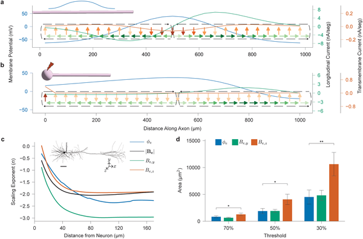
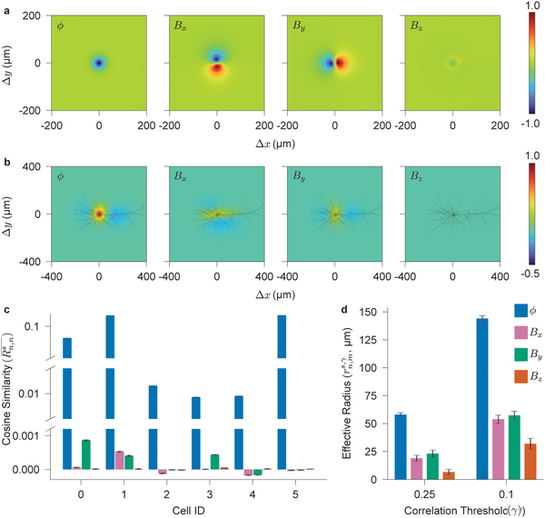
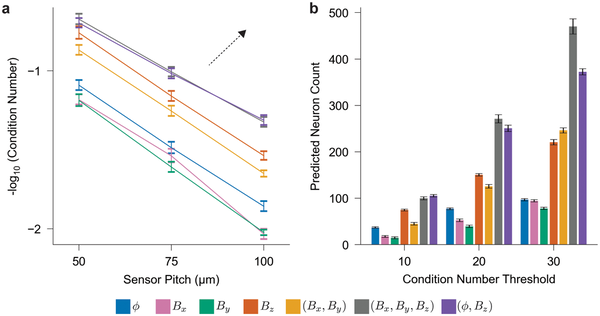
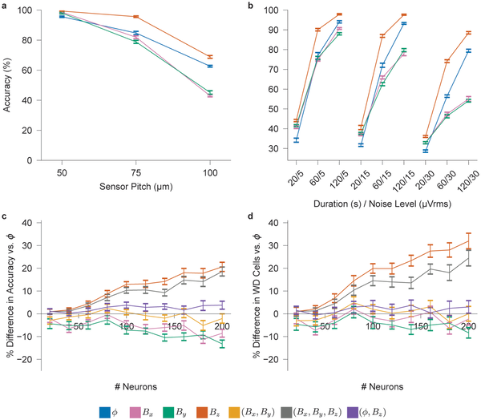

What if brain implants could listen to the brain’s magnetic whispers instead of its electrical chatter? Recent advances suggest that measuring the tiny magnetic fields generated by neurons might provide clearer, longer-lasting insights into brain activity than traditional electrical recordings. This new perspective could transform how we decode neural signals and design brain-computer interfaces.

> **TL;DR**
> - Neural magnetic fields arise from currents flowing along neurons and carry complementary, spatially richer information compared to electrical potentials.
> - This spatial richness enables better distinction of densely packed neurons and may allow approximate reconstruction of neuron shapes, motivating new magnetic sensing technologies for brain implants.

For decades, brain implants have relied on measuring electrical potentials through microelectrode arrays to capture the activity of individual neurons. While effective, these electrodes face challenges such as tissue scarring and signal degradation over time due to their direct contact with brain tissue. Magnetic sensing, by contrast, does not require physical contact and is less affected by tissue properties, offering a promising alternative. Yet, the detailed informational differences between neural magnetic fields and electrical potentials at the cellular level have remained largely unexplored—until now.

Researchers developed a mathematical framework grounded in the physics of neuronal current sources to compare how neurons generate extracellular electrical potentials versus magnetic fields. They modeled neurons as current-carrying structures and used computational simulations of realistic neuron morphologies to analyze how these signals scale with distance and differ in spatial patterns. By simulating networks of neurons, they evaluated how well magnetic versus electrical signals could distinguish individual neurons through spike sorting techniques. They also explored how the unique properties of magnetic fields might enable reconstructing neuron shapes even with sparse sensor arrays.

The study found that neural magnetic fields originate primarily from longitudinal currents flowing along neurons, while electrical potentials arise from currents crossing the membrane. This difference means magnetic fields have a lower spatial polarity order, causing their signals to decay more slowly with distance and exhibit richer spatial patterns. Computational models showed that magnetic spike templates are more distinctive, allowing better separation of signals from densely packed neurons. Additionally, the solenoidal (curl-like) nature of magnetic fields enables approximate morphological reconstruction of neurons, a feat not possible with electrical potentials alone.

These insights highlight the untapped potential of neural magnetic fields as a complementary or even superior signal modality for brain implants and neural decoding. Magnetic sensing could overcome key limitations of electrode-based recordings, such as long-term stability and signal clarity, while providing richer information about neuron activity and structure. This motivates the development of compact, low-noise magnetic sensors capable of detecting these tiny fields at the cellular scale, paving the way for improved neuroprosthetics and brain-machine interfaces.

Despite these promising theoretical and computational results, practical challenges remain. Neural magnetic fields are extremely weak—often in the femtotesla range—making their detection technologically demanding. Current sensor technologies have not yet achieved single-shot recordings of magnetic signals from individual cortical neurons. Further experimental validation and advances in sensor sensitivity are needed before these findings can be translated into clinical or research devices.

## Figures

*Neuron models show how electrical currents and fields scale along axons during action potentials, revealing current loops and distance effects on signals.*

*Fig 3 shows how far neural electrical and magnetic signals spread and how similar they are across space in brain cells.*

*Analysis shows how well different sensor setups can distinguish signals from groups of brain cells based on electrical and magnetic data.*

*Simulated tests show how sensor spacing, recording time, and noise affect accuracy in detecting brain cell signals with neural probes.*

## Sources

- [Spatial richness of neural magnetic fields](https://journals.plos.org/ploscompbiol/article?id=10.1371/journal.pcbi.1014283)
- DOI: [10.1371/journal.pcbi.1014283](https://doi.org/10.1371/journal.pcbi.1014283)
