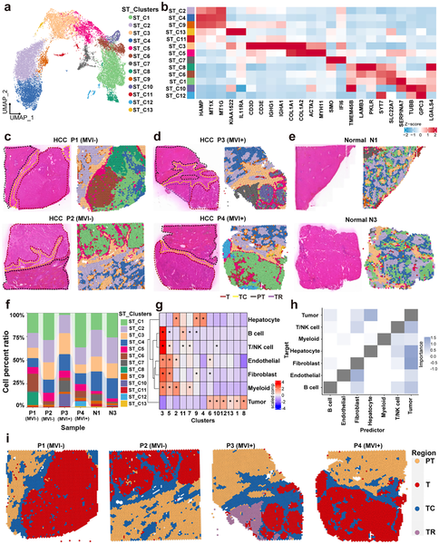
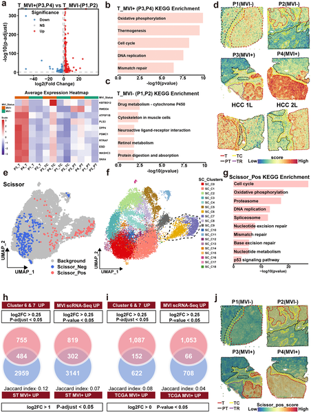

Liver cancer, specifically hepatocellular carcinoma (HCC), remains a formidable health challenge worldwide due to its high rates of recurrence and metastasis. One critical factor linked to aggressive disease is microvascular invasion (MVI), where cancer cells infiltrate tiny blood vessels, enabling the tumor to spread. But what cellular and molecular features distinguish these invasive tumors from less aggressive ones? A recent study harnessed cutting-edge spatial mapping technologies to peer inside liver tumors and their surrounding tissue, revealing a previously unrecognized cancer cell subtype and how the tumor’s microenvironment may fuel its growth.

> **TL;DR**
> - Researchers discovered a new subtype of liver cancer cells marked by specific genes (STMN1, HMGN2, GPC3) that are highly proliferative and metabolically distinct, enriched in tumors with microvascular invasion.
> - They also found that a molecule called taurine in the tumor capsule suppresses certain fibroblast cells that normally restrain tumor growth, thereby promoting cancer progression.

Hepatocellular carcinoma is the most common primary liver cancer and a leading cause of cancer-related deaths globally. Despite advances in treatment, many patients experience tumor recurrence, often driven by microvascular invasion—a process where cancer cells invade small blood vessels near the tumor, facilitating spread within the liver and beyond. Understanding the cellular makeup and metabolic environment of these invasive tumors is crucial for developing targeted therapies. However, traditional methods often lack spatial context, missing how cancer cells and their neighbors interact within the tumor landscape.

To address this, the researchers applied spatial transcriptomics and spatial metabolomics—techniques that map gene expression and metabolite distribution directly onto tissue sections. They analyzed tumor and surrounding capsule tissues from patients with and without microvascular invasion, integrating these data with public single-cell RNA sequencing datasets. This multi-omics approach allowed them to identify distinct cell populations, characterize their metabolic states, and observe their spatial relationships within the tumor microenvironment. They further validated their findings using multiplex immunofluorescence staining in a larger patient cohort and conducted laboratory experiments to test the functional effects of key metabolites on cancer-associated fibroblasts.

The study identified a malignant cancer cell subtype characterized by high expression of STMN1, HMGN2, and GPC3 genes, which was enriched in tumors exhibiting microvascular invasion. These cells showed enhanced proliferation and a unique metabolic profile marked by suppressed glycerolipid metabolism. In the tumor capsule—the connective tissue surrounding the tumor—researchers observed a reduction in inflammatory cancer-associated fibroblasts (iCAFs) in invasive tumors. Spatial mapping revealed a strong association between taurine, a naturally occurring molecule, and the presence of iCAFs. Laboratory assays demonstrated that taurine suppresses iCAF activity, which in turn promotes cancer cell proliferation and migration. Together, these findings suggest that both the aggressive cancer cell subtype and the altered tumor capsule environment contribute to liver cancer progression.

This integrative spatial multi-omics study sheds light on the complex cellular and metabolic landscape of microvascular invasion in hepatocellular carcinoma. By pinpointing a novel aggressive cancer cell population and revealing how tumor capsule metabolites like taurine modulate fibroblast activity, the research opens new avenues for precision therapies targeting these components. Such targeted interventions could potentially reduce tumor spread and recurrence, improving outcomes for patients with invasive liver cancer.

While the findings are promising, the study’s spatial omics analyses were conducted on a relatively small number of tissue samples, which may limit the generalizability of the results. Further research with larger patient cohorts is needed to validate the identified cancer cell subtype and the role of taurine in modulating the tumor microenvironment. Additionally, the complex interactions within the tumor niche require deeper exploration to fully understand their therapeutic potential.

## Figures

*Cell types and regions in liver cancer tissues were mapped and compared to show differences in cell distribution and interactions.*

*Gene activity and cell clusters differ between tumors with and without microvascular invasion, revealing unique pathways and cell types linked to tumor spread.*

## Sources

- [Spatial transcriptomic-metabolic features of tumor foci and tumor capsule in microvascular invasion with hepatocellular carcinoma: A spatial multi-omics study](https://journals.plos.org/plosmedicine/article?id=10.1371/journal.pmed.1004703)
- DOI: [10.1371/journal.pmed.1004703](https://doi.org/10.1371/journal.pmed.1004703)
