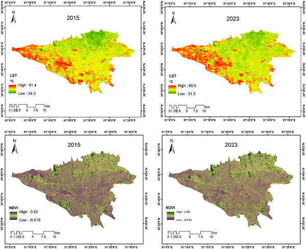

As cities grow and temperatures rise, urban green spaces become vital oases of cool in the concrete jungle. But it’s not just the amount of greenery that matters — how these patches connect across a city can determine their ability to fight heat. In Tehran, Iran’s sprawling and rapidly urbanizing capital, researchers have mapped nearly a decade of change in green space connectivity to understand its role in shaping urban heat islands. Their findings reveal a shifting landscape where some neighborhoods cool down while others heat up, highlighting the importance of smart green infrastructure planning.

> **TL;DR**
> - Tehran’s northern districts lost about 1,400 hectares of cool green space from 2015 to 2023, while hot zones expanded by over 1,600 hectares in southern and southwestern areas.
> - Using satellite data and electrical circuit theory, the study shows that green space connectivity improved locally in the north but became more fragmented citywide, intensifying heat in underserved areas.

Urban heat islands (UHIs) occur when city surfaces like asphalt and concrete absorb and retain more heat than natural landscapes, causing urban temperatures to rise significantly above surrounding rural areas. This effect worsens heat stress, air pollution, and energy demand, especially as climate change accelerates. Urban green spaces — parks, gardens, and tree-lined streets — help cool cities through shade and evapotranspiration. However, the cooling benefit depends not only on how much green space exists but also on its spatial arrangement and connectivity. Connected green patches allow cooling effects to spread more effectively across neighborhoods, while fragmented greenery limits their impact. Tehran, with its dense population, varied topography, and semi-arid climate, faces growing UHI challenges, making it an ideal case to study how green space connectivity evolves and influences urban temperatures.

The research team analyzed satellite images from 2015 and 2023 using Landsat 8 data processed on Google Earth Engine. They derived land surface temperature (LST) maps to identify hot and cold spots across the city’s 730 square kilometers. Vegetation health was assessed using the Normalized Difference Vegetation Index (NDVI), which distinguishes green from non-green areas. To classify green spaces accurately, the team applied statistical methods including Receiver Operating Characteristic (ROC) curves and True Skill Statistic (TSS). They then used landscape metrics to quantify spatial patterns like patch size, density, and fragmentation. To model how cooling effects might flow between green patches, they employed electrical circuit theory, which simulates multiple pathways of heat diffusion across the urban landscape, treating green spaces as conductive nodes and built-up areas as resistance surfaces. This approach captures the complex connectivity of green spaces rather than relying on simpler, single-path models.

The study revealed a clear spatial shift in Tehran’s thermal landscape over eight years. Northern districts, traditionally cooler due to proximity to the Alborz Mountains and more vegetation, lost about 1,400 hectares of cold, green areas. Meanwhile, hot zones expanded by approximately 1,618 hectares in the southern and southwestern districts, where urbanization and impervious surfaces dominate. Analysis showed increased fragmentation of cool green patches, reducing their continuity and weakening their cooling influence. Interestingly, the connectivity modeling indicated that while green patches in 2015 were weakly connected and scattered, by 2023 they had become more concentrated with stronger local connectivity in the north. However, this concentration also highlighted an imbalance: southern, western, and central parts of Tehran remain underserved by connected green infrastructure, exacerbating heat stress there.

This research offers valuable insights for urban planners and policymakers aiming to build climate-resilient cities. By demonstrating how green space connectivity—not just quantity—affects urban cooling, the study underscores the need for targeted interventions to enhance green networks, especially in heat-vulnerable neighborhoods. The use of circuit theory provides a nuanced tool to identify priority areas where green infrastructure can be expanded or linked to maximize cooling benefits. As many cities worldwide face similar heat challenges, this replicable framework can guide sustainable urban design that balances growth with environmental health and human comfort.

While the study uses robust satellite data and established modeling techniques, it focuses on a single city with unique topography and climate, which may limit direct generalization to other urban areas. The circuit theory approach models potential cooling flows but does not capture all microclimatic factors or social variables influencing heat exposure. Additionally, the study covers data up to 2023; ongoing urban development and climate trends may alter these patterns in the future. Further research integrating ground-based temperature measurements and socio-economic data could deepen understanding of how green connectivity impacts different communities within Tehran.

## Figures

*Maps showing plant health and land temperature in summer 2015 and 2023 using satellite images from USGS/NASA.*

## Sources

- [Spatiotemporal modeling of urban green space connectivity and landscape structure for climate adaptation in Tehran, Iran](https://journals.plos.org/plosone/article?id=10.1371/journal.pone.0341276)
- DOI: [10.1371/journal.pone.0341276](https://doi.org/10.1371/journal.pone.0341276)
