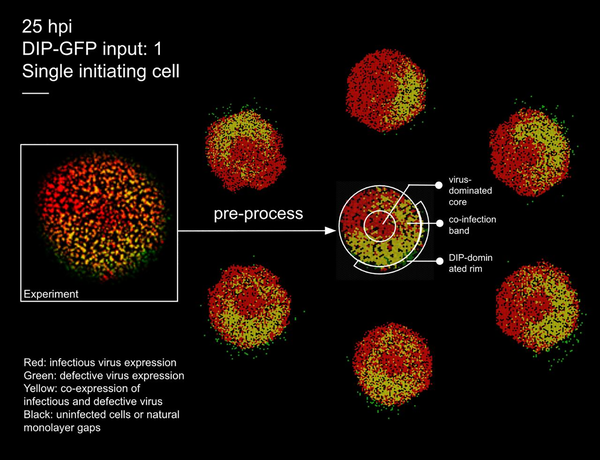
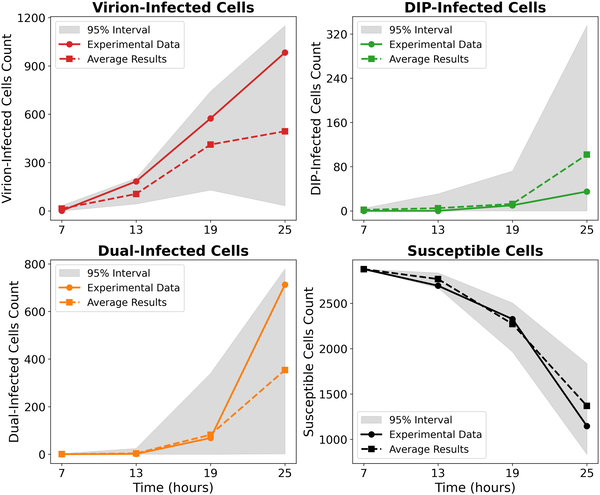
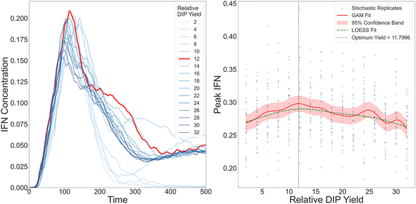

Did you know that some viruses produce defective copies of themselves—viral 'imposters' that can’t replicate on their own but still influence the course of infection? These defective interfering particles (DIPs) play a surprising role in influenza infections, not only by competing with the standard virus but also by activating our immune defenses. But how exactly do these viral fragments affect the battle between the flu virus and our immune system, especially when infections unfold across space and time in tissues? A recent study from Princeton University uses a detailed computer model to explore this question, revealing unexpected insights about viral spread, immune activation, and the fine line between viral control and escape.

> **TL;DR**
> - Defective interfering particles (DIPs) can both boost and hinder immune responses during influenza infection, with the strongest interferon activation occurring at intermediate DIP levels.
> - Even a small number of viral particles spreading over longer distances can break through local immune defenses, leading to earlier and stronger viral outbreaks despite immune activation.

Influenza A virus (IAV) is a common respiratory pathogen that replicates by infecting cells and producing new virus particles. However, during replication, the virus often generates defective copies of its genome—DIPs—that lack essential genetic information and cannot replicate alone. These DIPs interfere with normal virus replication and trigger innate immune responses, particularly the production of type I interferons (IFNs), molecules that help limit viral spread and activate other immune defenses. While previous studies have shown that DIPs can influence infection outcomes, understanding how they interact with IFN responses in spatially structured environments—like layers of cells in the respiratory tract—remained unclear. This spatial complexity matters because infections do not spread evenly; instead, viruses and immune signals move locally, creating patterns of infection and immunity that affect disease severity.

To investigate these dynamics, the researchers developed a spatially explicit, stochastic computer model simulating influenza infection in a layer of cells. The model tracks individual cells and viral particles on a hexagonal grid, simulating how viruses and DIPs infect cells, replicate, and spread. It also incorporates the production and diffusion of type I interferon, which can induce an antiviral state in nearby cells. Importantly, the model allows for different modes of viral spread: local cell-to-cell transmission and rare long-range jumps that mimic how some viral particles might travel farther due to factors like mucus movement or airflow. The model parameters were carefully calibrated using experimental data from influenza and other viruses, ensuring realistic replication rates, interferon timing, and cell death dynamics. The researchers also made their model available as an interactive online platform, allowing users to visualize infection spread and immune responses under various conditions.

The simulations revealed several intriguing findings. First, the model successfully reproduced complex infection patterns observed in experiments, such as ring-like and patchy plaques of infected cells. Second, interferon production peaked not when defective particles were most abundant, but at an intermediate ratio of DIPs to standard virus. This reflects a trade-off: too few DIPs produce insufficient immune activation, while too many inhibit viral replication so strongly that immune signaling diminishes. Third, even a tiny fraction of viruses and DIPs spreading over longer distances enabled the infection to escape local immune containment. This long-range dispersal led to stronger overall antiviral responses but also caused the virus to reach peak levels earlier, with similar levels of cell death. These results suggest that defective particles and their spatial spread create a complex balance between immune activation and viral persistence.

This study advances our understanding of how viral diversity and spatial factors shape infection outcomes. By integrating defective viral particles, interferon signaling, and spatial spread into a unified model, it highlights why infections can vary in severity and why simply increasing defective particles does not always strengthen immunity. The findings also emphasize that rare long-range viral spread can undermine local immune defenses, a factor that may be relevant to respiratory infections beyond influenza. While the work is based on in vitro models and computational simulations, it provides a valuable framework for exploring how innate immunity and viral heterogeneity interact in tissues. Such insights could inform future antiviral strategies and improve our grasp of viral pathogenesis.

It’s important to note that this model focuses on simplified in vitro conditions and does not capture the full complexity of infections in living organisms, where multiple immune cell types, tissue structures, and systemic factors come into play. The exact mechanisms and frequency of long-range viral spread in vivo remain to be fully elucidated. Additionally, while the model parameters are grounded in experimental data, biological variability and differences between viral strains or host species could influence outcomes. Therefore, further experimental validation and extension to more complex biological systems will be necessary to translate these findings into clinical contexts.

## Figures

*Images show virus spread in cells at 25 hours, comparing real experiments and simulations with color-coded infection states.*

*Model matches experimental cell counts over time for different infection types without IFN, showing data and simulation ranges on a log scale.*

*IFN levels rise then fall with increasing DIP yield, peaking at an optimal point shown by multiple model fits and simulations in cell layers.*

## Sources

- [Spatio–temporal modelling of in vitro influenza A virus infection: The impact of defective interfering particles on the type I interferon response](https://journals.plos.org/ploscompbiol/article?id=10.1371/journal.pcbi.1014198)
- DOI: [10.1371/journal.pcbi.1014198](https://doi.org/10.1371/journal.pcbi.1014198)
