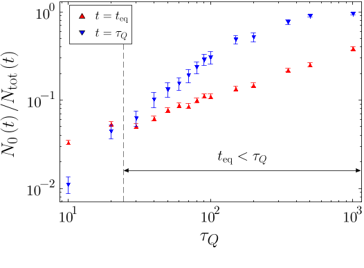
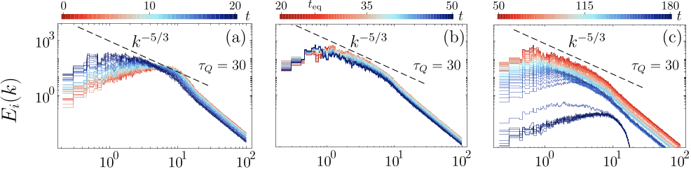
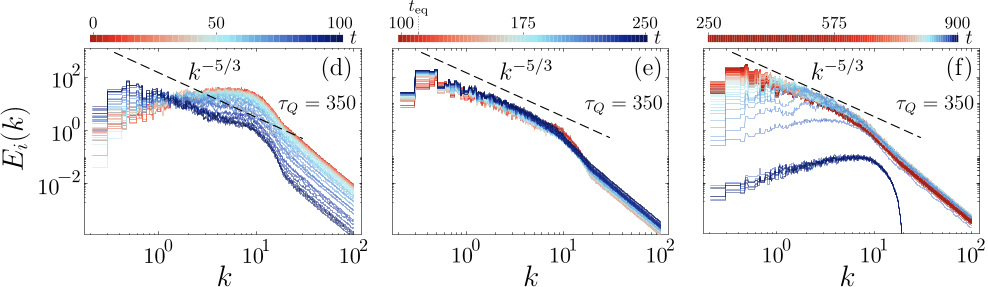
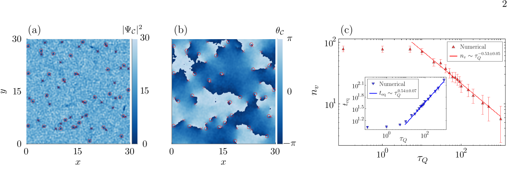

How does chaos spontaneously emerge in a newborn quantum fluid? When a gas of ultracold atoms cools down enough to form a Bose-Einstein condensate (BEC), it transitions into a new state of matter governed by quantum mechanics. Surprisingly, this transition can give rise to swirling patterns of quantum vortices—tiny whirlpools of superfluid that mark the onset of quantum turbulence. Recent research reveals that this spontaneous quantum turbulence follows universal laws, offering a fresh perspective on how order and disorder arise in quantum systems.

> **TL;DR**
> - During the rapid cooling (quench) that creates a Bose-Einstein condensate, quantum vortices spontaneously form, leading to quantum turbulence.
> - The number of vortices and the turbulent energy spectrum follow universal scaling laws predicted by the Kibble-Zurek mechanism and Kolmogorov turbulence theory.

*Note: this summary is based on a preprint — research shared ahead of formal peer review.*

Turbulence—the chaotic swirling of fluids—is a notoriously complex phenomenon, familiar in everything from weather systems to ocean currents. In quantum fluids like superfluid helium or Bose-Einstein condensates, turbulence manifests differently: it arises from quantized vortices, which are stable, topological defects with precisely quantized circulation. Understanding quantum turbulence not only sheds light on fundamental physics but also has implications for fields as diverse as atomtronics and astrophysics. The Kibble-Zurek mechanism (KZM), originally developed to describe defect formation in cosmological phase transitions, provides a universal framework for predicting how such vortices emerge when a system crosses a critical point at a finite rate.

The researchers modeled the formation of a two-dimensional Bose-Einstein condensate undergoing a thermal quench—a rapid cooling process—using numerical simulations of the stochastic projected Gross-Pitaevskii equation. This equation captures the dynamics of the condensate’s macroscopic wavefunction, including thermal fluctuations and interactions. By varying the quench duration, they studied how the condensate formed and how quantum vortices appeared spontaneously. They analyzed the resulting velocity field to separate compressible and incompressible components and computed energy spectra to diagnose turbulence and vortex dynamics.

The simulations revealed that as the condensate forms, a proliferation of quantum vortices arises spontaneously, consistent with the predictions of the Kibble-Zurek mechanism. The number of vortices scales with the quench time following a power law, confirming the universal nature of defect formation. Moreover, the incompressible kinetic energy spectrum of the condensate exhibits Kolmogorov scaling—a hallmark of turbulence—over an inertial range determined by the vortex spacing and healing length. By rescaling the energy spectra with the Kibble-Zurek correlation length, the authors demonstrated a universal collapse of data across different quench rates, reinforcing the connection between nonequilibrium critical dynamics and quantum turbulence.

This work provides a compelling theoretical demonstration that quantum turbulence can emerge spontaneously during the nonequilibrium formation of a Bose-Einstein condensate, governed by universal scaling laws. It bridges concepts from cosmology, condensed matter, and fluid dynamics, enriching our understanding of how complex quantum states form and evolve. The findings offer a predictive framework for future experiments with ultracold gases and may inspire new explorations into nonequilibrium quantum phenomena, potentially informing technologies based on quantum fluids.

While the study uses robust numerical simulations grounded in established theory, it focuses on an idealized two-dimensional, homogeneous system without external trapping potentials. Real experimental setups may introduce additional complexities such as thermal vortices from the Berezinskii-Kosterlitz-Thouless transition or trap-induced inhomogeneities. The inertial range for observing Kolmogorov scaling in Bose-Einstein condensates is relatively narrow, which may limit the direct observation of some predicted features. Further experimental validation and exploration in three-dimensional systems will be important to fully confirm and extend these results.

## Figures

*Condensate fraction shown at equilibration time and quench end, averaged over many trials with error bars for confidence. — Figure from Seong-Ho Shinn et al., [CC BY 4.0](http://creativecommons.org/licenses/by/4.0/), caption edited.*

*Fig. 11 shows how swirling energy and vortex numbers change over time, revealing energy loss and no same-sign vortex grouping. — Figure from Seong-Ho Shinn et al., [CC BY 4.0](http://creativecommons.org/licenses/by/4.0/), caption edited.*

*Panels show how incompressible kinetic energy changes over time during two different quench durations, starting at time zero. — Figure from Seong-Ho Shinn et al., [CC BY 4.0](http://creativecommons.org/licenses/by/4.0/), caption edited.*

*Condensate density and phase show vortices after cooling, with vortex count following a power-law as cooling time changes. — Figure from Seong-Ho Shinn et al., [CC BY 4.0](http://creativecommons.org/licenses/by/4.0/), caption edited.*

## Sources

- [Spontaneous Quantum Turbulence in a Newborn Bose-Einstein Condensate via the Kibble-Zurek Mechanism](https://arxiv.org/abs/2506.21670)
- DOI: [10.1103/b16v-hwp2](https://doi.org/10.1103/b16v-hwp2)

*This article reuses and adapts text and figures from the original research by Seong-Ho Shinn et al., available via Phys. Rev. Lett. 137, 020402 (2026), under the [CC BY 4.0](http://creativecommons.org/licenses/by/4.0/) license.*
