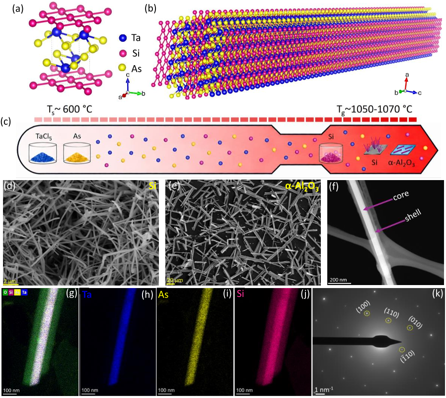
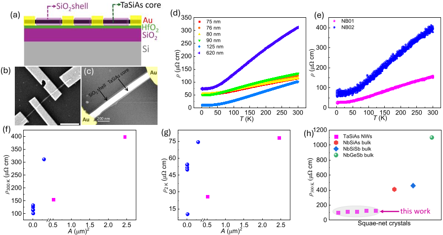
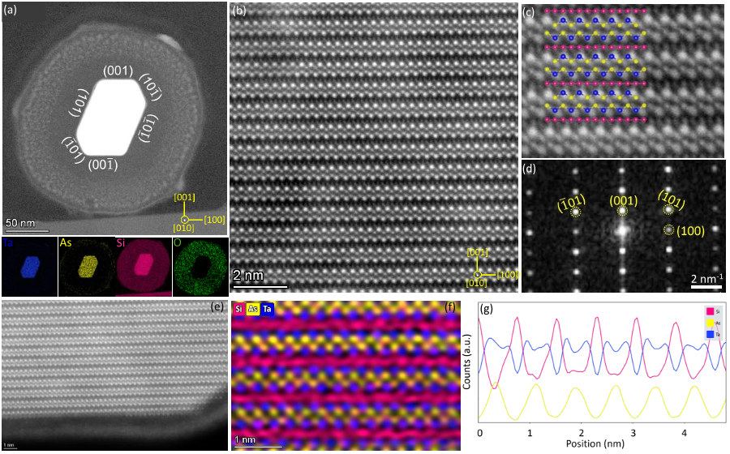
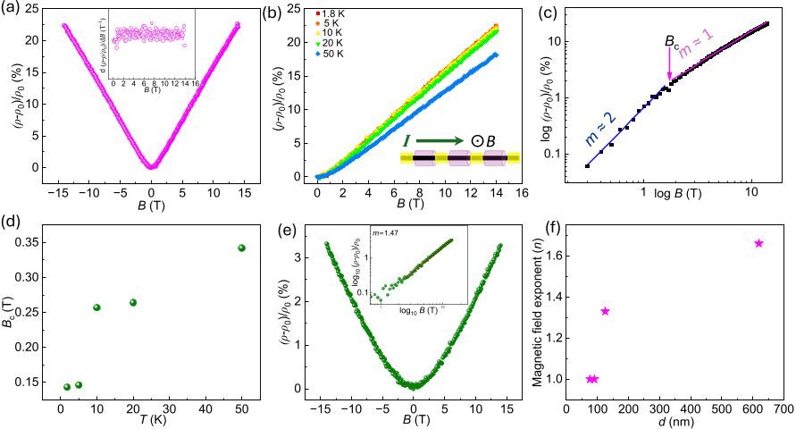

Imagine a wire so thin that its entire structure is just a few atoms across, yet it carries electrical currents in ways that defy classical expectations. Such ultra-thin nanowires, built from exotic materials called topological square-net compounds, hold the promise of revolutionizing quantum computing and next-generation electronics. Recent research has unveiled a new type of nanowire made from TaSiAs, a material with a unique atomic arrangement that supports robust surface conduction and unusual magnetic responses, potentially opening new pathways for advanced quantum devices.

> **TL;DR**
> - Researchers synthesized single-crystal TaSiAs nanowires encapsulated in a protective silicon dioxide shell, preserving pristine surfaces critical for quantum transport.
> - These nanowires exhibit topologically protected surface conduction and a distinctive linear magnetoresistance, confirmed by atomic-scale imaging and theoretical calculations.

*Note: this summary is based on a preprint — research shared ahead of formal peer review.*

Square-net materials, characterized by layers of atoms arranged in a two-dimensional square lattice, have fascinated scientists for their exotic electronic properties, including topological states that protect electrons from scattering. While bulk crystals of these materials have been studied extensively, their low-dimensional forms—like nanowires—remain largely unexplored. Low-dimensional structures can amplify quantum effects due to their confined geometry and high surface area, making them highly attractive for quantum technologies. TaSiAs, a compound combining tantalum, silicon, and arsenic atoms in a square-net lattice, represents a new frontier in this field, bridging the gap between complex bulk materials and nanoscale devices.

The TaSiAs nanowires were synthesized using a chemical vapor transport method inside a sealed quartz tube. A silicon substrate acted as both a growth surface and a silicon source, enabling the formation of a TaSiAs core surrounded by a thin, stable silicon dioxide (SiO2) shell. This core-shell structure was confirmed through scanning and transmission electron microscopy, alongside energy dispersive X-ray spectroscopy, revealing a sharp interface and uniform composition. The nanowires were then integrated into four-terminal devices by selectively etching the SiO2 shell to form electrical contacts, allowing detailed measurements of electrical resistance and magnetotransport properties. Complementary first-principles calculations based on density functional theory provided insight into the electronic band structure and topological features.

The TaSiAs nanowires demonstrated metallic conductivity with resistivity significantly lower than related bulk materials, indicating enhanced charge transport. Importantly, they exhibited non-saturating linear magnetoresistance—a rare phenomenon where the electrical resistance increases linearly with applied magnetic field without leveling off. This behavior, alongside temperature-dependent transport measurements, pointed to coherent surface conduction protected by the material’s topological nature. Atomic-resolution imaging confirmed the presence of a silicon square-net lattice extending along the wire axis, while theoretical calculations revealed multiple Dirac cones—points where conduction and valence bands meet linearly—protected by crystal symmetries. Together, these results highlight the nanowires as a platform for robust quantum transport phenomena.

This work marks the first demonstration of low-dimensional nanowires based on square-net topological materials with chemically protected surfaces. The combination of stable, pristine surfaces and unique electronic properties positions TaSiAs nanowires as promising candidates for future quantum computing components, spintronic devices, and ultra-efficient interconnects. Their linear magnetoresistance and topologically protected conduction channels could enable devices that operate reliably under varying magnetic fields and temperatures, addressing key challenges in nanoscale electronics. Furthermore, the synthetic approach offers a pathway to explore other low-dimensional topological materials with tailored quantum functionalities.

While these findings are compelling, the research is at an early stage, focusing on fundamental synthesis and characterization. The practical integration of TaSiAs nanowires into complex quantum circuits or commercial devices will require further study, including scalability, reproducibility, and interface engineering. Additionally, the precise mechanisms behind the observed magnetoresistance and surface conduction warrant deeper investigation to fully exploit their potential. As with many emerging quantum materials, translating unique physical properties into robust technologies remains a significant challenge.

## Figures

*TaSiAs nanowires with a protective SiO2 shell were made and analyzed using images and chemical maps to show their structure and composition. — Figure from Anand Roy et al., [CC BY 4.0](http://creativecommons.org/licenses/by/4.0/), caption edited.*

*TaSiAs nanowires' electrical resistance changes with size and temperature, showing unique properties compared to similar materials. — Figure from Anand Roy et al., [CC BY 4.0](http://creativecommons.org/licenses/by/4.0/), caption edited.*

*Detailed images reveal the layered atomic structure and chemical makeup of a TaSiAs core surrounded by a SiO2 shell in a tiny nanowire. — Figure from Anand Roy et al., [CC BY 4.0](http://creativecommons.org/licenses/by/4.0/), caption edited.*

*Magnetoresistance in TaSiAs nanowires changes with magnetic field, temperature, and wire size, showing unique electrical behaviors at low temperatures. — Figure from Anand Roy et al., [CC BY 4.0](http://creativecommons.org/licenses/by/4.0/), caption edited.*

## Sources

- [Square Net TaSiAs Nanowires with Topological Surface Conduction and Linear Magnetoresistance](https://arxiv.org/abs/2607.24244)
- DOI: [10.48550/arxiv.2607.24244](https://doi.org/10.48550/arxiv.2607.24244)

*This article reuses and adapts text and figures from the original research by Anand Roy et al., available via arXiv Materials Science, under the [CC BY 4.0](http://creativecommons.org/licenses/by/4.0/) license.*
