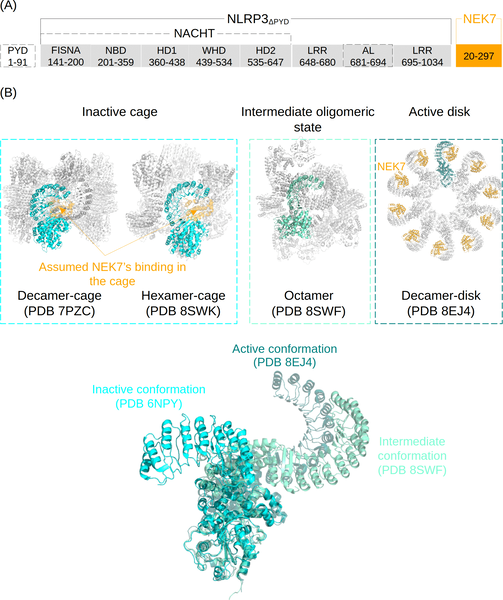
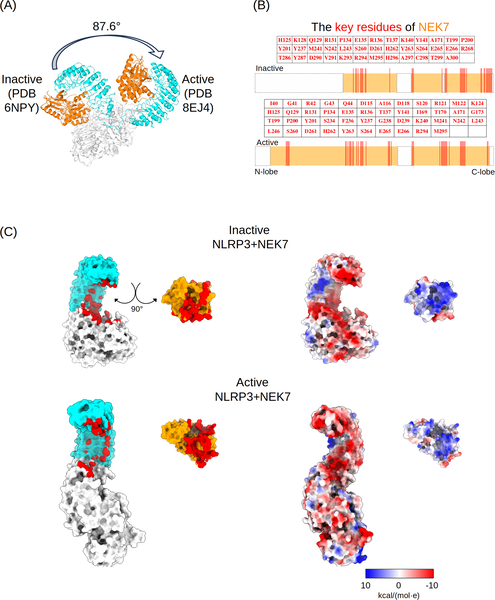

Imagine a tiny molecular switch inside your immune system, flipping to activate a powerful defense mechanism against infection and damage. This switch is a protein called NLRP3, which senses danger and triggers inflammation to protect the body. But how does NLRP3 change its shape to turn on this response? Recent research reveals that another protein, NEK7, plays a surprising and complex role in guiding NLRP3’s shape-shifting journey — a discovery that could open new doors for treating inflammatory diseases.

> **TL;DR**
> - NEK7 interacts with the NLRP3 protein in a stage-dependent manner, first priming its inactive form to start activating, then transiently slowing its progress at an intermediate stage.
> - The final activation step of NLRP3’s shape change requires assembly into larger protein complexes, meaning NEK7’s influence is crucial early on but less so later.

NLRP3 is a central player in the innate immune system, forming a multiprotein complex called the inflammasome that kickstarts inflammation by producing signaling molecules called cytokines. This process is vital for fighting infections and responding to cellular damage. However, when NLRP3 activation goes awry, it can lead to chronic inflammatory diseases. Understanding how NLRP3 switches from an inactive to an active state is therefore a key focus for developing new therapies. While it’s known that NLRP3 assembles into large oligomeric structures during activation, the detailed molecular steps—especially how individual NLRP3 units (monomers) change shape—have been challenging to capture experimentally.

To unravel these details, researchers used advanced multi-scale molecular dynamics simulations, a computational approach that models protein movements and interactions over time at atomic resolution. They simulated the conformational transitions of NLRP3 monomers both with and without the co-factor protein NEK7 bound. By combining conventional and biased sampling simulations, they mapped the energy landscape of NLRP3’s shape changes, revealing how NEK7 affects different stages of the transition from inactive to active forms.

The simulations showed that NEK7’s role is nuanced and changes across the activation timeline. Early on, NEK7 binds to the unstable inactive NLRP3 monomer and reshapes its dynamics to resemble the active state, effectively priming it for activation. In the middle stage, however, NEK7 stabilizes an intermediate conformation that is actually farther from the fully active form than if NEK7 were absent, temporarily hindering the progression. Finally, in the late stage, NEK7’s presence has little impact because a high energy barrier prevents the monomer from completing its conformational change alone. This suggests that the assembly of multiple NLRP3 monomers into larger oligomeric complexes is essential to overcome this barrier and complete activation.

These findings deepen our mechanistic understanding of how the NLRP3 inflammasome is activated at the molecular level. By revealing that NEK7 acts as both a facilitator and a checkpoint during the conformational transition of NLRP3 monomers, the study highlights potential targets for therapeutic intervention. Drugs that modulate NEK7’s interaction with NLRP3 in the early or intermediate stages could fine-tune inflammasome activation, offering new strategies to treat inflammatory diseases linked to NLRP3 dysregulation.

While the computational simulations provide valuable insights into the dynamic process of NLRP3 activation, these findings await further experimental validation to confirm the detailed molecular interactions and energy barriers. Additionally, the complexity of inflammasome assembly in living cells involves many factors beyond NEK7 and NLRP3 monomers, so translating these mechanistic insights into therapies will require comprehensive biological studies.

## Figures

*This study explores how NEK7 affects the shape changes of the NLRP3 protein involved in immune response activation.*

*NEK7 binds differently to inactive and active NLRP3, showing key contact points and charge interactions during activation.*

## Sources

- [Stage-dependent role of NEK7 in the inactive-to-active conformational transition of NLRP3 monomer](https://journals.plos.org/ploscompbiol/article?id=10.1371/journal.pcbi.1014405)
- DOI: [10.1371/journal.pcbi.1014405](https://doi.org/10.1371/journal.pcbi.1014405)
