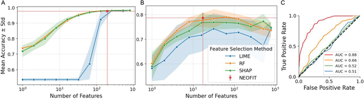
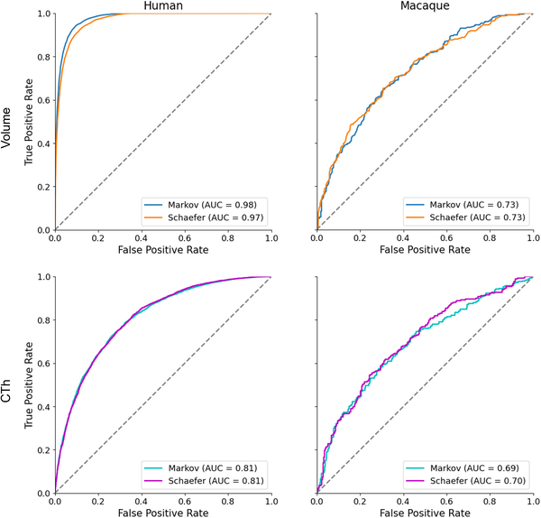

How can artificial intelligence help us uncover subtle differences between male and female brains, not just in humans but across species? Recent advances in machine learning now allow researchers to analyze complex brain imaging data with improved accuracy and interpretability. By combining smart algorithms with rigorous statistical testing, scientists can identify which brain features truly distinguish sexes, shedding light on both health implications and evolutionary biology.

> **TL;DR**
> - A novel machine learning framework using Oblique Random Forests and a new statistical test (NEOFIT) improves sex classification accuracy from brain MRI data in humans and macaques.
> - This approach not only achieves strong predictive performance but also identifies statistically significant brain regions that differ between sexes, enhancing interpretability and cross-species comparisons.

Structural brain differences between males and females have long intrigued neuroscientists, partly because they may underlie sex-specific risks for neurological and psychiatric disorders. Magnetic Resonance Imaging (MRI) provides detailed data on brain anatomy, but analyzing such high-dimensional data is challenging. Traditional machine learning methods can classify sex from brain scans but often struggle to explain which brain features drive their decisions, especially when dealing with thousands or millions of measurements. Moreover, existing explanation techniques may be noisy or computationally expensive, limiting their practical use in neuroscience.

To tackle these challenges, researchers developed an integrated framework combining Oblique Random Forests (ORFs) with a novel permutation-based feature importance testing algorithm called NEOFIT. Unlike standard random forests that split data along individual features, ORFs use linear combinations of features to form decision boundaries, capturing complex interactions in brain imaging data. NEOFIT rigorously assesses the statistical significance of each feature's contribution by generating null distributions through tree permutations and applying multiple comparison corrections. The method was first validated on simulated datasets to ensure robustness, then applied to classify biological sex from voxel-wise structural MRI and cortical thickness data in both humans and macaques, enabling direct cross-species comparisons.

The ORF models achieved strong classification performance, with area under the curve (AUC) scores exceeding 0.80 for human data and 0.70 for macaque data. Importantly, NEOFIT identified brain regions with statistically significant contributions to sex classification that aligned with known sex-dimorphic neuroanatomy. These included areas involved in limbic functions, sensory processing, and motor control. The framework outperformed or complemented existing explanation methods like LIME and SHAP by providing more stable and interpretable feature importance scores. Cross-species analysis revealed both conserved and species-specific patterns of sex-related brain structure differences, offering insights into evolutionary neurobiology.

This work represents a meaningful advance in applying machine learning to neuroimaging by balancing predictive accuracy with interpretability and statistical rigor. By revealing which brain features reliably distinguish sexes across species, the framework can inform personalized diagnostics and deepen our understanding of sex-specific brain organization and evolution. The approach’s scalability and robustness make it promising for broader applications in neuroscience and medicine, particularly where high-dimensional imaging data are involved.

While the method improves interpretability and statistical validation, the biological findings remain moderate in novelty and require further exploration to link structural differences with functional or clinical outcomes. The classification accuracy, though strong, is not perfect, reflecting inherent complexity and variability in brain anatomy. Additionally, the technical nature of the approach may limit immediate accessibility outside specialized research settings. Future work will need to extend these methods to larger and more diverse datasets and investigate how identified features relate to behavior and disease.

## Figures

*Fig 1 shows how well our method, NEOFIT, selects features to classify data, achieving high accuracy with fewer features.*

*Graphs show how well models classify sex using brain MRI data in humans and primates, comparing tissue types and methods with accuracy scores.*

## Sources

- [Statistically valid explainable black-box machine learning: applications in sex classification across species using brain imaging](https://journals.plos.org/plosone/article?id=10.1371/journal.pone.0346575)
- DOI: [10.1371/journal.pone.0346575](https://doi.org/10.1371/journal.pone.0346575)
