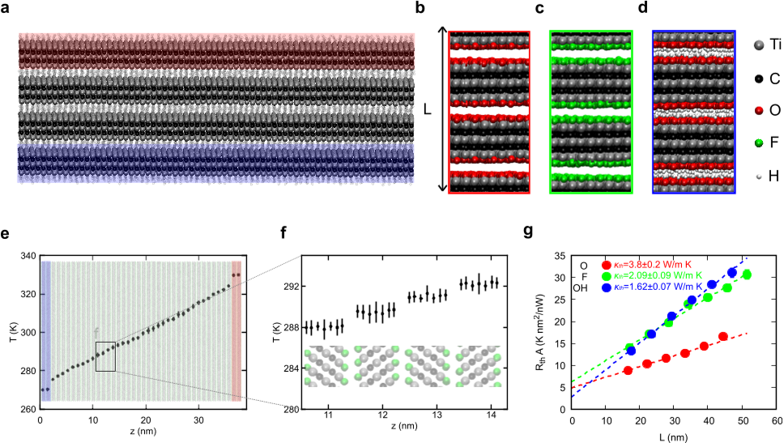
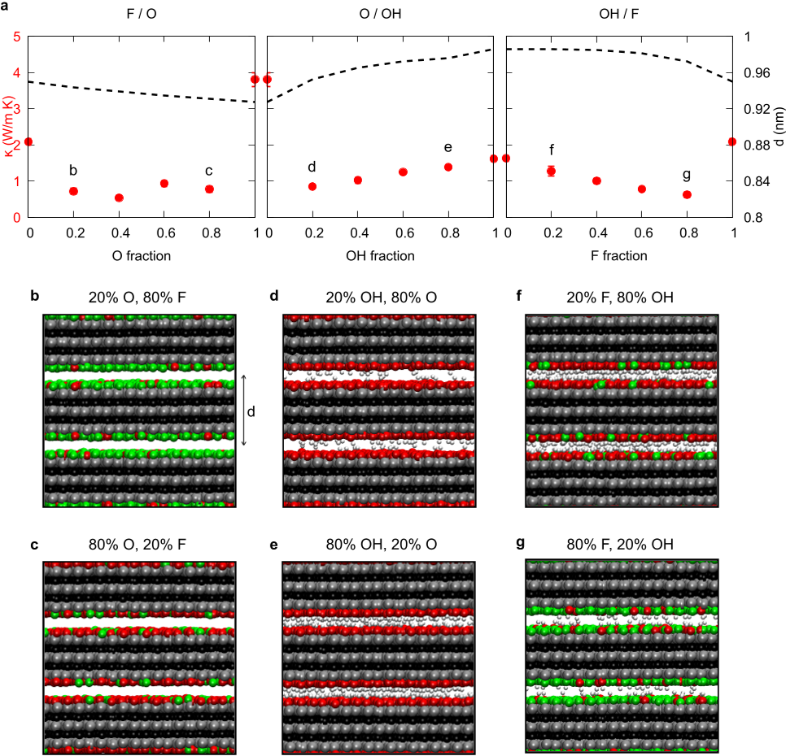
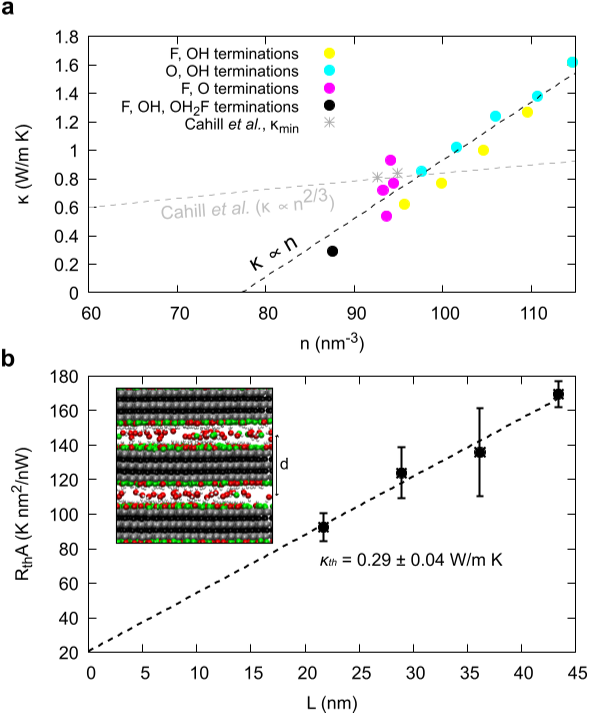

Imagine a material so thin that its layers are only a few atoms thick, yet it can block heat from passing through almost as if there were tiny vacuum gaps between them. This is the surprising behavior of MXenes, a family of two-dimensional materials attracting attention for thermal management and camouflage technologies. Recent research has uncovered that these atomic-scale vacuum gaps, created by the mix of different surface atoms on MXene layers, are key to their exceptional ability to insulate heat in the direction perpendicular to their sheets.

> **TL;DR**
> - Mixed surface atoms on MXenes create tiny vacuum gaps between layers that drastically reduce heat conduction out-of-plane.
> - This stereochemical vacuum gap explains why experiments measure much lower thermal conductivity than previous simulations predicted, and suggests ways to engineer even better thermal insulators.

*Note: this summary is based on a preprint — research shared ahead of formal peer review.*

MXenes are ultra-thin sheets made from transition metal carbides, known for their mechanical strength, low infrared emission, and layered structure. These properties make them promising candidates for controlling heat flow and even thermal camouflage. However, experimental measurements of heat conduction perpendicular to the layers have varied widely, and computational models consistently overestimated their thermal conductivity. One overlooked aspect is the chemical diversity of surface atoms—oxygen, fluorine, hydroxyl groups, and sometimes residual water—that decorate the MXene layers after synthesis. This surface chemistry affects how the layers stack and interact, but its role in heat transport remained unclear.

To investigate this, researchers performed detailed Non-Equilibrium Molecular Dynamics simulations focusing on Ti3C2Tx MXene flakes with varying surface terminations. They modeled stacks of layers with different combinations of oxygen, fluorine, and hydroxyl groups on their surfaces, including hydrated species to mimic residual water. By imposing a temperature difference across the stack and measuring the resulting heat flow, they calculated the out-of-plane thermal conductivity. The simulations accounted for atomic interactions validated against experimental structural and vibrational data, ensuring realistic modeling of the material’s behavior.

The simulations revealed that when surface terminations are homogeneous—only one type of atom—the thermal conductivity is relatively high, inconsistent with many experimental results. However, introducing a mix of surface atoms of different sizes leads to the formation of tiny vacuum gaps between layers, a stereochemically induced effect caused by the spatial mismatch of the surface groups. These gaps act as barriers to heat flow, drastically lowering the thermal conductivity to values matching experimental measurements. Moreover, adding bulkier groups, such as hydrated species, widens these gaps further, pushing thermal conductivity below theoretical minimum limits for disordered solids. The key parameter controlling heat flow was found to be the atomic density in the interlayer space: fewer atoms mean larger gaps and better insulation.

This discovery resolves a longstanding puzzle about the variability and unexpectedly low thermal conductivity of MXenes. It highlights the critical role of surface chemistry heterogeneity in controlling heat transport at the atomic scale. Importantly, it offers a practical strategy for engineering MXenes with tailored thermal properties by manipulating surface terminations and interlayer chemistry. Such control could advance applications in thermal management, infrared camouflage, and energy devices where precise heat insulation is essential. The findings also open new avenues for exploring stereochemical effects in other layered materials.

While the simulations provide strong evidence for the stereochemical vacuum gap mechanism, direct experimental observation of these atomic-scale gaps remains challenging. The models assume idealized conditions and do not capture all complexities of real MXene samples, such as defects or environmental factors. Further experimental validation is needed to confirm the presence and exact nature of these gaps. Additionally, the study focuses on a specific MXene composition, and the generality of the mechanism across other MXenes or layered materials requires further investigation.

## Figures

*Simulations show heat flow and temperature profiles in stacked Ti3C2Tx layers with different surface atoms (O, F, OH) under varied temperatures. — Figure from O. Mateos-Lopez et al., [CC0 1.0](http://creativecommons.org/publicdomain/zero/1.0/), caption edited.*

*Thermal conductivity of Ti3C2Tx varies with different surface mixes, shown with simulation snapshots for F, O, and OH terminations. — Figure from O. Mateos-Lopez et al., [CC0 1.0](http://creativecommons.org/publicdomain/zero/1.0/), caption edited.*

*Thermal conductivity varies with surface types and density in Ti3C2Tx, while heat resistance changes with thickness and surface makeup. — Figure from O. Mateos-Lopez et al., [CC0 1.0](http://creativecommons.org/publicdomain/zero/1.0/), caption edited.*

## Sources

- [Stereochemical Vacuum Gap Explains Out-of-Plane Thermal Insulation in MXenes](https://arxiv.org/abs/2607.18963)
- DOI: [10.48550/arxiv.2607.18963](https://doi.org/10.48550/arxiv.2607.18963)

*This article reuses and adapts text and figures from the original research by O. Mateos-Lopez et al., available via arXiv Materials Science, under the [CC0 1.0](http://creativecommons.org/publicdomain/zero/1.0/) license.*
