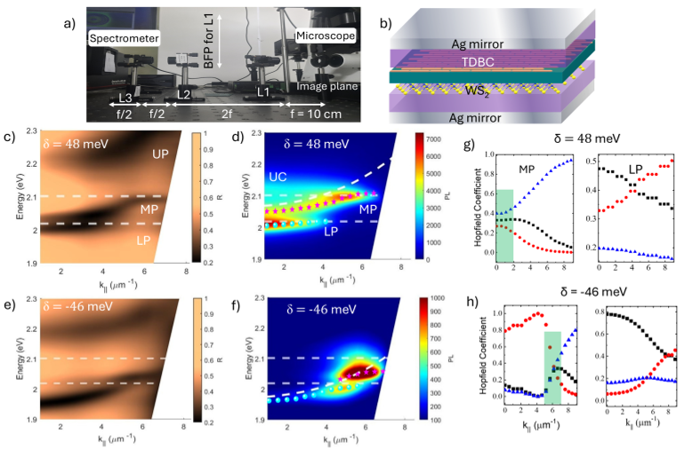
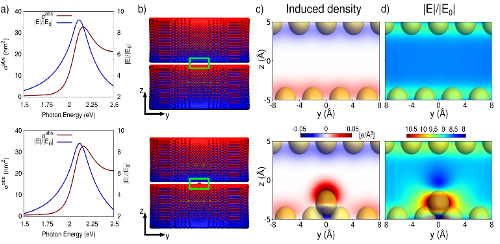
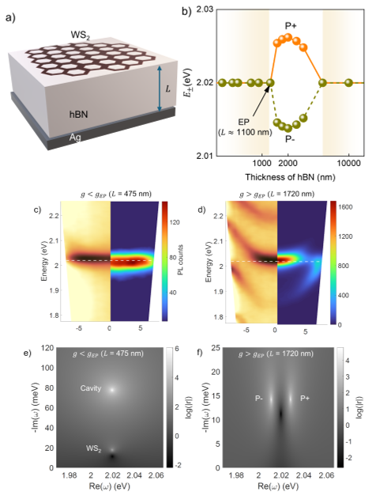
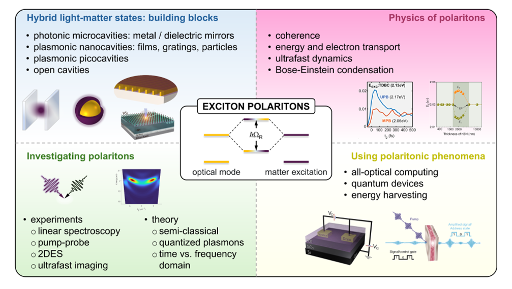

Imagine a world where light and matter don’t just interact but merge to form entirely new hybrid particles. These particles, known as polaritons, blend the properties of photons (particles of light) and excitons (excited states in materials) to create fascinating new behaviors. By trapping light in tiny cavities or near nanostructures, scientists can control how energy flows and how chemical reactions proceed, opening exciting possibilities for future technologies.

> **TL;DR**
> - Strong coupling between light and matter creates polaritons—hybrid states that mix photons and material excitations, leading to new optical, electronic, and chemical properties.
> - Using photonic microcavities, plasmonic nanostructures, and open cavities, researchers can tune polariton behavior to influence energy transport and chemical reactivity at ultrafast timescales.

*Note: this summary is based on a preprint — research shared ahead of formal peer review.*

Polaritons arise when the interaction between light confined in a cavity and excitations in a material becomes so strong that they can no longer be considered separate. Instead, they form new quantum states with mixed light and matter character. This strong coupling is identified by a phenomenon called Rabi splitting, where energy levels split into new branches that reveal the hybrid nature of polaritons. These states have been studied in various systems, from inorganic semiconductors and organic molecules to hybrid materials, often at room temperature thanks to advances in materials and cavity designs.

Scientists create polaritons by placing materials inside specially designed optical environments. Photonic microcavities, formed by reflective mirrors, trap light between them, allowing it to interact strongly with excitons in materials like two-dimensional semiconductors or organic dyes. Plasmonic nanostructures, such as gold nanoparticles, confine light to extremely small volumes, enhancing interactions even further. Open cavities and metasurfaces offer flexible platforms that can be tuned and integrated with diverse materials. To study these systems, researchers use advanced techniques like ultrafast pump-probe spectroscopy and two-dimensional electronic spectroscopy, which reveal the coherent energy exchange and dynamics of polaritons on femtosecond timescales.

Research has demonstrated that polaritons can sustain coherent oscillations—Rabi oscillations—that reflect ultrafast energy exchange between light and matter. These oscillations have been observed in microcavities embedding semiconductor quantum wells and in plasmonic systems combining gold nanostructures with molecular dyes. Such hybrid states enable new pathways for energy and charge transport that are faster and longer-ranged than in uncoupled materials. Moreover, strong coupling can modify chemical reactivity, potentially allowing control over reaction rates and outcomes by engineering the light-matter environment.

The ability to engineer hybrid light-matter states opens new frontiers in controlling material properties and chemical processes. Polaritonic systems could lead to advances in optoelectronics, energy-efficient devices, and novel photonic technologies. By manipulating how energy flows and how molecules interact with light, scientists are exploring ways to enhance charge transport, catalyze chemical reactions, and develop quantum technologies. These studies bridge physics, chemistry, and materials science, offering a versatile platform for future innovations.

While the field of polaritonics is rapidly advancing, many applications remain experimental and face challenges such as managing losses in plasmonic systems and understanding complex interactions in real-world environments. Theoretical models continue to evolve to capture the detailed molecular and quantum dynamics involved. Furthermore, translating laboratory demonstrations into practical devices will require overcoming fabrication and integration hurdles. Nevertheless, ongoing research is steadily expanding the understanding and capabilities of hybrid light-matter systems.

## Figures

*Microscopy and spectroscopy reveal light-matter interactions in a hybrid system made of WS2 and TDBC layers under different conditions. — Figure from Ben Johns et al., [CC BY 4.0](http://creativecommons.org/licenses/by/4.0/), caption edited.*

*This figure shows how tiny cavities boost light absorption and electric fields, highlighting detailed charge and field patterns at the nanoscale. — Figure from Ben Johns et al., [CC BY 4.0](http://creativecommons.org/licenses/by/4.0/), caption edited.*

*Study shows how changing layer thickness in a WS2-based system affects light-matter states, revealing unique energy behaviors and light emission patterns. — Figure from Ben Johns et al., [CC BY 4.0](http://creativecommons.org/licenses/by/4.0/), caption edited.*

*Overview of hybrid polaritonic systems showing their components, key effects, research methods, and applications in light-matter interactions. — Figure from Ben Johns et al., [CC BY 4.0](http://creativecommons.org/licenses/by/4.0/), caption edited.*

## Sources

- [Strong light-matter interactions in hybrid polaritonic systems](https://arxiv.org/abs/2605.01583)
- DOI: [10.1039/d6cc02672a](https://doi.org/10.1039/d6cc02672a)

*This article reuses and adapts text and figures from the original research by Ben Johns et al., available via arXiv Materials Science, under the [CC BY 4.0](http://creativecommons.org/licenses/by/4.0/) license.*
