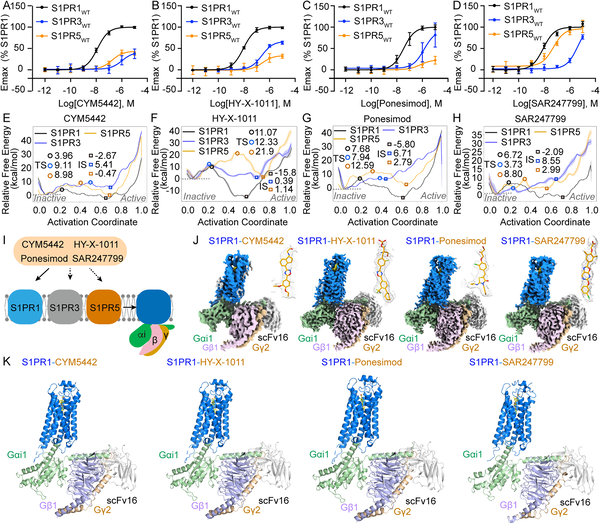
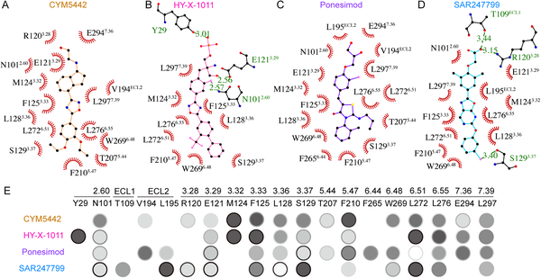
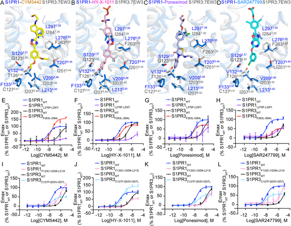
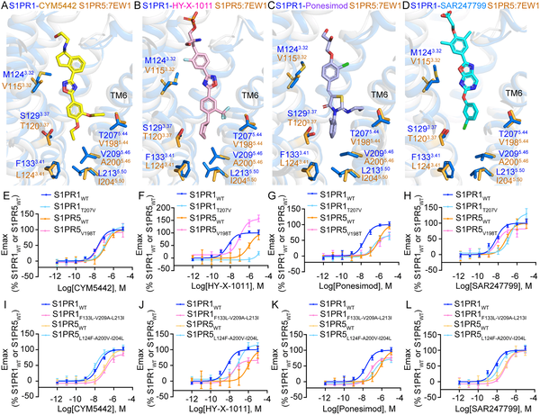

Imagine a key that fits perfectly into a lock, but only if the lock has a very specific shape. This is the challenge scientists face when designing drugs that target closely related receptors in the body. A recent study has captured detailed 3D snapshots of how certain drug molecules snugly fit into one subtype of a receptor family called sphingosine-1-phosphate receptors (S1PRs), which play critical roles in autoimmune and neurological diseases such as multiple sclerosis.

> **TL;DR**
> - Scientists used cryo-electron microscopy to reveal high-resolution structures of four drugs bound to the S1PR1 receptor subtype, showing how these drugs selectively activate S1PR1 over other closely related subtypes.
> - The study identified specific molecular features and binding orientations that explain this selectivity, providing a structural framework to design next-generation drugs with fewer side effects.

Sphingosine-1-phosphate (S1P) is a lipid molecule involved in many physiological processes, including immune cell movement and blood vessel function. It acts by binding to a family of five receptor subtypes (S1PR1 through S1PR5), each triggering different cellular responses. Because S1PR1 is especially important in regulating immune cell trafficking and maintaining the blood-brain barrier, it has become a key target for drugs treating autoimmune diseases like multiple sclerosis. However, the receptors are highly similar in structure, making it difficult to develop drugs that selectively activate only S1PR1 without affecting other subtypes, which can lead to unwanted side effects.

To unravel how drugs distinguish S1PR1 from its siblings, researchers used cryo-electron microscopy (cryo-EM) to capture four distinct drug molecules—CYM5442, HY-X-1011, Ponesimod, and SAR247799—bound to the human S1PR1 receptor complexed with its signaling partner, the Gi1 protein. They complemented these structural images with molecular dynamics simulations to explore the activation pathways of S1PR1 and related receptors S1PR3 and S1PR5. Pharmacological assays measured how effectively each drug activated these receptor subtypes, providing a comprehensive picture of drug-receptor interactions and selectivity.

The high-resolution structures revealed that all four drugs adopt extended shapes within the receptor’s binding pocket but differ in how they orient and interact with specific amino acids. Key differences in nonconserved residues—those that vary between receptor subtypes—within the binding pocket and at the interface with the Gi1 protein were found to govern selectivity. For example, branched chemical groups on the drugs increase their molecular width, causing steric clashes that prevent them from fitting well into S1PR3 and S1PR5. Additionally, polar interactions with conserved residues at the pocket’s top region influence binding strength and activation. These subtle structural distinctions explain why these drugs strongly activate S1PR1 but have reduced or no activity on other subtypes.

Understanding the precise molecular interactions that enable selective activation of S1PR1 opens new avenues for designing more targeted therapies. Such drugs could minimize side effects by avoiding activation of other receptor subtypes linked to adverse reactions like heart rate disturbances. This is especially important for treating diseases like multiple sclerosis, where current drugs can have significant limitations. The structural blueprint provided by this study offers a rational foundation for developing next-generation S1PR1 agonists with improved safety and efficacy profiles.

While these structural insights are a major step forward, drug development remains complex. The study focuses on receptor binding and activation in controlled laboratory conditions, which may not capture all biological variables present in patients. Moreover, the long-term effects of highly selective S1PR1 activation need further evaluation. Future research will be necessary to translate these molecular findings into clinically effective and safe therapies.

## Figures

*Structures and activation of S1PR1, S1PR3, and S1PR5 by four drugs show how they bind and trigger responses in these receptors.*

*Key pocket residues interact with different drugs to activate S1PR1, and mutations affect how well these drugs trigger receptor signaling.*

*Differences in key protein spots affect how S1PR1 and S1PR3 respond to four specific drug molecules.*

*Differences in key protein parts affect how four drugs selectively activate S1PR1 and S1PR5 receptors, shown by structural and activity tests.*

## Sources

- [Structural insights into subtype-specific agonist recognition by sphingosine-1-phosphate receptors](https://journals.plos.org/plosbiology/article?id=10.1371/journal.pbio.3003381)
- DOI: [10.1371/journal.pbio.3003381](https://doi.org/10.1371/journal.pbio.3003381)
