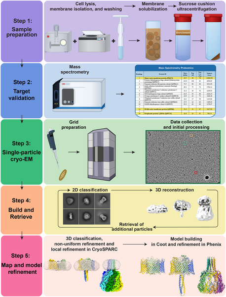

Bacteria like Campylobacter jejuni are microscopic invaders responsible for millions of infections worldwide, yet many details about how they interact with our bodies remain elusive. Recently, scientists have developed a new imaging approach that captures the detailed shapes of crucial bacterial membrane proteins directly from their natural environment. These proteins form the bacterial outer shell and play key roles in infection. Understanding their structures could illuminate how bacteria invade and survive within hosts, opening doors to new treatments.

> **TL;DR**
> - A new cryo-electron microscopy method called GENTLE enables high-resolution imaging of bacterial membrane proteins directly from native membranes without purification.
> - The study reveals the first detailed structures of three important Campylobacter jejuni outer membrane proteins—PorA, OMP50, and Cj0034c—highlighting features linked to bacterial virulence and host interaction.

Campylobacter jejuni is a leading cause of foodborne illness globally, causing symptoms ranging from diarrhea to more severe complications. This bacterium’s outer membrane proteins (OMPs) are critical for its ability to adhere to and invade host cells. However, studying these proteins has been challenging because traditional methods require extracting and purifying them, which can alter their natural structure and assembly. Moreover, many OMPs are present in low abundance and have complex architectures that are difficult to capture. Gaining detailed structural insights into these proteins in their native state is essential for understanding bacterial infection mechanisms and developing new antibiotics.

To tackle these challenges, researchers developed a technique called Gradient Enrichment of Native Targets from Lipid Environments (GENTLE). This method starts by isolating crude bacterial membranes and gently solubilizing them with detergents to preserve protein-lipid interactions. Using sucrose cushion ultracentrifugation, they enrich the membrane protein population without overexpressing or purifying individual proteins. Next, they apply advanced cryo-electron microscopy (cryo-EM) combined with a computational approach known as Build-and-Retrieve (BaR) to identify and reconstruct high-resolution 3D structures of multiple proteins simultaneously from this complex mixture. This approach allows visualization of membrane proteins as they naturally assemble in the bacterial outer membrane.

Applying GENTLE to Campylobacter jejuni membranes, the team successfully solved high-resolution structures of three key OMPs: PorA, OMP50, and Cj0034c. PorA, the most abundant porin, forms a trimeric assembly creating large pores for molecule exchange and is implicated in bacterial adhesion and virulence. Notably, one of PorA’s extracellular loops (L4) was found to be highly flexible, a feature that may help the bacterium evade the host immune system. OMP50 revealed a novel two-domain architecture with a β-barrel transmembrane domain and an α-helical periplasmic domain, and its tyrosine residues are positioned to potentially regulate host interactions via phosphorylation. The full-length Cj0034c protein was observed as a nonamer forming a channel spanning the membrane, though its exact membrane location remains to be confirmed. These structural revelations provide unprecedented insight into how these proteins assemble and function in their native bacterial context.

This study demonstrates that it is possible to obtain detailed structural information about bacterial membrane proteins directly from native membranes without the need for overexpression or purification, overcoming a major hurdle in membrane protein research. By revealing new architectures and flexible regions linked to bacterial virulence, the findings deepen our understanding of how Campylobacter jejuni interacts with its host. Such knowledge could inform the design of novel antibiotics or vaccines targeting these membrane proteins, a critical need given rising antibiotic resistance. Furthermore, the GENTLE method offers a powerful platform for studying membrane proteins from other pathogens in their natural state.

While the GENTLE approach provides high-resolution structures from native membranes, some aspects remain unresolved. For example, the precise membrane localization of Cj0034c—whether it spans the outer or inner membrane—requires further experimental validation. Additionally, although structural features suggest roles in virulence and host interaction, functional studies are needed to confirm these hypotheses. Finally, the method currently focuses on detergent-solubilized membranes, and future adaptations may be necessary to capture membrane proteins in fully native lipid environments. Despite these limitations, the study marks a significant advance in structural microbiology.

## Figures

*Fig 1 shows a simple overview of the GENTLE method, with full details available in the Methods section.*

## Sources

- [Structural insights into the outer membrane proteins PorA, OMP50 and Cj0034c from native Campylobacter jejuni membranes](https://journals.plos.org/plosbiology/article?id=10.1371/journal.pbio.3003961)
- DOI: [10.1371/journal.pbio.3003961](https://doi.org/10.1371/journal.pbio.3003961)
