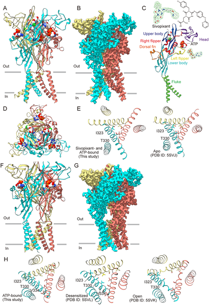
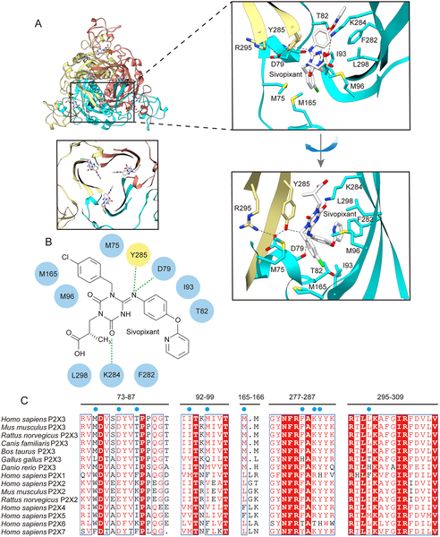
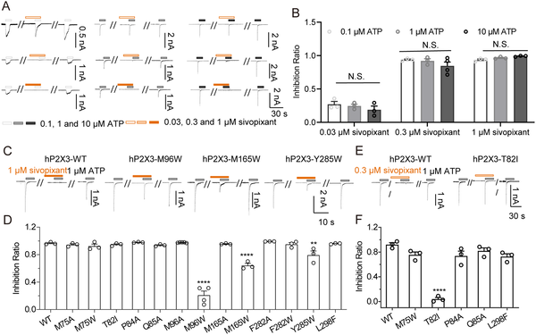
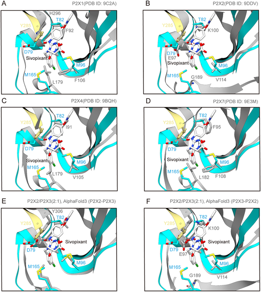

Chronic pain and persistent cough affect millions worldwide, often with limited treatment options and uncomfortable side effects. A promising target for new therapies is the P2X3 receptor, a protein on sensory nerves that senses ATP signals and triggers pain and cough reflexes. But drugs that block this receptor have struggled with unwanted effects like taste disturbances because they also affect closely related receptor subtypes. Now, cutting-edge cryo-electron microscopy reveals the detailed 3D structure of the human P2X3 receptor bound to sivopixant, a next-generation drug designed to block this receptor more selectively. This breakthrough offers fresh insights into how sivopixant works and why it might improve treatments for chronic pain and cough with fewer side effects.

> **TL;DR**
> - The human P2X3 receptor structure bound to ATP and sivopixant was solved using cryo-EM, revealing the exact binding site and conformational changes induced by the drug.
> - Sivopixant binds at an allosteric site distinct from ATP’s binding pocket, stabilizing a closed receptor conformation and selectively inhibiting P2X3 over related receptor subtypes, which may reduce side effects like taste disturbance.

P2X receptors are a family of ATP-gated ion channels that play important roles in transmitting sensory signals, including pain and cough reflexes. Among these, the P2X3 subtype is found primarily in peripheral sensory neurons and has been implicated in chronic pain and chronic cough conditions. The first approved drug targeting P2X3, gefapixant, showed promise in reducing chronic cough but caused taste disturbances due to its lack of selectivity between P2X3 homomers and P2X2/3 heteromers. This limitation has driven the development of next-generation negative allosteric modulators (NAMs) like sivopixant, designed to selectively inhibit P2X3 receptors while sparing others. However, until now, the molecular details of how these drugs achieve subtype selectivity and inhibit receptor function remained unclear.

To uncover how sivopixant interacts with the human P2X3 receptor, researchers purified the receptor protein and incubated it with ATP and sivopixant. They then used single-particle cryogenic electron microscopy (cryo-EM) to capture high-resolution 3D structures of the receptor in different states—with and without the drug bound. Complementing this, they performed electrophysiological patch-clamp recordings to measure how receptor mutations affected sivopixant’s ability to inhibit ATP-induced currents. Molecular dynamics simulations further helped model the dynamic conformational changes induced by sivopixant binding.

The cryo-EM structures revealed that sivopixant binds to a specific allosteric pocket located at the interface between subunits in the extracellular domain, distinct from the ATP-binding site. This pocket, known as the portal of the central pocket, is a hotspot for small-molecule modulation. Sivopixant’s binding stabilizes the receptor in a closed conformation, preventing the channel from opening even when ATP is present. Mutational analyses identified key amino acid residues—such as Met96, Met165, Tyr285, and Asp79—that are critical for sivopixant’s inhibitory effect. Structural comparisons with other P2X receptor subtypes showed that differences in these residues underpin sivopixant’s high selectivity for P2X3, explaining why it spares P2X2/3 heteromers and thereby reduces side effects like taste disturbance.

This study provides the first direct structural visualization of a next-generation P2X3-selective NAM bound to its receptor, illuminating the molecular basis for its subtype selectivity and mechanism of inhibition. By stabilizing a closed receptor conformation through an allosteric site, sivopixant effectively blocks P2X3 receptor activation without interfering with ATP binding. These insights not only deepen our understanding of P2X receptor pharmacology but also guide the rational design of improved therapeutics for chronic pain and cough with fewer adverse effects. Given the clinical challenges posed by current treatments, such structural knowledge is a crucial step toward safer and more effective drugs.

While the structural and functional data compellingly explain sivopixant’s selective inhibition of the P2X3 receptor, these findings are based on purified receptor proteins studied outside of the complex cellular environment. The exact effects in human tissues and patients may be influenced by additional factors such as receptor interactions and cellular context. Moreover, although molecular dynamics simulations provide supportive insights into receptor conformational changes, they are models that approximate real molecular behavior. Further clinical studies are needed to confirm that the improved selectivity observed structurally translates into better therapeutic outcomes with fewer side effects.

## Figures

*3D views of the human P2X3 receptor with ATP and sivopixant show detailed structures and binding sites from different angles.*

*This figure shows how the drug sivopixant binds to the human P2X3 receptor, highlighting key interactions and comparing related proteins across species.*

*Sivopixant reduces human P2X3 receptor currents triggered by ATP, with effects varying by ATP dose and receptor mutations.*

*Close-up views compare sivopixant binding in different P2X receptor types, highlighting subtype-specific interactions in the P2X3 receptor.*

## Sources

- [Structure of the human P2X3 receptor reveals the basis for subtype-selective inhibition by sivopixant](https://journals.plos.org/plosbiology/article?id=10.1371/journal.pbio.3003777)
- DOI: [10.1371/journal.pbio.3003777](https://doi.org/10.1371/journal.pbio.3003777)
