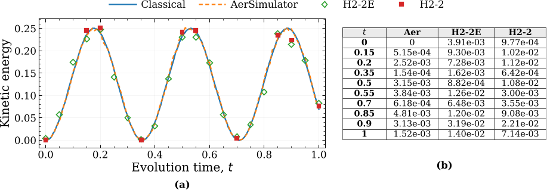

Imagine harnessing the power of a quantum computer to simulate the ripples of waves—not just a handful of points, but thousands—capturing the intricate dance of acoustic and relativistic waves on real hardware. This is no longer a distant dream but a demonstrated reality on cutting-edge trapped-ion quantum processors.

> **TL;DR**
> - Researchers developed and executed quantum circuits that simulate one- and two-dimensional wave equations on a trapped-ion quantum computer, encoding thousands of spatial points.
> - Their approach preserves the mathematical structure of wave dynamics, enabling accurate tracking of physical observables like kinetic energy with low error on current quantum hardware.

*Note: this summary is based on a preprint — research shared ahead of formal peer review.*

Wave equations are fundamental to modeling phenomena ranging from sound and seismic waves to quantum particles. Classically, solving these equations at high resolution demands massive computational resources. Quantum computers, with their ability to represent complex states efficiently, offer a promising alternative. Yet, demonstrating large-scale, accurate quantum simulations of wave equations on real hardware has been a significant challenge due to noise, gate errors, and circuit complexity.

The team focused on the acoustic wave equation in one and two dimensions, and a one-dimensional Dirac equation with variable mass, reformulating them into forms suitable for quantum simulation. They used a structure-preserving finite-difference discretization combined with the quantum Fourier transform (QFT) to encode spatial grids of up to 1024 points in one dimension and 32×32 points in two dimensions—equivalent to a quantum state space with up to 4096 dimensions. Instead of reconstructing full wave fields, they measured physically meaningful quantities like kinetic energy directly from quantum measurements. Their circuits leveraged the all-to-all connectivity of trapped-ion hardware to efficiently implement complex quantum gates.

Executing these circuits on the Quantinuum H2-2 trapped-ion processor, the researchers observed that the quantum simulations closely tracked classical reference solutions. The mean absolute error in kinetic energy measurements ranged from about 0.006 to 0.024, demonstrating impressive accuracy given the scale and complexity. They also analyzed how circuit size and gate depth scaled with grid size and evolution time, finding that gate counts grow roughly quadratically with the number of qubits encoding spatial points. Notably, their two-dimensional approach used a novel 'bright–dark' mode decomposition to eliminate certain errors common in previous methods.

This work marks a significant step forward in practical quantum simulation of physical systems. By demonstrating accurate, large-scale wave equation simulations on current trapped-ion quantum hardware, it showcases the potential of quantum processors to tackle complex physics problems beyond the reach of classical computers. The structure-preserving circuit designs and resource benchmarks provide valuable guidance for future quantum algorithm development and hardware improvements, bringing us closer to realizing quantum advantages in scientific computing.

While the results are promising, the experiments focus on periodic boundary conditions and structured, low-bandwidth inputs, which simplify the problem. The study does not claim a quantum speedup over classical methods yet, as error rates and resource demands remain substantial. Moreover, the observable measurements are limited to kinetic energy fractions rather than full wavefunction reconstructions. Continued advances in hardware fidelity and algorithmic efficiency will be necessary to extend these techniques to more general and larger-scale simulations.

## Figures

*Kinetic energy of vx over half the domain is shown with classical and quantum simulations, plus their errors compared to the classical reference. — Figure from Abhishek Shringi et al., [CC BY 4.0](http://creativecommons.org/licenses/by/4.0/), caption edited.*

## Sources

- [Structure-Preserving Quantum Simulation of Wave Equations on a Trapped-Ion Processor](https://arxiv.org/abs/2607.28499)
- DOI: [10.48550/arxiv.2607.28499](https://doi.org/10.48550/arxiv.2607.28499)

*This article reuses and adapts text and figures from the original research by Abhishek Shringi et al., available via arXiv Quantum Physics, under the [CC BY 4.0](http://creativecommons.org/licenses/by/4.0/) license.*
