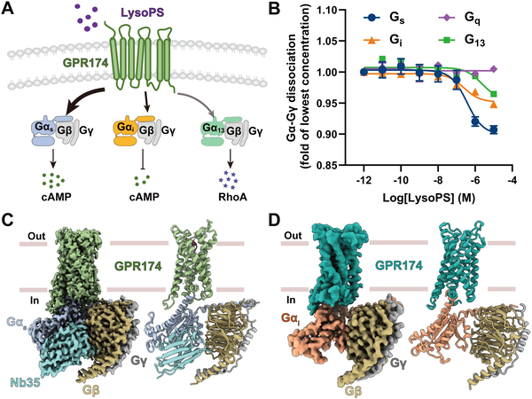
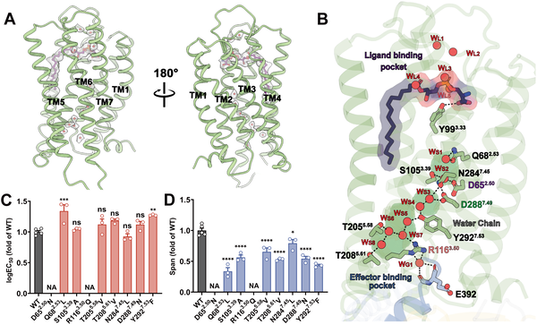
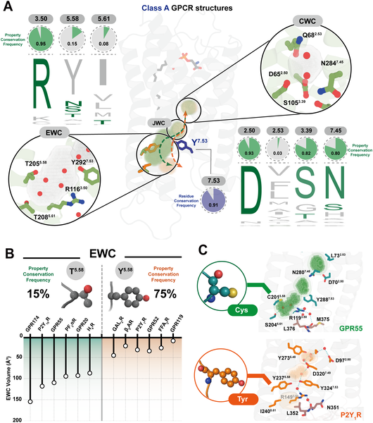
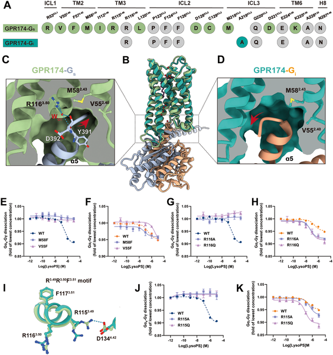

Imagine tiny water molecules acting as molecular switches inside your cells, guiding how immune receptors respond to signals. Recent advances have uncovered that water isn’t just a passive solvent but an active participant in cellular communication. In particular, the immune receptor GPR174, which plays a key role in maintaining immune balance, depends on a network of structured water molecules to activate and selectively engage different signaling pathways.

> **TL;DR**
> - High-resolution cryo-electron microscopy reveals a continuous network of water molecules inside the GPR174 receptor that stabilizes its active state and connects key structural motifs to the G protein binding site.
> - This hydration network dynamically reshapes the receptor’s intracellular cavity, enabling selective coupling to different G proteins (Gs and Gi), which modulate distinct immune responses.

G protein-coupled receptors (GPCRs) are a large family of membrane proteins that detect external signals and translate them into cellular responses by activating intracellular G proteins. GPR174 is a class A GPCR expressed mainly in immune cells and linked to autoimmune diseases like Graves’ and Addison’s disease. It can couple to multiple G proteins, notably Gs and Gi, triggering different signaling outcomes that influence immune cell behavior. While the overall structure of GPR174 activated by its ligand lysophosphatidylserine (LysoPS) was known for the Gs pathway, the role of water molecules inside the receptor and how they affect activation and G protein selectivity remained unclear.

To explore this, researchers used cryo-electron microscopy (cryo-EM) to capture high-resolution structures of human GPR174 bound to LysoPS and coupled to either Gs or Gi proteins, achieving resolutions of 2.0 Å and 3.4 Å respectively. They identified internal water molecules forming a continuous hydrogen-bond network linking important receptor motifs—the sodium-binding pocket, the NPxxY and DRY motifs—and the G protein interface. Complementing structural data, molecular dynamics simulations tracked the stability and behavior of these waters over time, while mutagenesis experiments tested the functional importance of residues coordinating the water network by measuring receptor activation through a NanoBiT G protein dissociation assay.

The study revealed that 14 structured water molecules inside GPR174 form three main clusters: one stabilizing the ligand binding pocket, another bridging conserved activation motifs, and a third linking to the intracellular G protein binding site. This hydration network acts like a molecular necklace, reinforcing the receptor’s active conformation and facilitating signal transmission. Mutations disrupting water-coordinating residues impaired receptor activation for both Gs and Gi pathways, confirming the network’s functional role. Simulations showed these waters have prolonged residence times, indicating they are tightly bound structural waters rather than transient solvent. Comparing GPR174 structures with Gs and Gi revealed subtle differences in hydration dynamics that likely contribute to selective G protein coupling. Extending their analysis, the researchers identified three hydration cavities conserved across class A GPCRs, suggesting a broader role for structured water in receptor function.

This work highlights a previously underappreciated role of internal water molecules in controlling immune receptor activation and signaling specificity. By elucidating how hydration networks stabilize active states and modulate G protein selectivity, it provides new molecular insights into GPCR function. Since GPCRs are major drug targets, understanding water-mediated mechanisms could inform the design of more selective therapeutics, particularly for immune modulation. Moreover, the identification of conserved hydration cavities offers a framework for investigating water’s role in other receptors, potentially revealing universal principles of cellular signaling regulation.

While the structural and simulation data strongly support the importance of the hydration network in GPR174 function, the exact dynamics of water molecules in living cells and their influence under physiological conditions remain to be fully explored. The study focused on two G proteins, Gs and Gi, but other signaling partners and cellular contexts may further modulate hydration effects. Additionally, translating these molecular insights into therapeutic strategies will require further work to connect hydration-mediated mechanisms with disease processes and drug responses.

## Figures

*Figure shows how GPR174 receptor is activated by LysoPS and its detailed 3D structure with different protein complexes revealed by cryo-EM.*

*This figure shows how water molecules help GPR174 receptor signal with LysoPS, and how mutations affect this process.*

*Water cavities in class A GPCRs show conserved and varied residues affecting structure and function across different receptors.*

*This figure shows how GPR174 interacts differently with G proteins Gαs and Gαi, highlighting key residues and effects of mutations on receptor activation by LysoPS.*

## Sources

- [Structured water molecules drive activation and G protein selectivity in the GPR174 receptor](https://journals.plos.org/plosbiology/article?id=10.1371/journal.pbio.3003447)
- DOI: [10.1371/journal.pbio.3003447](https://doi.org/10.1371/journal.pbio.3003447)
