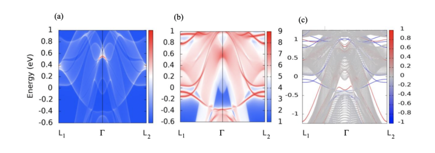
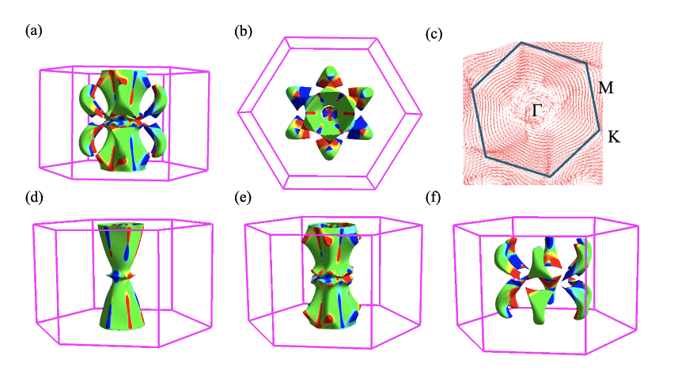
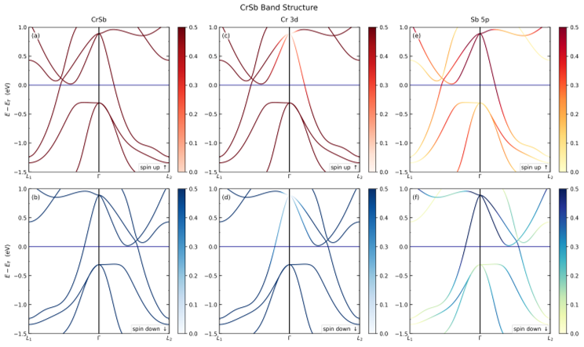
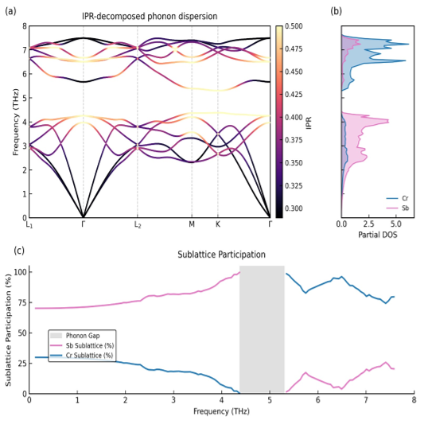

Imagine a world where the tiny magnetic spins inside a crystal can be flipped and twisted to unlock new electronic behaviors—behaviors that could one day power quantum computers. This is the promise of altermagnets, a recently discovered class of magnetic materials with unusual properties. Among these, CrSb stands out for its intriguing anomalous Hall effect, a phenomenon where electrons veer sideways under certain conditions, defying classical expectations. What happens when we tune the spin orientations in CrSb? The answer challenges long-held assumptions and opens new doors in quantum materials research.

> **TL;DR**
> - Altermagnets like CrSb exhibit an unconventional anomalous Hall effect that does not simply scale linearly with magnetization, unlike traditional magnetic materials.
> - First-principles calculations reveal that the spin orientation and crystal symmetries in CrSb lead to unique electronic and topological properties, including topological surface states and complex Berry curvature patterns.

*Note: this summary is based on a preprint — research shared ahead of formal peer review.*

The Hall effect, discovered over a century ago, describes how electrons in a conductor deflect sideways when exposed to a magnetic field, creating a measurable voltage perpendicular to the current. In ferromagnets, this effect is enhanced by the material's internal magnetization, producing what is known as the anomalous Hall effect (AHE). Traditionally, the strength of this effect was thought to scale linearly with magnetization. However, the emerging field of altermagnetism challenges this view. Altermagnets possess a unique spin arrangement where opposing spins are linked by crystal rotational symmetries, resulting in zero net magnetization but still exhibiting magnetic order. CrSb is a prime example of such a material, and understanding its anomalous Hall effect could reshape our grasp of magnetic phenomena and their quantum implications.

Researchers employed first-principles density functional theory (DFT) calculations combined with maximally localized Wannier functions to investigate CrSb’s electronic structure and magnetic properties. Using computational tools like VASP and Quantum Espresso, they simulated various spin orientations and magnetic configurations within the crystal. These simulations allowed them to map the electronic bands, phonon vibrations, Berry curvature distributions, and topological surface states. Additionally, slab models oriented along the (001) plane were constructed to explore surface phenomena, employing tight-binding models and surface Green’s functions to identify potential topological states.

The study revealed that CrSb’s spin-resolved band structure displays alternating spin polarizations connected by the crystal’s rotational symmetries, confirming its altermagnetic nature. Phonon analyses showed distinct vibrational modes associated with the Cr and Sb atoms, highlighting the material’s dynamic complexity. Crucially, the Berry curvature—a geometric property of the electronic bands related to the anomalous Hall effect—exhibited intricate momentum-dependent patterns that do not conform to the simple linear scaling with magnetization seen in conventional magnets. The simulations of different spin orientations demonstrated that the anomalous Hall conductivity varies nonlinearly with magnetization in CrSb. Furthermore, slab calculations uncovered topological surface states, indicating that CrSb hosts nontrivial quantum phases potentially useful for quantum technologies.

These findings challenge the traditional understanding that anomalous Hall conductivity scales linearly with magnetization, showing that in altermagnets like CrSb, the relationship is more complex due to symmetry and spin structure. This insight is important because the anomalous Hall effect is a key feature in spintronic devices and quantum computing architectures, especially those involving topological phases and dissipationless edge currents. By elucidating how spin orientation affects electronic transport and topological properties, this work lays foundational knowledge for designing new quantum materials and devices that exploit altermagnetic order, potentially advancing quantum information processing.

It is important to note that the study is theoretical, relying on computational models without direct experimental validation of the predicted anomalous Hall behaviors in CrSb. While the methods used are well-established in materials physics, real-world materials may exhibit additional complexities such as disorder, temperature effects, and interactions not fully captured in simulations. Future experimental investigations will be necessary to confirm these predictions and to explore how these effects manifest under practical conditions. Additionally, while the potential applications in quantum computing are promising, they remain prospective and require further development.

## Figures

*Energy spectrum and surface states of a material's (001) plane revealed through slab calculations and tight binding models. — Figure from Sreedevi Chintalapudi et al., [CC BY 4.0](http://creativecommons.org/licenses/by/4.0/), caption edited.*

*Colorful views of CrSb's Fermi surface show how electron motion affects its electrical properties in different directions. — Figure from Sreedevi Chintalapudi et al., [CC BY 4.0](http://creativecommons.org/licenses/by/4.0/), caption edited.*

*CrSb's band structure shows unique spin patterns linked by symmetry, revealing its special magnetic properties called altermagnetism. — Figure from Sreedevi Chintalapudi et al., [CC BY 4.0](http://creativecommons.org/licenses/by/4.0/), caption edited.*

*Phonon vibrations in CrSb show how atoms Cr and Sb contribute to energy and movement across different zones. — Figure from Sreedevi Chintalapudi et al., [CC BY 4.0](http://creativecommons.org/licenses/by/4.0/), caption edited.*

## Sources

- [Study of the Anomalous Hall effect by tuning the spin orientation in the Altermagnetic material CrSb](https://arxiv.org/abs/2607.29646)
- DOI: [10.48550/arxiv.2607.29646](https://doi.org/10.48550/arxiv.2607.29646)

*This article reuses and adapts text and figures from the original research by Sreedevi Chintalapudi et al., available via arXiv Materials Science, under the [CC BY 4.0](http://creativecommons.org/licenses/by/4.0/) license.*
