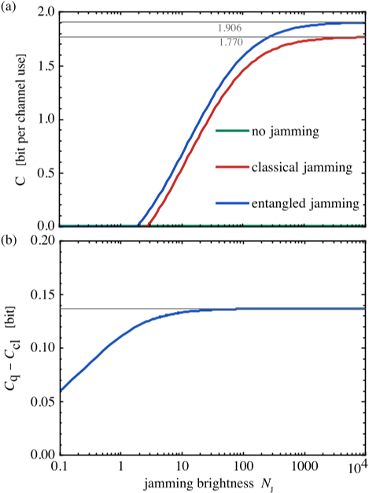
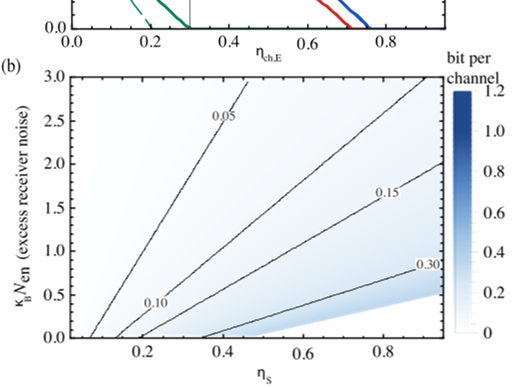
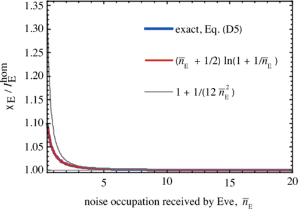

How can quantum entanglement help keep your messages safe from eavesdroppers? Imagine a jamming signal that disrupts hackers but leaves your own receiver clear and noise-free. This is the promise of a novel quantum-enhanced jamming protocol that pushes noise below classical limits, improving secure communication in ways previously thought impossible.

> **TL;DR**
> - A new jamming method uses quantum entanglement to reduce self-interference noise below classical limits, allowing legitimate receivers to cancel out jamming noise while still disrupting eavesdroppers.
> - This protocol supports bright classical message transmission without requiring a full quantum channel, offering practical improvements for secure optical and microwave communication systems.

*Note: this summary is based on a preprint — research shared ahead of formal peer review.*

In secure communication, one common challenge is that artificial noise intended to block eavesdroppers also interferes with the legitimate receiver’s signal. Traditional methods try to steer or cancel this noise but face fundamental limits, especially due to unavoidable quantum shot noise. Quantum key distribution offers security based on quantum mechanics but requires fragile quantum states and dedicated low-noise channels, limiting practical deployment. Between these extremes lies an approach where quantum resources enhance classical communication security without carrying the message in quantum states. The new correlated jamming protocol fits this niche by using quantum correlations to suppress the jammer’s noise at the legitimate receiver while maintaining its disruptive effect on eavesdroppers.

The protocol involves a sender (Alice) transmitting a bright classical signal to a receiver (Bob) over a channel that an eavesdropper (Eve) can tap. Bob generates a correlated two-mode noise source: one mode is broadcast as a jamming field, and the other, called the idler, is retained locally. Eve receives the full noisy jamming field without access to the idler, so her channel is degraded by the noise. Bob, however, uses an optimized joint measurement combining the received signal and the retained idler to cancel correlated noise fluctuations. The key innovation is using an entangled two-mode squeezed-vacuum (TMSV) source, whose quantum correlations surpass classical limits and reduce Bob’s residual noise below the vacuum noise floor, a level unattainable by classical correlations alone. The protocol accounts for realistic channel losses and imperfect idler storage, ensuring practical relevance.

The analysis shows that classical correlated noise sources can only reduce Bob’s self-jamming noise down to the vacuum noise level, meaning no improvement beyond the unjammed baseline. In contrast, the entangled TMSV source achieves sub-vacuum residual noise, effectively lowering Bob’s noise floor. This quantum advantage grows with the brightness of the jamming source and is bounded by the transmissivity of the jamming path back to Bob. Importantly, the protocol maintains positive secrecy capacity even when Eve’s channel is stronger than Bob’s, and it remains robust against advanced collective attacks on Eve’s received states. The scheme supports bright classical message transmission and does not require an end-to-end quantum channel, making it compatible with existing communication infrastructure.

This work introduces a practical quantum-enhanced jamming technique that overcomes fundamental limits of classical jamming by exploiting entanglement. It offers a new tool for physical-layer security, potentially improving secure communication in optical and microwave networks, especially in covert or power-constrained scenarios. By lowering noise below classical limits, it enables legitimate receivers to better distinguish signals from jamming noise, enhancing secrecy capacity even under challenging conditions. This approach bridges classical and quantum communication methods, leveraging quantum correlations as a local resource without the need for fragile quantum message states or dedicated quantum channels.

While the theoretical framework is robust and well-grounded in quantum optics, the protocol currently lacks experimental validation and real-world demonstrations. Practical implementation challenges include generating and storing high-quality entangled states with minimal loss and integrating the optimized joint measurement techniques into existing communication systems. Additionally, the model assumes a passive eavesdropper and idealized channel parameters; future work must consider active adversaries and more complex channel dynamics. Nonetheless, the results provide a promising direction for enhancing secure communication using quantum resources.

## Figures

*Secrecy capacity rises with jamming brightness, showing quantum methods outperform classical ones, reaching higher data rates under specific conditions. — Figure from S. Barzanjeh et al., [CC0 1.0](http://creativecommons.org/publicdomain/zero/1.0/), caption edited.*

*Jamming boosts secure communication by raising the eavesdropper's cutoff point and entanglement further improves this gain under various noise conditions. — Figure from S. Barzanjeh et al., [CC0 1.0](http://creativecommons.org/publicdomain/zero/1.0/), caption edited.*

*This graph shows how noise affects Eve's information advantage, with jamming reducing her gain as noise increases from 0.5 to 20. — Figure from S. Barzanjeh et al., [CC0 1.0](http://creativecommons.org/publicdomain/zero/1.0/), caption edited.*

## Sources

- [Sub-Vacuum Jamming for Secure Communication](https://arxiv.org/abs/2608.06720)
- DOI: [10.48550/arxiv.2608.06720](https://doi.org/10.48550/arxiv.2608.06720)

*This article reuses and adapts text and figures from the original research by S. Barzanjeh et al., available via arXiv Quantum Physics, under the [CC0 1.0](http://creativecommons.org/publicdomain/zero/1.0/) license.*
