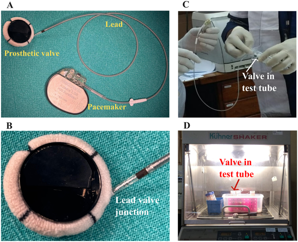

What if a tiny zap of electricity could help prevent dangerous blood clots on artificial heart valves? Mechanical heart valves are life-saving devices for many patients, but they come with a major drawback: they tend to trigger blood clot formation, requiring patients to take blood thinners for life. Now, scientists have designed a new kind of mechanical heart valve that uses a mild electrical charge to mimic nature’s own anti-clotting shield, potentially making these valves safer and reducing the need for lifelong anticoagulants.

> **TL;DR**
> - Mechanical heart valves often cause blood clots, necessitating lifelong blood thinning medication with associated risks.
> - Applying a mild negative electrical potential (~0.5 V) to the valve surface in vitro mimics the natural anti-thrombotic glycocalyx of blood vessels and reduces platelet adhesion without damaging blood cells.

Mechanical heart valves (MHVs) are among the most durable options for replacing damaged heart valves, especially in younger patients. However, their synthetic surfaces tend to attract platelets and trigger blood clot formation, which can lead to serious complications like stroke. To prevent this, patients must take anticoagulant drugs such as warfarin for life, which carry risks of bleeding and require careful monitoring. Natural blood vessels avoid clotting through a thin, carbohydrate-rich layer called the glycocalyx, which carries a negative electrical charge that repels platelets and proteins. Inspired by this, researchers sought to recreate this anti-clotting effect on MHVs by applying a mild electrical charge to the valve surface.

The research team modified standard bileaflet mechanical heart valves by attaching an electrode connected to a programmable pacemaker device. This setup delivered a weak negative electrical potential (0, 0.25, or 0.5 volts) to the blood-contacting surfaces of the valve. The valves were then immersed in human platelet-rich plasma or whole blood at body temperature for 30 minutes under gentle agitation. Researchers measured blood cell counts, markers of platelet activation and coagulation, and examined valve surfaces using scanning electron microscopy (SEM) to assess clot formation and cell adhesion.

The study found that valves activated with a 0.5-volt electrical potential had the highest area free of platelet and cellular deposits—about 96%—compared to 86% for uncharged controls and 58% for 0.25 volts. Importantly, the electrical field did not cause hemolysis (destruction of red blood cells) or activate coagulation pathways, as blood cell counts and platelet activation markers remained within normal ranges. These results suggest that a mild negative charge can reproduce the anti-thrombotic behavior of the natural vascular glycocalyx, preventing platelet adhesion without harming blood cells.

This innovative approach offers a promising strategy to improve the safety of mechanical heart valves by reducing their tendency to form clots without relying solely on systemic anticoagulation. If further validated in animal models and clinical trials, electrically activated valves could decrease patients’ dependence on blood thinners, lowering the risk of bleeding complications and improving quality of life. Moreover, this bioengineering concept harnesses the body's own natural mechanisms, potentially leading to more durable and biocompatible heart valve prostheses.

While the in vitro results are encouraging, this study was conducted on a small number of valves in controlled laboratory conditions. The complex environment inside a living body may present additional challenges, such as interactions with immune cells and long-term durability of the electrical system. Further research involving animal models and eventually human trials will be necessary to confirm safety, efficacy, and practical feasibility before this technology can be applied clinically.

## Figures

*Setup showing an electrically activated prosthetic valve connected to a pacemaker, tested in blood at 35°C for 30 minutes to check blood compatibility.*

## Sources

- [Surface anticoagulation of mechanical heart valves using electrically induced biomimetic glycocalyx: An in-vitro study to assess hemocompatibility and optimal voltage](https://journals.plos.org/plosone/article?id=10.1371/journal.pone.0336760)
- DOI: [10.1371/journal.pone.0336760](https://doi.org/10.1371/journal.pone.0336760)
