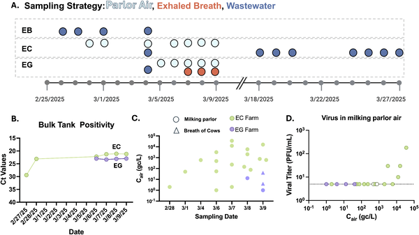
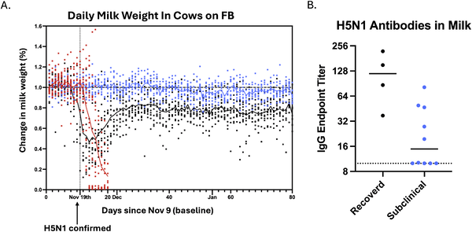
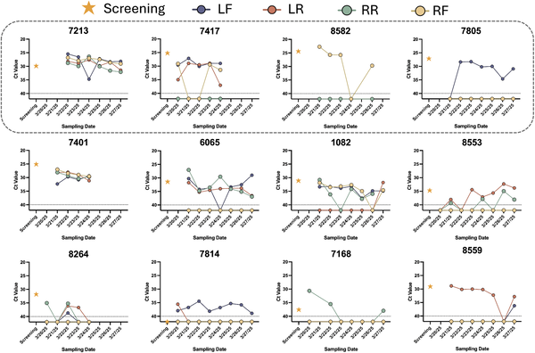

When we think of bird flu, images of sick birds or poultry farms often come to mind. But what if this virus was quietly circulating in dairy cows, spreading through the air they breathe and the water they share — all without obvious signs of illness? Scientists investigating outbreaks of the highly pathogenic H5N1 influenza virus on California dairy farms have uncovered surprising new ways this virus might be moving between cows, and potentially to humans.

> **TL;DR**
> - Infectious H5N1 virus was detected in the air inside milking parlors and in farm wastewater, suggesting airborne and environmental transmission routes beyond direct contact with milk.
> - Many cows carried the virus without showing symptoms, shedding virus in milk and breath, and developing antibodies — indicating subclinical infections that could silently spread H5N1 on farms.

Highly pathogenic avian influenza H5N1 has long been a concern due to its potential to infect humans and cause severe disease. While it primarily affects birds, recent outbreaks have shown that dairy cattle can become infected. California, the largest dairy-producing state in the U.S., has seen hundreds of herds test positive since 2024. Traditionally, transmission was thought to occur mainly through direct contact with contaminated milk or milking equipment. However, the exact ways the virus spreads among cows and from cows to humans on farms have remained unclear.

To explore how H5N1 might be transmitted on dairy farms, researchers conducted extensive surveillance on 14 infected farms across California. They collected air samples inside milking parlors and housing pens, tested wastewater streams that include discarded milk and cleaning water, and sampled milk from individual quarters of cows’ udders over time. Advanced air sampling devices captured aerosols and droplets, while sensitive molecular tests detected viral RNA and infectious virus. Genetic sequencing was used to analyze viral variants present in environmental samples. Antibody testing of milk helped identify cows with past or ongoing infections, even if they showed no symptoms.

The study found infectious H5N1 virus floating in the air within milking parlors, with viral RNA also detected in the exhaled breath of cows. Wastewater samples similarly contained infectious virus. Genetic analysis revealed unique viral variants in the air and wastewater, some carrying mutations associated with adaptation to mammals, raising concerns about potential human susceptibility. Importantly, many cows were infected without showing clinical signs like mastitis, yet shed virus in their milk and breath. Antibodies against H5N1 were found in milk from asymptomatic cows, confirming subclinical infections. The distribution of virus-positive milk quarters varied by cow and over time, suggesting that transmission is not solely due to contaminated milking equipment.

These findings broaden our understanding of how H5N1 spreads on dairy farms. The presence of infectious virus in air and wastewater highlights additional pathways for transmission that had been underappreciated. Subclinical infections mean that many cows could silently harbor and spread the virus, complicating detection and control efforts. For farm workers and public health officials, recognizing airborne and environmental transmission routes is critical for improving biosecurity measures, protecting animal health, and reducing zoonotic risks. This research underscores the need for comprehensive surveillance strategies that consider multiple transmission modes to better manage H5N1 outbreaks in livestock.

While this study provides valuable insights, it is based on sampling from a limited number of farms and regions, and viral detection in environmental samples does not always equate to efficient transmission. The exact risk of infection to humans from airborne or wastewater sources on farms remains to be fully quantified. Further research is needed to determine how these findings translate to real-world transmission dynamics and to develop targeted interventions. Additionally, the presence of mammalian-adaptive mutations in viral variants warrants close monitoring but does not confirm increased human infectivity at this stage.

## Figures

*Air and milk samples from California dairy farms showed presence and levels of infectious H5N1 virus over time.*

*Milk from cows with mild or recovered illness showed different milk drops and levels of antibodies against H5 virus.*

*H5N1 virus levels varied in milk from different udder quarters of infected cows over time, with some treated for mastitis or sent to slaughter.*

## Sources

- [Surveillance on California dairy farms reveals multiple possible sources of H5N1 influenza virus transmission](https://journals.plos.org/plosbiology/article?id=10.1371/journal.pbio.3003761)
- DOI: [10.1371/journal.pbio.3003761](https://doi.org/10.1371/journal.pbio.3003761)
