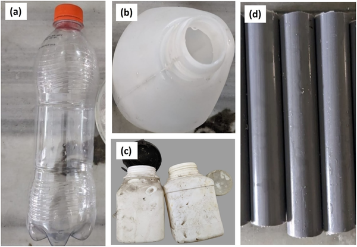
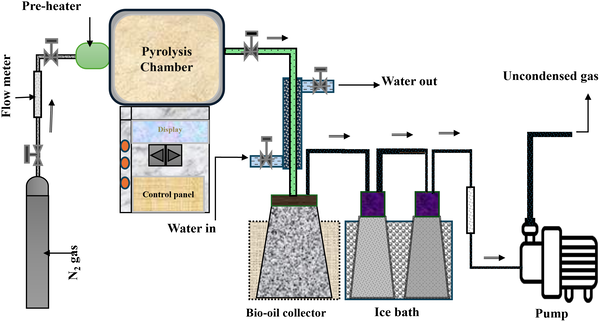
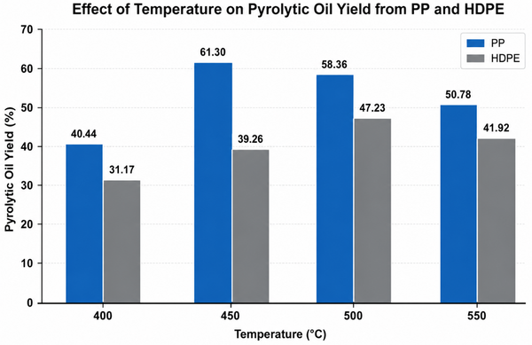

What if the plastic bottles, bags, and packaging piling up in landfills and oceans could instead fuel your car or power a generator? This idea is no longer just science fiction. Researchers are developing ways to transform waste plastics into renewable fuels through a process called pyrolysis, which uses heat to break down plastics into valuable liquid oils. A recent study from Bangladesh offers new insights into optimizing this process for different types of plastics, bringing us closer to a sustainable solution for plastic pollution and energy shortages.

> **TL;DR**
> - Scientists optimized pyrolysis conditions to convert common plastics like PET, PVC, PP, and HDPE into bio-oils rich in hydrocarbons suitable for fuels such as gasoline and diesel.
> - The study used advanced chemical analyses to characterize the fuel quality and examined the solid char byproduct for potential industrial uses, demonstrating a comprehensive approach to plastic waste valorization.

Plastic production has skyrocketed globally, exceeding 300 million metric tonnes annually, with a significant portion ending up as municipal waste. In Bangladesh, plastic consumption per person has risen sharply, intensifying the need for effective waste management strategies. Traditional disposal methods struggle to keep pace, and plastics’ resistance to degradation means they persist in the environment for centuries. Meanwhile, fossil fuel reserves are depleting, driving demand for renewable energy alternatives. Pyrolysis, a thermal decomposition process conducted without oxygen, offers a promising route to convert plastic waste into liquid fuels and solid residues, potentially addressing both waste and energy challenges simultaneously.

The researchers collected post-consumer plastic waste from municipal collection points in Dhaka, sorting it into four main types: polyethylene terephthalate (PET), polyvinyl chloride (PVC), polypropylene (PP), and high-density polyethylene (HDPE). Using a stainless-steel batch reactor heated electrically, they subjected these plastics to pyrolysis at temperatures ranging from 300 to 550 °C under an oxygen-free nitrogen atmosphere. By carefully adjusting temperature and process parameters for each plastic type, they maximized the yield of liquid bio-oil. The pyrolysis vapors were condensed into liquids, while solid char remained in the reactor. The team then analyzed the bio-oils using Fourier-transform infrared spectroscopy (FTIR) and gas chromatography-mass spectrometry (GC-MS) to identify their chemical composition. The solid char was characterized using scanning electron microscopy (SEM) and X-ray diffraction (XRD) to explore its potential industrial applications.

The study found that optimal pyrolysis temperatures varied by plastic type: 500 °C for PET, PVC, and HDPE, and 450 °C for PP, yielding up to 61.3% liquid oil from PP and 47.23% from HDPE. The bio-oils primarily contained hydrocarbons with carbon chains ranging from C6 to C16, aligning closely with components found in naphtha, gasoline, and diesel fuels. Chemical analyses revealed that PP-derived oils were rich in paraffinic hydrocarbons, while HDPE oils contained significant olefins and naphthenes, both valuable for fuel applications. The solid char byproducts exhibited structural properties suggesting usefulness in various industrial contexts. These results demonstrate that tailored pyrolysis can efficiently convert different plastic wastes into renewable fuels with promising quality.

This research advances the field of sustainable waste management by providing a detailed, optimized approach to converting plastic waste into renewable biofuels. By tailoring pyrolysis conditions to specific plastic types and thoroughly characterizing the resulting fuels and residues, the study offers practical pathways to reduce plastic pollution and supplement fossil fuel supplies. Such technologies could be especially impactful in rapidly urbanizing regions like Bangladesh, where plastic waste accumulation and energy demand are both high. Beyond energy recovery, the valorization of solid char byproducts adds economic and environmental value, supporting circular economy principles. Overall, this work contributes to developing scalable, efficient methods for turning a persistent environmental problem into a resource.

While promising, the pyrolysis process faces challenges before widespread adoption. The variability in plastic waste composition and contamination can affect product consistency and quality, requiring careful feedstock sorting and preprocessing. The energy input for pyrolysis and the management of non-condensable gases must be optimized to ensure net environmental benefits. Additionally, scaling laboratory findings to industrial levels involves engineering complexities and economic considerations. Further research is needed to evaluate long-term sustainability, lifecycle emissions, and integration with existing waste management systems. Nonetheless, this study lays important groundwork for developing practical and environmentally responsible plastic-to-fuel technologies.

## Figures

*Photos of collected plastic waste types: PET, PP, HDPE, and PVC.*

*Diagram of the pyrolysis plant showing the reactor, temperature control, nitrogen flow, and bio-oil collection system.*

*Pyrolysis of PP and HDPE plastics at various temperatures shows how they break down under heat.*

## Sources

- [Sustainable conversion of waste plastics to biofuel: Process insights and fuel characteristics](https://journals.plos.org/plosone/article?id=10.1371/journal.pone.0354825)
- DOI: [10.1371/journal.pone.0354825](https://doi.org/10.1371/journal.pone.0354825)
