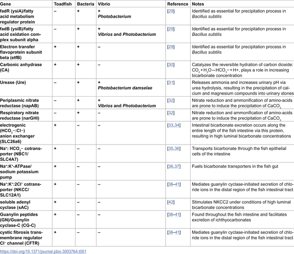

Did you know fish guts might help build the ocean’s carbon cycle? Marine fish produce tiny calcium carbonate crystals inside their intestines, contributing to the ocean’s inorganic carbon balance. But until recently, the biological details behind this process remained a mystery. Now, scientists have discovered that bacteria living symbiotically in fish guts may play a key role in forming these carbonate deposits, revealing a surprising partnership beneath the waves.

> **TL;DR**
> - Marine fish generate magnesium-rich calcium carbonate crystals in their intestines as part of osmoregulation, contributing substantially to ocean carbonate production.
> - Vibrio bacteria in the Gulf toadfish gut express genes that promote calcium carbonate precipitation, suggesting a symbiotic role in this process.

The ocean is a major player in the global carbon cycle, exchanging vast amounts of carbon dioxide with the atmosphere. Marine organisms contribute to this cycle through processes like photosynthesis and calcification. Among calcifiers, marine fish produce calcium carbonate crystals—called ichthyocarbonates—in their guts, which they excrete into the ocean. These crystals help fish manage salt and water balance in salty seawater. Remarkably, fish carbonate production rivals or even exceeds that of well-known calcifiers like coccolithophores and foraminifera. Despite this importance, the biological mechanisms driving carbonate formation inside fish intestines have remained unclear.

To explore the role of gut bacteria in calcium carbonate formation, researchers studied the Gulf toadfish (Opsanus beta), a marine fish known for its well-characterized intestinal calcification. They exposed toadfish to different salinity levels common in their natural habitat to stimulate carbonate precipitation. Samples were taken from distinct gut regions including the anterior and posterior intestines, intestinal fluid, and the calcium carbonate precipitates themselves. Using 16S rRNA gene metabarcoding, the team profiled the microbial communities across these gut regions. They also performed meta-transcriptomic analyses to identify which genes were actively expressed by both the fish and their gut bacteria, focusing on genes linked to carbonate precipitation.

The study revealed that Vibrio bacteria were highly abundant in the calcium carbonate precipitates within the toadfish gut, especially at higher salinities. Specifically, the bacterium Photobacterium damselae expressed the transcriptional activator ureR, which regulates urease production. Urease catalyzes the breakdown of urea into ammonia and bicarbonate ions, increasing local bicarbonate concentration and promoting calcium carbonate precipitation. Alongside the fish’s own enzymes, these bacteria appear to contribute metabolically to the formation of ichthyocarbonates. This suggests that calcium carbonate precipitation in marine fish is not solely a host-driven process but a functional symbiosis between fish and their gut microbiota.

This discovery expands our understanding of marine biomineralization by highlighting a previously unrecognized microbial partner in fish carbonate production. Just as photosynthetic symbionts enable corals to build reefs, gut bacteria may assist fish in producing carbonate minerals that influence ocean chemistry. Given that marine fish contribute an estimated 0.33 to 9.03 petagrams of calcium carbonate annually—comparable to major planktonic calcifiers—this symbiosis could have significant implications for global carbon cycling and climate models. Understanding these microbial interactions may refine predictions of how oceanic carbon fluxes respond to environmental changes such as rising temperatures and ocean acidification.

While the evidence strongly suggests a symbiotic role for Vibrio bacteria in calcium carbonate precipitation, further research is needed to confirm the exact mechanisms and quantify bacterial contributions relative to the host fish. The study focused on one species under controlled salinity conditions, so generalizing findings across diverse marine fish species and natural environments requires additional investigation. Moreover, the complex interplay between host physiology, microbial metabolism, and environmental factors warrants deeper exploration to fully understand how this symbiosis influences oceanic carbonate production over time.

## Figures

*Table showing genes linked to CaCO3 formation, with plus (+) for presence and minus (−) for absence, plus Vibrio species details.*

## Sources

- [Symbiotic bacteria may support calcium carbonate precipitation in the Gulf toadfish](https://journals.plos.org/plosbiology/article?id=10.1371/journal.pbio.3003764)
- DOI: [10.1371/journal.pbio.3003764](https://doi.org/10.1371/journal.pbio.3003764)
