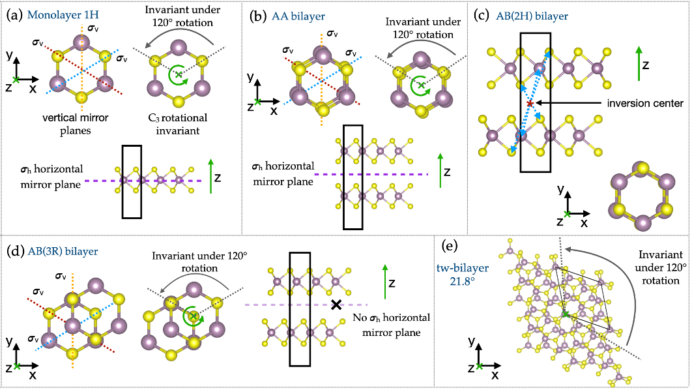
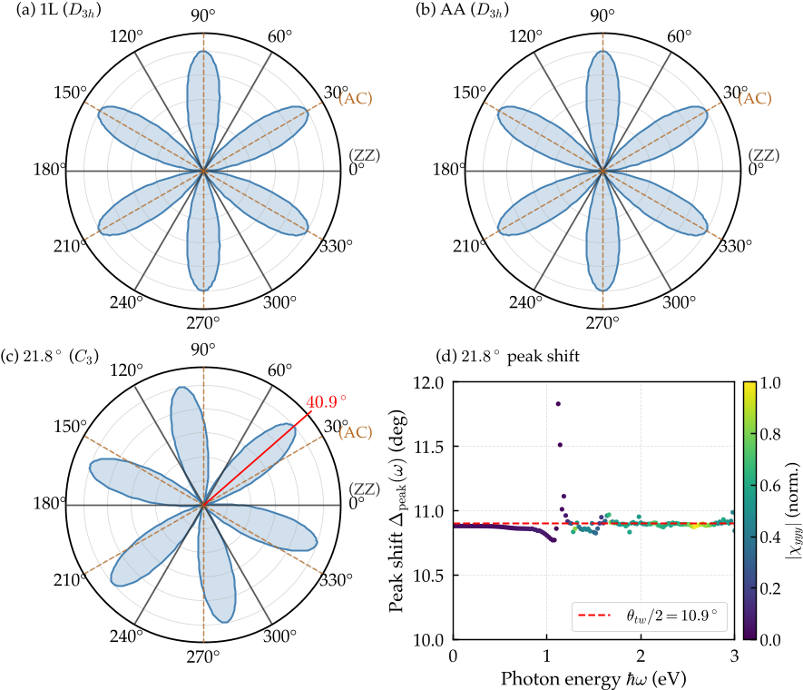
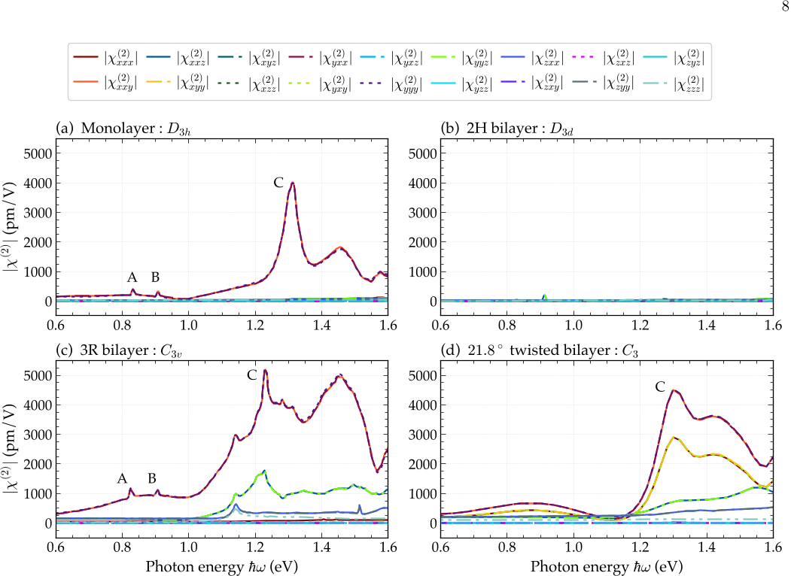

Imagine taking two ultra-thin sheets of a material just a few atoms thick and rotating one slightly against the other. This tiny twist can dramatically change how the stack interacts with light, causing it to shine differently when illuminated by lasers. Scientists have long been fascinated by these so-called 'twistronics' effects, but understanding and predicting exactly how twisting alters optical properties has remained a challenge. Now, by combining symmetry principles with detailed calculations, researchers have cracked the code for molybdenum disulfide (MoS2) bilayers, revealing a direct and predictable link between twist angle and the material’s nonlinear optical response.

> **TL;DR**
> - Twisting two layers of MoS2 breaks certain symmetries and activates new components of the material’s nonlinear optical response, measurable via second-harmonic generation (SHG).
> - The angle by which the SHG light pattern rotates is locked to half the structural twist angle, providing a wavelength-independent optical method to precisely determine twist angles in 2D materials.

*Note: this summary is based on a preprint — research shared ahead of formal peer review.*

Two-dimensional transition metal dichalcogenides (TMDs) like MoS2 have emerged as promising materials for advanced optics due to their strong light-matter interactions and tunable properties. In their monolayer form, MoS2 lacks inversion symmetry, allowing it to generate light at twice the frequency of incoming laser light—a phenomenon called second-harmonic generation (SHG). When two such layers are stacked, their relative orientation and stacking order can either preserve or break symmetries, drastically altering their SHG response. Understanding these effects is crucial for designing van der Waals heterostructures with tailored optical functionalities, but the complexity of possible stacking configurations has made this a difficult problem.

To tackle this, the researchers developed a comprehensive symmetry-based framework that classifies MoS2 bilayer structures into four point groups (D3h, D3d, C3v, and C3) depending on their stacking and twisting. Using group theory, they determined which components of the second-order susceptibility tensor χ^(2) are allowed or forbidden by symmetry. These theoretical predictions were then benchmarked against first-principles calculations, which compute the frequency-dependent nonlinear optical response from the atomic structure without empirical parameters. This combined approach allowed them to map how symmetry breaking from twisting activates new tensor elements and alters the angular patterns of SHG emission.

The study confirmed that bilayers with inversion symmetry (D3d), like the common 2H stacking, completely suppress SHG, while those preserving certain mirror symmetries (D3h and C3v) produce characteristic six-lobed SHG patterns aligned with crystallographic directions. Crucially, twisting the layers to form a C3 symmetry group breaks all mirror planes and activates an in-plane tensor component χ_xxx that is absent otherwise. This activation causes the SHG polar lobes to rotate rigidly by an angle locked to half the twist angle between the layers. Remarkably, this rotation is frequency-independent across the entire optical spectrum, providing a direct and robust optical signature of the twist angle. Additionally, out-of-plane tensor components become accessible under oblique light incidence, offering further experimental handles.

These findings establish a clear, symmetry-based roadmap for engineering nonlinear optical responses in 2D materials by controlling stacking and twist. The direct link between twist angle and SHG pattern rotation offers a practical, non-destructive optical method to precisely measure twist angles in MoS2 bilayers and related materials. This capability is valuable for the rapidly growing field of twistronics, where controlling atomic-scale rotations unlocks new electronic and optical phenomena. Moreover, understanding and harnessing these nonlinear optical effects could pave the way for next-generation photonic devices that exploit atomically thin materials with tunable light-matter interactions.

While the symmetry framework and first-principles calculations provide a strong foundation, real materials may exhibit additional complexities such as strain, defects, and environmental effects that can influence SHG signals. The study focuses on idealized commensurate twist angles and does not fully address incommensurate or disordered moiré patterns. Experimental validation across a wider range of twist angles and conditions will be important to confirm the universality and robustness of the predicted optical signatures. Nonetheless, this work offers an essential step toward rational design and characterization of twisted 2D heterostructures.

## Figures

*Five MoS2 structures show different atomic layouts and symmetries, with Mo in violet and S in yellow, highlighting mirror planes and rotational features. — Figure from Sumanti Patra and Caterina Cocchi, [CC BY 4.0](http://creativecommons.org/licenses/by/4.0/), caption edited.*

*SHG patterns show how light interacts with MoS2 layers, highlighting shifts in light response angles for twisted bilayers at specific energies. — Figure from Sumanti Patra and Caterina Cocchi, [CC BY 4.0](http://creativecommons.org/licenses/by/4.0/), caption edited.*

*MoS2 layers show changing light response as symmetry drops, activating different two-photon resonances in mono, bilayer, and twisted structures. — Figure from Sumanti Patra and Caterina Cocchi, [CC BY 4.0](http://creativecommons.org/licenses/by/4.0/), caption edited.*

## Sources

- [Symmetry-Based Design Rules for Second-Harmonic Generation in Stacked and Twisted MoS2 Bilayers](https://arxiv.org/abs/2607.19937)
- DOI: [10.48550/arxiv.2607.19937](https://doi.org/10.48550/arxiv.2607.19937)

*This article reuses and adapts text and figures from the original research by Sumanti Patra and Caterina Cocchi, available via arXiv Materials Science, under the [CC BY 4.0](http://creativecommons.org/licenses/by/4.0/) license.*
