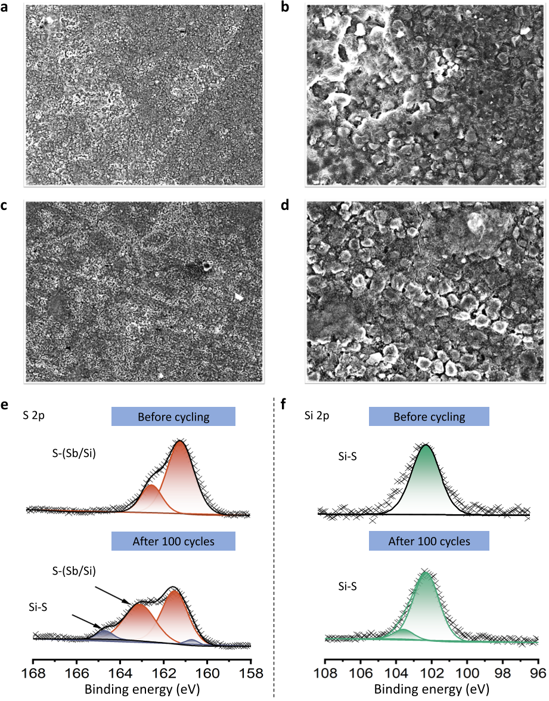
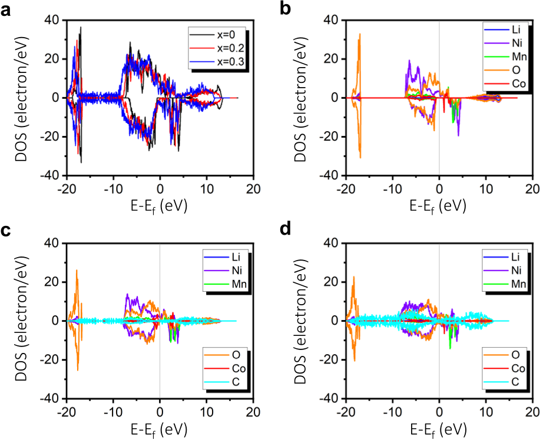
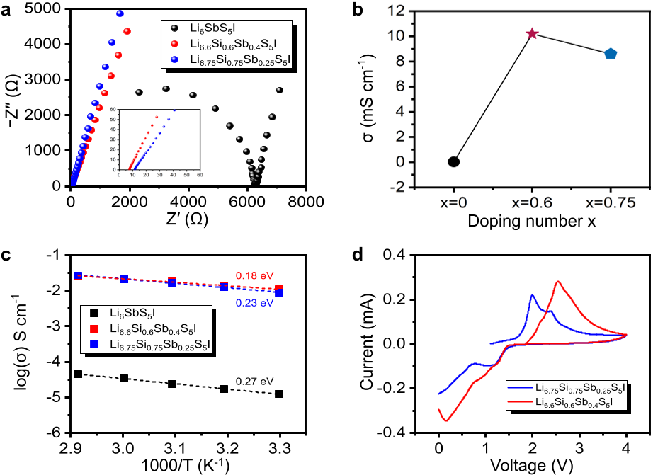
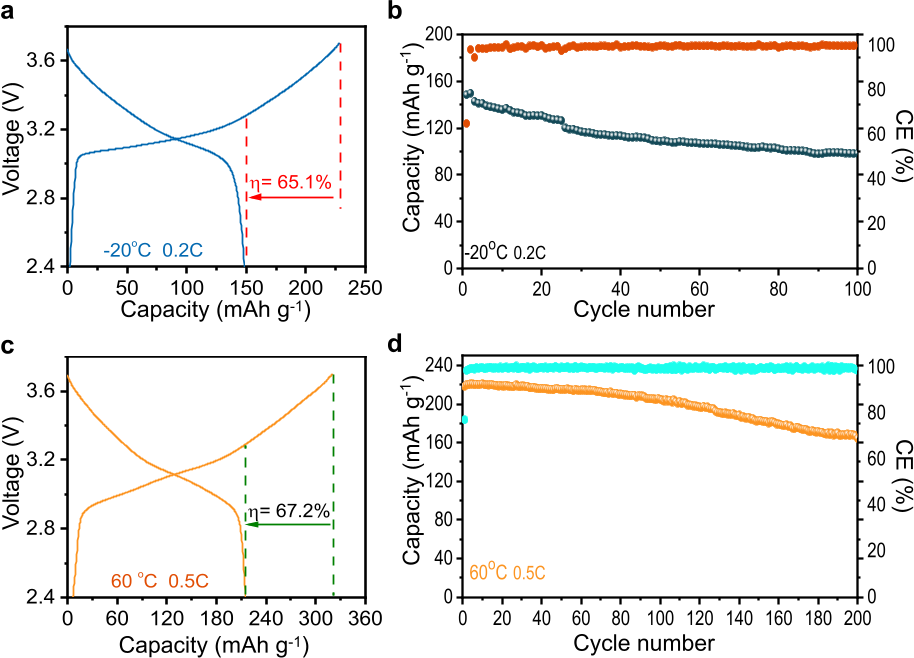

Imagine a battery that not only lasts longer but also stays safe and efficient whether you're driving your electric car through a freezing winter morning or charging your phone on a hot summer day. Scientists have recently engineered a novel solid electrolyte material that brings us closer to this reality by dramatically improving lithium-ion transport and interface stability in solid-state batteries across a wide temperature range.

> **TL;DR**
> - A newly synthesized silicon-doped antimony iodide argyrodite electrolyte achieves record-high room-temperature lithium-ion conductivity of 9.9 mS/cm.
> - When combined with a coated high-voltage cathode, this electrolyte enables solid-state batteries that maintain stable cycling performance from -20°C to 60°C with good capacity retention over hundreds of cycles.

*Note: this summary is based on a preprint — research shared ahead of formal peer review.*

Lithium-ion batteries power much of our modern technology, from smartphones to electric vehicles. However, conventional batteries rely on liquid electrolytes that can be flammable and degrade over time, especially under extreme temperatures. Solid-state lithium-ion batteries replace the liquid with a solid electrolyte, offering improved safety and potentially higher energy density. Yet, challenges remain: many solid electrolytes suffer from poor ionic conductivity at room temperature, unstable interfaces with cathode materials, and limited performance in hot or cold conditions. Sulfide-based electrolytes, particularly iodide argyrodites, have shown promise due to their high ionic conductivity and stability, but practical use has been hampered by issues like dendrite formation and interfacial degradation.

The researchers synthesized a new electrolyte material, Li6.6Si0.6Sb0.4S5I, by substituting silicon into an antimony iodide argyrodite framework. They used ball milling followed by heat treatment to produce powders with a controlled crystal structure. Structural characterization techniques such as X-ray diffraction and Raman spectroscopy confirmed successful silicon incorporation and phase purity. Electrochemical impedance spectroscopy measured ionic conductivity and activation energy, while density functional theory calculations provided insight into lithium-ion migration pathways. To improve interface stability, the team coated a high-voltage cathode material (LiNi0.7Co0.1Mn0.2O2) with a thin LiNbO3 layer and optimized the carbon additive content to balance electronic conduction with electrolyte protection. Finally, they assembled all-solid-state batteries and tested their cycling performance across temperatures from -20°C to 60°C.

The optimized silicon-doped electrolyte exhibited an impressive room-temperature ionic conductivity of 9.9 mS/cm, substantially higher than the undoped counterpart. This enhancement was attributed to the silicon substitution creating additional lithium-ion pathways and reducing migration energy barriers, as confirmed by theoretical calculations. The coated cathode and carefully balanced carbon content minimized interfacial degradation and electronic leakage, enabling stable battery cycling. The assembled solid-state batteries delivered an initial discharge capacity of about 171 mAh/g and retained over 84% of this capacity after 200 cycles at a moderate charge rate. Remarkably, the batteries maintained stable cycling performance over a wide temperature range, from the chill of -20°C to the heat of 60°C, demonstrating robustness for real-world conditions.

This work represents a meaningful advance in solid-state battery technology by addressing two critical hurdles simultaneously: achieving high ionic conductivity in the electrolyte and stabilizing the electrolyte-cathode interface. The silicon-doped antimony iodide argyrodite electrolyte not only facilitates rapid lithium-ion transport but also supports durable battery operation across temperatures that challenge many current battery systems. Such improvements could translate to safer, longer-lasting batteries for electric vehicles and portable electronics, reducing concerns about battery performance in extreme climates and enhancing overall energy storage reliability.

While the results are promising, the study is currently limited to laboratory-scale cells and has not yet undergone peer review. Further research is needed to scale up synthesis, evaluate long-term stability beyond hundreds of cycles, and confirm performance in full battery packs under practical conditions. Additionally, the materials contain antimony and iodine, whose environmental and cost impacts require consideration. Nonetheless, this research lays important groundwork for future development of commercially viable solid-state batteries capable of operating safely and efficiently across diverse temperatures.

## Figures

*Images show surface changes and chemical shifts in coated cathodes before and after 100 charge cycles, revealing how battery materials evolve with use. — Figure from Liang Ming et al., [CC BY 4.0](http://creativecommons.org/licenses/by/4.0/), caption edited.*

*Graph shows how changing carbon levels in cathodes affects their electronic properties and battery performance. — Figure from Liang Ming et al., [CC BY 4.0](http://creativecommons.org/licenses/by/4.0/), caption edited.*

*This figure shows how well three materials conduct ions and their stability during electrical tests at room temperature. — Figure from Liang Ming et al., [CC BY 4.0](http://creativecommons.org/licenses/by/4.0/), caption edited.*

*Battery tests show stable charging and long-lasting performance at very cold (-20°C) and hot (60°C) temperatures. — Figure from Liang Ming et al., [CC BY 4.0](http://creativecommons.org/licenses/by/4.0/), caption edited.*

## Sources

- [Synergistic Interface Stability and High Room-Temperature Ionic Conductivity for Wide-Temperature All-Solid-State Batteries Based on Li6+xSixSb1-xS5I Electrolytes](https://arxiv.org/abs/2607.19664)
- DOI: [10.48550/arxiv.2607.19664](https://doi.org/10.48550/arxiv.2607.19664)

*This article reuses and adapts text and figures from the original research by Liang Ming et al., available via arXiv Materials Science, under the [CC BY 4.0](http://creativecommons.org/licenses/by/4.0/) license.*
