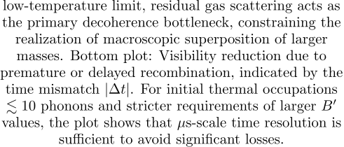
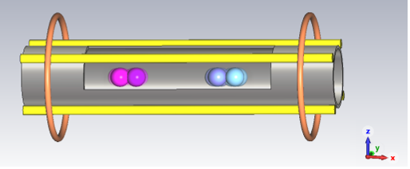

Could tiny diamonds help us unlock the secrets of quantum gravity? For decades, physicists have sought to reconcile the seemingly incompatible worlds of quantum mechanics and general relativity. Now, a new table-top experiment proposes using nanodiamonds in delicate quantum superpositions to probe whether gravity itself exhibits quantum behavior — a question at the heart of modern physics.

> **TL;DR**
> - The paper proposes a compact interferometer using nanodiamonds with nitrogen-vacancy centers to create spatial quantum superpositions sensitive to gravitational effects.
> - This approach reduces the technological challenges of previous proposals by using trapped nanodiamonds and time-varying magnetic fields, enabling faster, more precise tests of gravity’s quantum nature.

*Note: this summary is based on a preprint — research shared ahead of formal peer review.*

Unifying quantum mechanics, which governs the microscopic world, and general relativity, which describes gravity and the cosmos, remains one of physics’ greatest challenges. One promising path involves testing whether gravity can generate quantum entanglement between massive objects. Previous proposals, such as those involving free-falling nanodiamonds, require complex setups with large magnetic structures and ultra-high vacuum conditions, making experiments difficult to realize. The new proposal builds on these ideas but offers a more practical, table-top design that could bring quantum gravity tests within reach of current technology.

The experiment centers on two nanodiamonds, each containing a single nitrogen-vacancy (NV) center, trapped so they can move freely along one axis but are confined in the others. By applying carefully controlled magnetic field gradients, the NV center spins are manipulated to create spatially separated quantum superpositions of the nanodiamonds’ center-of-mass positions. The setup uses a magnetostatic trap with anti-Helmholtz coils to generate tunable magnetic gradients, allowing the nanodiamonds to oscillate in a controlled manner. The quantum states of the NV centers and the nanodiamonds’ motion become entangled, and any gravitational interaction between the superposed components could induce further entanglement detectable through spin coherence measurements. Importantly, the design allows the quantum probes to be recycled after each run, improving efficiency and precision.

The authors show that their interferometer design naturally suppresses certain magnetic noise sources, as the spin-dependent forces shift equilibrium positions without accumulating unwanted magnetic phases. They calculate the expected spatial separations and coherence times achievable with nanodiamonds of different sizes and magnetic gradients. Decoherence mechanisms, including interactions with residual gas molecules and blackbody radiation, are analyzed in detail, revealing that low temperatures and vacuum conditions can preserve coherence long enough for meaningful measurements. The proposal demonstrates that with realistic parameters, gravitationally induced entanglement between the nanodiamonds could be observed, providing a direct test of gravity’s quantum nature.

Detecting quantum entanglement mediated by gravity would be a landmark result, confirming that gravity itself must be quantized and ruling out a broad class of classical gravity theories. This would mark the first experimental evidence of quantum effects in gravity, a major step toward unifying the fundamental forces. The table-top nanodiamond interferometer offers a promising, more accessible experimental platform that could accelerate progress in this challenging field. Beyond fundamental physics, the approach also has potential applications in precision gravimetry.

The proposal remains theoretical and has not yet been experimentally realized. While the design reduces some technological barriers, achieving the necessary coherence times and controlling environmental decoherence remain significant challenges. Furthermore, not observing gravitationally induced entanglement would not definitively prove gravity is classical but could indicate other factors at play or limitations of the setup. Continued experimental development and validation will be essential to confirm the feasibility and interpret the results of such tests.

## Figures

*Graph shows how decoherence changes with test mass and spatial splitting under different pressure conditions. — Figure from Marta Vicentini et al., [CC BY 4.0](http://creativecommons.org/licenses/by/4.0/), caption edited.*

*Two tiny diamond particles in special states are positioned to test if gravity can link them in a way classical physics can't explain. — Figure from Marta Vicentini et al., [CC BY 4.0](http://creativecommons.org/licenses/by/4.0/), caption edited.*

## Sources

- [Table-top nanodiamond interferometer enabling quantum gravity tests](https://arxiv.org/abs/2405.21029)
- DOI: [10.48550/arxiv.2405.21029](https://doi.org/10.48550/arxiv.2405.21029)

*This article reuses and adapts text and figures from the original research by Marta Vicentini et al., available via arXiv Quantum Physics, under the [CC BY 4.0](http://creativecommons.org/licenses/by/4.0/) license.*
