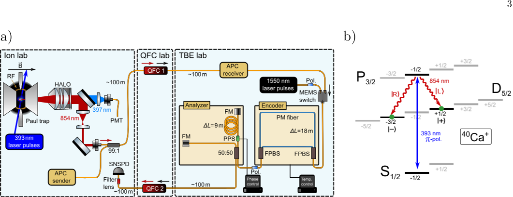
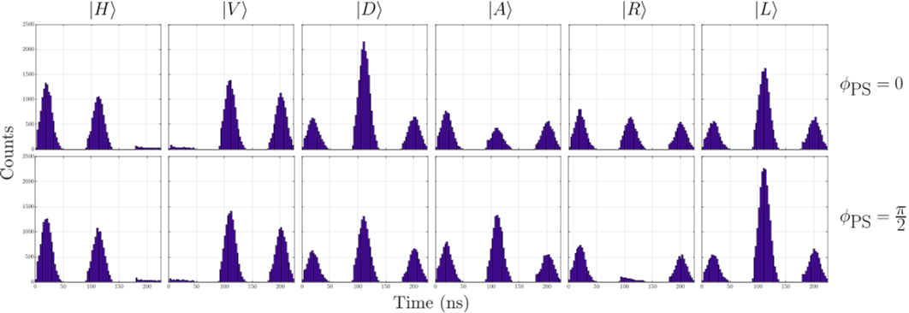
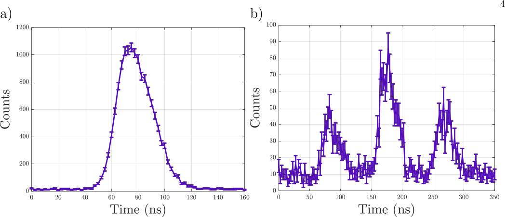

How do scientists send delicate quantum information from atoms through the vast infrastructure of telecom fiber networks? A major challenge in building future quantum internet lies in connecting different quantum technologies that speak different 'languages' of light. Recently, researchers have demonstrated a novel interface that converts entangled photons emitted by a single atom from polarization encoding—a natural format for atomic systems—into time-bin encoding, which is more robust for transmission over telecom fibers. This breakthrough promises to help heterogeneous quantum networks communicate seamlessly over long distances.

> **TL;DR**
> - The team generated photons entangled with a single trapped calcium ion in polarization encoding at 854 nm, then converted these photons to 1550 nm telecom wavelength while preserving entanglement.
> - They converted the photon's polarization encoding into time-bin encoding using a fiber-based interferometer, maintaining high entanglement fidelity, enabling more robust transmission over telecom fibers.

*Note: this summary is based on a preprint — research shared ahead of formal peer review.*

Quantum networks aim to connect quantum memories and processors across distances, enabling applications like distributed quantum computing and secure communication. Different quantum platforms naturally use different photonic encodings and wavelengths: trapped ions typically emit photons encoded in polarization at visible or near-visible wavelengths, while many solid-state systems and telecom infrastructure favor time-bin encoding at infrared telecom wavelengths. Polarization qubits are fragile in optical fibers due to environmental disturbances, whereas time-bin qubits are more stable for long-distance transmission. Thus, converting between these encodings while preserving entanglement is a critical step toward interoperable, large-scale quantum networks.

In the experiment, a single 40Ca+ ion trapped in a Paul trap was excited to emit single photons at 854 nm entangled with its internal electronic state via polarization. These photons were collected and sent through a quantum frequency converter to shift their wavelength to the telecom C-band at 1550 nm. Subsequently, a fiber-based unbalanced Mach-Zehnder interferometer converted the photon's polarization qubit into a time-bin qubit by splitting the photon into early and late temporal modes. A second interferometer analyzed the time-bin encoded photons, and full quantum state tomography was performed to reconstruct the entangled state and quantify the fidelity of entanglement preservation throughout the process.

The researchers demonstrated that the conversion from polarization encoding at 854 nm to time-bin encoding at 1550 nm preserved the atom-photon entanglement with a fidelity of approximately 96%. This high fidelity was confirmed by reconstructing the density matrix of the final state through quantum tomography. The process fidelity of the interferometers used for encoding and decoding was measured to be around 97%, indicating that the main limitation to fidelity was technical losses and background noise. The results represent the first demonstration of polarization-to-time-bin conversion of photons entangled with a single atomic quantum memory, a key milestone for heterogeneous quantum networks.

This work provides a crucial building block for future quantum networks that must interconnect diverse quantum technologies operating at different wavelengths and encoding schemes. By enabling robust transmission of entangled photons over existing telecom fiber infrastructure, the demonstrated interface helps bridge the gap between atomic quantum memories and fiber-based quantum communication channels. Such interoperability is essential for realizing scalable, long-distance quantum networks and distributed quantum computing architectures. The approach also offers flexibility in tailoring time-bin separation independently from the emitter dynamics, facilitating integration with various quantum memory platforms.

While the fidelity achieved is high, the experiment involved careful stabilization and compensation techniques to mitigate environmental disturbances and losses. The conversion process currently incurs some intrinsic losses, especially due to passive interferometric encoding, which may limit transmission rates. Furthermore, the concepts and apparatus are technically complex and remain primarily at the laboratory demonstration stage. Scaling this technology to practical quantum networks will require further engineering to improve efficiency, reduce noise, and integrate with other quantum devices. Nonetheless, the results mark an important step toward heterogeneous quantum network interoperability.

## Figures

*Diagram showing how photons change color and encoding to create and study atom-photon connections using specialized equipment. — Figure from Christian Haen et al., [CC BY 4.0](http://creativecommons.org/licenses/by/4.0/), caption edited.*

*Measured signals for six input polarizations and two phase settings after the analyzer. — Figure from Christian Haen et al., [CC BY 4.0](http://creativecommons.org/licenses/by/4.0/), caption edited.*

*Photon wave-packets measured over hours, showing differences with and without time-bin encoding using 2.5 ns intervals. — Figure from Christian Haen et al., [CC BY 4.0](http://creativecommons.org/licenses/by/4.0/), caption edited.*

## Sources

- [Telecom-compatible polarization-to-time-bin conversion of atom-photon entanglement for heterogeneous quantum networks](https://arxiv.org/abs/2607.29609)
- DOI: [10.48550/arxiv.2607.29609](https://doi.org/10.48550/arxiv.2607.29609)

*This article reuses and adapts text and figures from the original research by Christian Haen et al., available via arXiv Quantum Physics, under the [CC BY 4.0](http://creativecommons.org/licenses/by/4.0/) license.*
