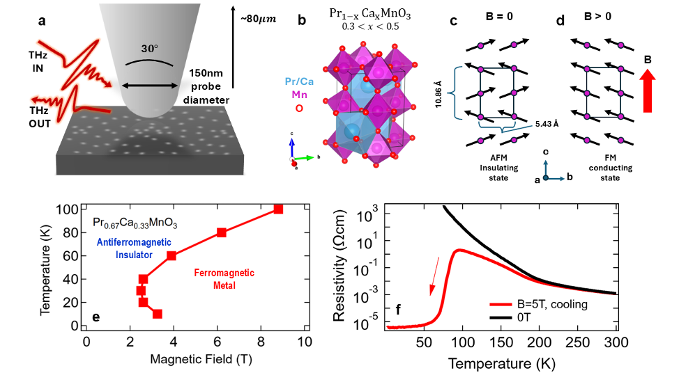
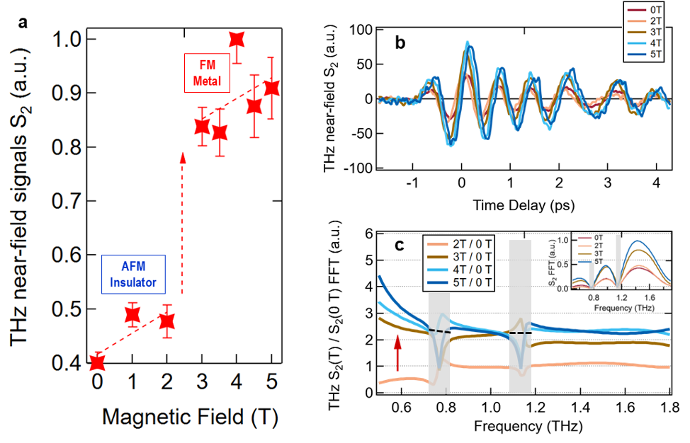
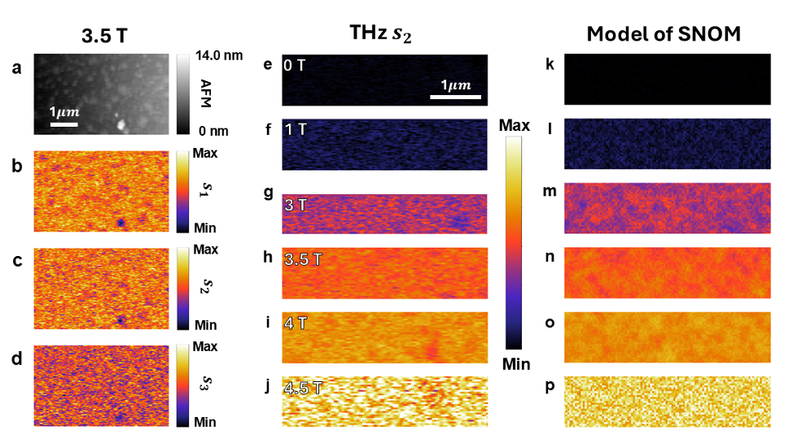
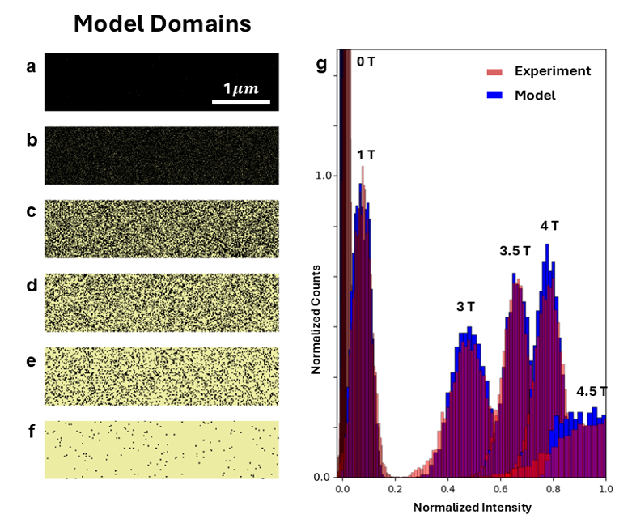

Imagine watching the tiniest magnetic switches flip in real time—each flip setting off a chain reaction that transforms a material from an insulator into a metal almost instantly. This is the kind of microscopic magic recently revealed by scientists using an innovative terahertz nanoscale imaging technique. By combining ultrafast terahertz spectroscopy with nanometer spatial resolution under extreme cold and strong magnetic fields, researchers have captured the elusive dynamics of colossal magnetoresistive switching, a phenomenon central to next-generation quantum electronics.

> **TL;DR**
> - A custom-built cryogenic magneto-terahertz near-field microscope reveals how nanoscale spin flips initiate the colossal magnetoresistive transition, switching a material from insulating to metallic.
> - The imaging shows that tiny 1-2 nm spin-flip sites grow and merge into ~15 nm metallic regions as magnetic fields increase, providing a detailed real-space view of the phase transition at terahertz frequencies.

*Note: this summary is based on a preprint — research shared ahead of formal peer review.*

Colossal magnetoresistance (CMR) is a striking effect where certain materials dramatically change their electrical resistance in response to magnetic fields. This effect is especially prominent in manganites—complex oxides with intertwined charge, spin, lattice, and orbital orders. Understanding how magnetic spins flip and reorganize at the nanoscale during CMR transitions is crucial for advancing spintronics and quantum computing technologies. However, probing these ultrafast, nanoscale dynamics requires overcoming significant experimental challenges: combining cryogenic temperatures, strong magnetic fields, and terahertz-frequency sensitivity with nanometer spatial resolution.

To tackle these challenges, the researchers developed a cryogenic magneto-terahertz scattering-type scanning near-field optical microscope (cm-THz-sSNOM). This sophisticated instrument focuses terahertz radiation onto a metal-coated atomic force microscope (AFM) tip, which acts like a nanoscale antenna to confine and enhance the electromagnetic field at its apex. By scanning the tip over a high-quality single crystal of Pr2/3Ca1/3MnO3 at 29 K and applying magnetic fields up to 5 Tesla, they captured time-domain terahertz waveforms scattered from the sample surface. Fourier analysis of these waveforms yielded local terahertz spectra, revealing the evolution of conductivity and spin states with sub-50 nm spatial resolution.

The terahertz near-field measurements revealed a clear insulator-to-metal transition triggered by magnetic-field-induced spin flipping. At low fields, isolated 1-2 nm spin-flip sites appeared within the antiferromagnetic insulating matrix. As the magnetic field approached the critical threshold (~2-3 T), these tiny metallic domains grew and coalesced into approximately 15 nm conducting regions. The spectral data showed the emergence of a Drude-like response characteristic of mobile charge carriers in the metallic phase. Remarkably, the spatial distribution of these domains appeared homogeneous at the measured scale, suggesting the transition proceeds via a dense, nanoscale distribution of switching sites rather than large macroscopic domains. Modeling with an ellipsoidal near-field dipole approach confirmed these observations and provided quantitative insights into the microscopic electronic structure.

This work provides the first real-space, terahertz-frequency nanoscale visualization of the microscopic spin-charge dynamics underlying colossal magnetoresistive switching. By bridging spatial scales from sub-nanometer spin flips to tens-of-nanometers metallic domains, it offers a new framework to study strongly correlated electronic phase transitions beyond traditional diffraction limits. The ability to map ultrafast magnetic switching at the nanoscale opens pathways for designing and controlling spintronic devices and quantum logic architectures that operate at fundamental energy and speed limits. Moreover, the custom cryogenic magneto-THz near-field technique demonstrated here is broadly applicable to exploring other complex quantum materials where intertwined spin, charge, lattice, and orbital orders govern exotic phenomena.

While these findings mark a significant advance, the study focuses on a specific manganite single crystal under carefully controlled cryogenic and magnetic field conditions. Real-world devices may involve more complex environments and material imperfections. Additionally, the spatial resolution, although well below conventional limits, still averages over ensembles of atomic-scale features. Future work will be needed to push resolution further, explore dynamic switching under electrical or optical stimuli, and connect these nanoscale observations to macroscopic device performance. Nonetheless, this research lays a solid experimental and theoretical foundation for such explorations.

## Figures

*This figure shows how a tiny probe detects changes in a material's structure and conductivity during a magnetic field-driven transition from insulator to metal. — Figure from Samuel Haeuser et al., [CC BY 4.0](http://creativecommons.org/licenses/by/4.0/), caption edited.*

*Magnetic fields change THz signals in a material, showing a switch from insulator to metal and enhanced electric responses at low temperatures. — Figure from Samuel Haeuser et al., [CC BY 4.0](http://creativecommons.org/licenses/by/4.0/), caption edited.*

*THz nano-imaging reveals electronic changes during a magnetic transition, confirmed by matching experimental and modeled images under varying magnetic fields. — Figure from Samuel Haeuser et al., [CC BY 4.0](http://creativecommons.org/licenses/by/4.0/), caption edited.*

*Simulations show tiny magnetic changes growing into larger regions under a magnetic field, matching well with experimental images. — Figure from Samuel Haeuser et al., [CC BY 4.0](http://creativecommons.org/licenses/by/4.0/), caption edited.*

## Sources

- [Terahertz-nanoscale visualization of the microscopic spin-charge architecture of colossal magnetoresistive switching](https://arxiv.org/abs/2603.07941)
- DOI: [10.1002/advs.76799](https://doi.org/10.1002/advs.76799)

*This article reuses and adapts text and figures from the original research by Samuel Haeuser et al., available via Advanced Science, 10.1002/advs.76799 (2026), under the [CC BY 4.0](http://creativecommons.org/licenses/by/4.0/) license.*
