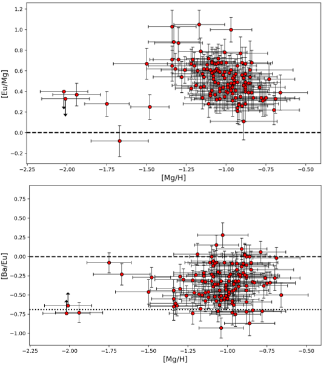
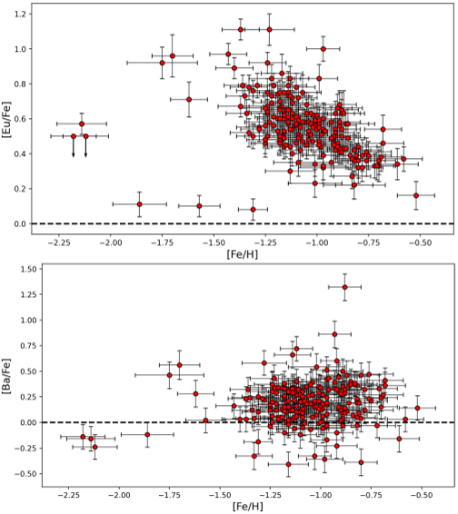

From the ashes of dying stars, some of the rarest elements in the universe are forged. Reconstructing their journey helps astronomers decode the cosmic history and formation of galaxies. One such element, europium (Eu), provides a fingerprint for a dramatic astrophysical process that remains partly mysterious even today.

> **TL;DR**
> - The Small Magellanic Cloud (SMC) has unexpectedly high levels of europium compared to alpha elements, hinting at unusually efficient r-process element production.
> - This pattern diverges from the Milky Way and may inform our understanding of how galaxies enrich themselves with heavy elements.

![5: Figure 5 shows the relationship between [Ba/Eu] and [Fe/H] in the stars studied, with a line marking pure r-process [Ba/Eu] at –0.69 dex.](./figure-1.png)
*5: Figure 5 shows the relationship between [Ba/Eu] and [Fe/H] in the stars studied, with a line marking pure r-process [Ba/Eu] at –0.69 dex.*

The Small Magellanic Cloud (SMC) is a neighboring dwarf galaxy, orbiting our Milky Way. Unlike our sprawling spiral, the SMC is both smaller and slower at making new stars. Yet, heavy elements—created in rare, high-energy events—permeate both galaxies. To learn how these elements are produced and distributed, astronomers need precise measurements of their abundance in different galactic environments. This study zeroes in on europium, a hallmark of the so-called rapid neutron-capture process (r-process), which builds many of the universe’s heaviest atoms.

To probe the origins and distribution of europium in the SMC, the research team analyzed light from 209 aging giant stars, each carefully confirmed to belong to the SMC. Their observations were made using the FLAMES spectrograph on the Very Large Telescope, specifically tuning into the signature europium absorption line at 6645 Ångströms. By comparing the europium content of these stars to more commonly studied elements—magnesium (an alpha element) and barium (an s-process product)—the authors could track not only how much europium exists, but also how its production compared to other pivotal stellar processes.

*6: Fig. 6: Ratios of europium to magnesium (top) and barium to europium (bottom) shown against magnesium levels in different samples.*

The results are striking. Regardless of metallicity (as measured by [Fe/H]), the SMC stars display [Eu/Fe] ratios elevated to levels seen in the Milky Way—but with a twist. As the iron content increases, [Eu/Fe] gradually declines, echoing the arrival of iron-rich supernovae (Type Ia) that dilute europium’s prominence. However, when comparing europium to magnesium, [Eu/Mg] is consistently about +0.5 dex higher than in Milky Way stars, indicating that for every magnesium atom, these SMC stars have more europium than their Milky Way counterparts. Meanwhile, the [Ba/Eu] ratio—signaling the interplay between r-process and s-process contributions—rises at lower metallicity in the SMC than in the Milky Way, suggesting an earlier influence of s-process enrichment.

What does this mean for our understanding of galactic chemistry? The findings suggest that small, low star-formation-efficiency galaxies like the SMC foster especially potent or frequent r-process events relative to alpha-element production. This aligns with patterns seen in other dwarf galaxies, and could reflect the impact of delayed r-process sources, such as neutron star mergers, which become more influential in such environments. If so, it paints the SMC as a key laboratory for studying how the universe’s rarest ingredients are seeded into the next generation of stars.

![7: Fig. 7: Trends of [Eu/Fe], [Eu/Mg], and [Ba/Eu] versus [Fe/H] for the SMC, LMC, and MW, with regression lines and confidence intervals shown.](./figure-3.png)
*7: Fig. 7: Trends of [Eu/Fe], [Eu/Mg], and [Ba/Eu] versus [Fe/H] for the SMC, LMC, and MW, with regression lines and confidence intervals shown.*

Yet, big questions remain. The exact astrophysical sites where europium is made—the balance between rare supernovae and neutron-star mergers—are still debated. Furthermore, translating abundance patterns into a full narrative of events requires models that match both the chemistry and star-formation history of each galaxy. As the study highlights, current chemical evolution models often struggle to fit the high europium signatures in dwarf galaxies. Ongoing and future observations, especially as more gravitational wave events are tied to element formation, will be crucial in refining the story.

## Sources

*2: Fig. 2: Abundance ratios of europium and barium relative to iron in SMC stars, shown against their iron content. Solar values are marked by dashed lines.*

[arXiv preprint](http://arxiv.org/abs/2510.26625v1)

[DOI link](https://doi.org/10.48550/arXiv.2510.26625)
