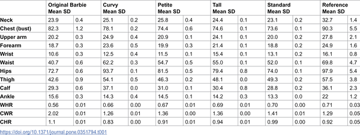
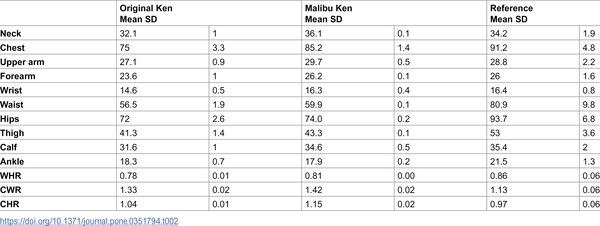
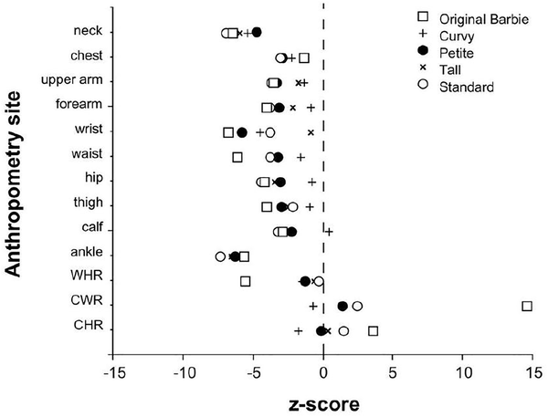
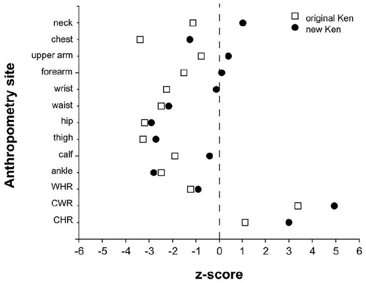

Did Barbie and Ken dolls just get a body makeover closer to real people? For decades, these iconic toys have sparked debate about unrealistic body standards and their impact on children’s body image. Now, a new study revisits their proportions, comparing the latest 'Fashionista' dolls to real human body measurements to see if they’ve evolved toward greater realism and diversity.

> **TL;DR**
> - The 2016 Fashionista Barbie and Ken dolls show significant changes in body proportions compared to the original 1959 versions, with many measurements falling closer to average adult human figures.
> - Despite improvements, some proportions—especially Ken’s waist—remain less typical of the general population, though the range of Barbie dolls offers more diversity than before.

Barbie was introduced in 1959 as a doll representing an adult woman, a departure from the baby-like dolls common at the time. Since then, Barbie and Ken have been cultural icons but also lightning rods for criticism over promoting unrealistic and potentially harmful body ideals. Earlier studies, including one in 1996, showed that their body shapes were far from average human proportions. In recent years, Mattel has expanded Barbie’s range to include different body types—Curvy, Petite, Tall, and Standard—as well as a new Ken model. This study builds on past research by using precise anthropometric measurements to compare these newer dolls to real population data, providing an updated perspective on their body diversity and realism.

Researchers measured key body girths—neck, chest, waist, hips, thighs, calves, ankles, and arms—on four Barbie dolls from the 2016 Fashionista line and a new Malibu Ken doll. These measurements were scaled to a standardized adult height of 170.18 cm to allow fair comparison with reference data from young adult males and females drawn from previous studies and large U.S. population surveys. Body proportions such as waist-to-hip and chest-to-waist ratios were calculated and compared using z-scores to determine how closely each doll matched average human body shapes. Multiple measurements by independent anthropometrists ensured accuracy and reliability.

The study found that the Fashionista Barbie dolls have body proportions much closer to those of average young adult women than the original Barbie. Notably, the Curvy Barbie model aligned most closely with population averages across girth measurements and key ratios like waist-to-hip and chest-to-waist. The new Ken doll also showed improvements, with most girth measurements nearer to average young adult males, except for the ankle and waist, which remained narrower than typical. Visual comparisons revealed that these dolls now fall within the 95% confidence intervals of real human body measurements, a significant shift from the extreme proportions of the original dolls. However, some measures still remain outside typical ranges, reflecting ongoing challenges in fully capturing human diversity.

These findings suggest that Mattel’s efforts to diversify Barbie and Ken’s body shapes have made meaningful progress toward more realistic and inclusive representations. Given the influence toys can have on children’s perceptions of body image and health, producing dolls that reflect a broader range of human shapes may help promote healthier attitudes and reduce body dissatisfaction. While dolls remain aspirational figures rather than exact replicas of real people, the move toward greater anthropometric realism marks an important cultural shift. This research provides objective data to inform discussions among parents, educators, health professionals, and toy designers about the role of toys in shaping social norms around body diversity.

It’s important to remember that dolls are designed products influenced by aesthetic and marketing choices, not scientific models of human anatomy. Although the Fashionista range shows improved realism, some proportions—especially in Ken dolls—still differ from typical human measurements. The study focused on young adult reference populations of predominantly Anglo-Australian ethnicity, which might not capture global diversity fully. Additionally, body image is influenced by many factors beyond toy design, including media and family environment. Future research could explore how children perceive these dolls and whether changes in doll proportions translate to shifts in body satisfaction or health behaviors.

## Figures

*Table shows body measurements of Barbie dolls and a reference group, all scaled to the same height for easy comparison.*

*Table comparing body measurements of Ken dolls and a reference group, all scaled to the same height for easy comparison.*

*Figure 1 shows how original and Fashionista Barbie dolls' body measurements differ from average women in waist, hip, and chest ratios.*

*Comparison of body measurements of original and Fashionista Ken dolls to average male figures, showing differences in waist, chest, and hip ratios.*

## Sources

- [The evolution of life size Barbie and Ken: Are they any closer to reality?](https://journals.plos.org/plosone/article?id=10.1371/journal.pone.0351794)
- DOI: [10.1371/journal.pone.0351794](https://doi.org/10.1371/journal.pone.0351794)
