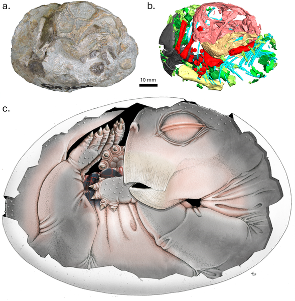
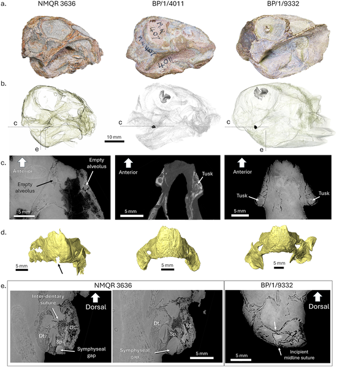
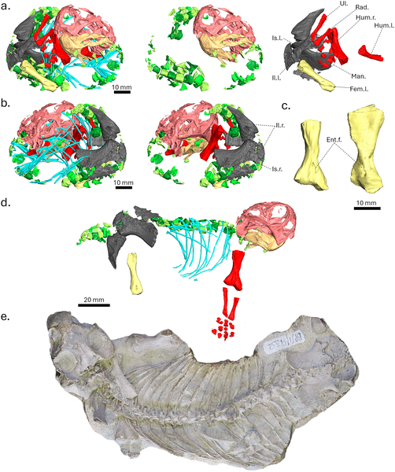
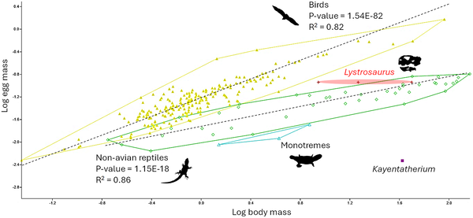

Imagine peering back 250 million years to glimpse the earliest relatives of mammals curled up inside an egg. For nearly two centuries, scientists have searched for fossilized evidence of how these ancient creatures reproduced, but until now, no definitive embryo fossils from non-mammalian synapsids had been found. A recent discovery in South Africa changes that, revealing a tiny, curled skeleton preserved as if still inside its egg. This remarkable find offers a rare window into the reproductive biology of stem-mammals and helps us understand how life rebounded after the most devastating mass extinction in Earth’s history.

> **TL;DR**
> - Scientists discovered the first fossilized embryo of a non-mammalian synapsid, Lystrosaurus, dating back to the Early Triassic period.
> - The embryo’s curled posture and unfused jaw bones indicate it was preserved in a soft-shelled egg, revealing ancient reproductive strategies that may have aided survival after mass extinction.

Synapsids are the evolutionary lineage that eventually gave rise to mammals, but their early members—often called 'stem-mammals'—lived long before true mammals appeared. Among these, the dicynodont Lystrosaurus was an especially successful genus, dominating terrestrial ecosystems shortly after the end-Permian mass extinction around 252 million years ago. While modern mammals give birth to live young, early synapsids are believed to have laid eggs, but fossil evidence for this has been frustratingly elusive. The absence of preserved eggs or embryos has left a significant gap in our understanding of how these ancient animals reproduced and developed. This new discovery from the Karoo Basin in South Africa finally provides direct evidence of an embryo from a non-mammalian synapsid, confirming oviparity (egg-laying) in this group and offering clues about their developmental biology.

The research team examined three of the smallest known Lystrosaurus specimens using advanced imaging techniques, including high-resolution X-ray micro-computed tomography (CT) and synchrotron radiation X-ray tomography. These non-destructive methods allowed the scientists to visualize the internal skeletal structures in exquisite detail without damaging the precious fossils. One specimen, labeled NMQR 3636, was particularly revealing: it was preserved in a tightly curled posture typical of embryos still inside eggs. By digitally reconstructing the skeleton and analyzing bone development, the researchers assessed features such as jaw fusion and ossification patterns to determine the specimen’s developmental stage and infer characteristics of the egg it came from.

The NMQR 3636 specimen showed several key traits indicating it was an embryo preserved inside an egg. Its tightly curled posture resembles that of modern bird and turtle embryos before hatching. Crucially, the lower jaw bones were not yet fused—a developmental feature seen only in pre-hatching embryos among living amniotes. Unlike many fossil eggs, no calcified eggshell was present, suggesting that the egg was soft and leathery, similar to those of some modern reptiles. The researchers estimated the egg’s volume at about 115 cubic centimeters, relatively large for the animal’s size, implying that the hatchling was precocial—well-developed and independent at birth—rather than relying on parental milk feeding. This contrasts with more derived, mammal-like cynodonts, which had smaller eggs consistent with lactation. These findings anchor the ancestral reproductive strategy of early synapsids as egg-laying with soft eggs, a condition far removed from modern mammals.

This discovery fills a critical gap in our understanding of synapsid reproductive evolution by providing the first direct fossil evidence of an embryo from a non-mammalian member of this lineage. It confirms that oviparity with soft-shelled eggs was the ancestral condition for synapsids, supporting long-held but previously unproven hypotheses. Moreover, the reproductive strategy inferred from this embryo may have contributed to Lystrosaurus’s remarkable success in recovering and dominating ecosystems after the end-Permian mass extinction—the most catastrophic biodiversity crisis in Earth’s history. Understanding these ancient developmental adaptations offers valuable insights into how early vertebrates survived and thrived through dramatic environmental upheavals.

While the evidence strongly supports that NMQR 3636 was an embryo preserved in ovo, the absence of a preserved eggshell means interpretations about the egg’s softness remain indirect. The fossil record of soft eggs is inherently biased because such eggs rarely fossilize, so this finding is exceptional but may not represent the full diversity of reproductive strategies among early synapsids. Additionally, the study focuses on a single genus, Lystrosaurus, so caution is needed before generalizing these reproductive traits to all non-mammalian synapsids. Future discoveries and analyses will help refine our understanding of the evolution of egg-laying and developmental biology in these ancient animals.

## Figures

*Fig 1 shows specimen NMQR 3636 from the side: a photo, a 3D bone model, and an artist's live reconstruction with color-coded bones.*

*Skull images and 3D scans of young Lystrosaurus show tusks, jaw bones, and growth stages in three specimens.*

*3D and photo views compare two young Lystrosaurus skeletons, highlighting bones like skull, ribs, limbs, and pelvis in different colors.*

*Graph showing egg size vs. body size in various animals, with colors representing different groups like Lystrosaurus, Kayentatherium, birds, and reptiles.*

## Sources

- [The first non-mammalian synapsid embryo from the Triassic of South Africa](https://journals.plos.org/plosone/article?id=10.1371/journal.pone.0345016)
- DOI: [10.1371/journal.pone.0345016](https://doi.org/10.1371/journal.pone.0345016)
