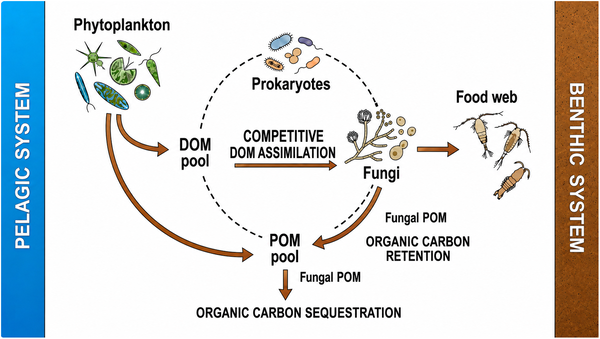

What if the ocean’s secret carbon recyclers aren’t just bacteria, but fungi? For decades, scientists believed that bacteria were the primary drivers of carbon cycling in marine ecosystems, while fungi played only a minor role. However, groundbreaking research now challenges this assumption, revealing that marine fungi can outcompete bacteria in assimilating dissolved organic matter and significantly influence carbon retention in the ocean.

> **TL;DR**
> - Marine fungi can dominate the assimilation of labile dissolved organic matter, a role previously attributed mainly to bacteria.
> - This fungal activity transforms dissolved organic carbon into stable biomass, contributing to carbon retention and potentially affecting ocean carbon storage models.

Traditionally, marine carbon cycling models have focused on prokaryotes—mainly bacteria—as the key players breaking down organic matter in the ocean. Fungi, well known for their vital roles in terrestrial ecosystems, were assumed to be minor contributors in marine environments. This assumption partly stemmed from the difficulty in detecting the microscopic and often unicellular marine fungi, as well as the belief that their terrestrial functions did not translate to the ocean. Yet, fungi are ubiquitous in marine habitats, exhibiting diverse forms from single-celled yeasts to filamentous structures. Until recently, their ecological roles in ocean carbon cycling remained poorly understood.

The new insights come from a study by Trejos-Espeleta and colleagues, who used quantitative stable isotope probing to track how marine fungi and bacteria assimilate dissolved organic matter in an Arctic fjord. This technique involves labeling organic substrates with stable isotopes and measuring their incorporation into microbial biomass, allowing researchers to quantify the metabolic activity of different microbial groups in situ. By comparing fungal and bacterial assimilation rates in both sediments and seawater, the study provided a detailed look at microbial competition for organic carbon in marine ecosystems.

Contrary to longstanding beliefs, the study found that marine fungi can outperform bacteria in assimilating dissolved organic matter, particularly in sediment environments. Fungi exhibited higher metabolic efficiency and rapidly converted labile dissolved organic carbon into fungal biomass. This biomass contributes to the pool of particulate organic matter, effectively retaining carbon within the marine system. Such fungal biomass accumulation suggests that fungi play a significant role in carbon cycling, not just decomposition, challenging the view that bacteria dominate these processes. Moreover, the fungal contribution to particulate organic matter could influence carbon sequestration if fungal biomass sinks or is buried in sediments.

These findings have important implications for how we understand and model ocean carbon cycling and climate change. Current marine carbon models largely ignore fungi, potentially overlooking a key mechanism of carbon retention and transformation. Recognizing fungi’s role could improve predictions of carbon storage in marine ecosystems and inform environmental policies aimed at mitigating climate change. The study also opens new avenues for research into the ecological functions of marine fungi, their interactions with other microbes, and their impact on the global carbon budget.

While the study reveals fungi’s surprising dominance in certain contexts, it also highlights the complexity and variability of marine microbial communities. Fungal dominance in carbon assimilation was observed only in some samples, indicating that environmental factors and spatial-temporal dynamics influence microbial roles. Additionally, the extent to which fungal biomass contributes to long-term carbon sequestration remains uncertain, as fungal biomass can be consumed or decomposed by other organisms. More research with higher resolution sampling and molecular analyses is needed to fully understand fungi’s ecological niches and their net impact on carbon cycling.

## Figures

*This model shows how marine fungi help recycle and store carbon by breaking down organic matter and contributing to long-term carbon storage in oceans.*

## Sources

- [The fungal blind spot: Why marine carbon models ignore a key player](https://journals.plos.org/plosbiology/article?id=10.1371/journal.pbio.3003840)
- DOI: [10.1371/journal.pbio.3003840](https://doi.org/10.1371/journal.pbio.3003840)
