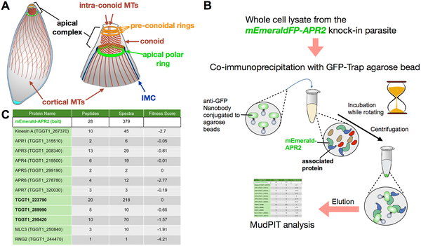
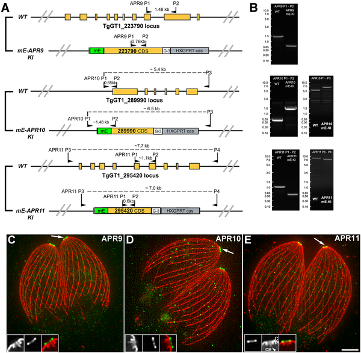
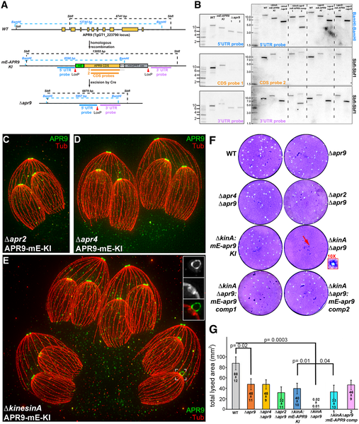
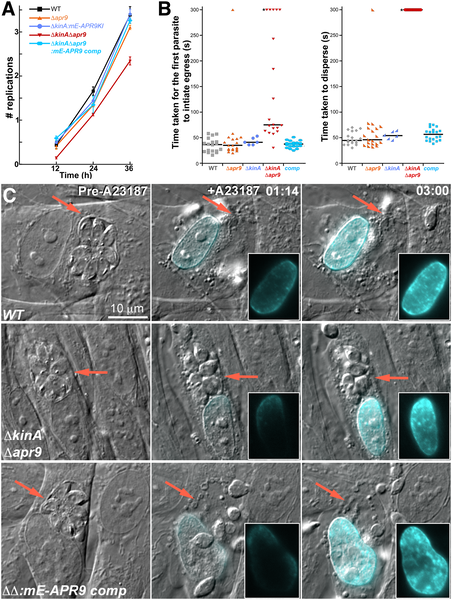

Imagine a tiny parasite that invades our cells with a microscopic ‘motor’ at its tip, enabling it to move, invade, and spread. Scientists have now identified two crucial components of this motor-like structure in Toxoplasma gondii — a common human parasite — whose absence leaves the parasite completely paralyzed, unable to infect or escape host cells.

> **TL;DR**
> - Two proteins, APR9 and KinesinA, within the parasite’s apical polar ring are critical for its movement and ability to invade host cells.
> - Removing both proteins causes multiple cellular defects, including impaired secretion and structural abnormalities, effectively stopping the parasite’s life cycle.

Toxoplasma gondii belongs to a large group of single-celled parasites called apicomplexans, which infect a wide range of animals, including humans. These parasites use a specialized structure called the apical complex to invade host cells. At the heart of this complex lies the apical polar ring, a cytoskeletal feature anchoring microtubules that help organize the parasite’s ‘engine’ for movement. Understanding the molecular components of this ring is key to unraveling how these parasites move and infect.

Researchers used a combination of genetic tagging, immunoprecipitation, and advanced microscopy techniques to identify new proteins associated with the apical polar ring. They tagged candidate proteins with fluorescent markers to observe their location and used gene knockout strategies to remove APR9 and KinesinA individually and together. The effects on parasite motility, invasion, and cellular structure were then analyzed using microscopy and biochemical assays.

The study identified APR9 as a highly conserved protein localized to the apical polar ring, alongside KinesinA. While removing APR9 alone caused only mild effects, deleting both APR9 and KinesinA paralyzed the parasite, severely impairing its ability to invade and exit host cells. The double knockout parasites exhibited abnormal accumulation of actin at their apex, defective extension of the conoid (a key cytoskeletal structure), and reduced secretion of MIC2, an adhesin essential for host cell attachment. These disruptions highlight the apical polar ring’s role as a coordinating hub for multiple processes critical to parasite motility.

By revealing how APR9 and KinesinA cooperate within the apical polar ring to power parasite movement and invasion, this research advances our understanding of Toxoplasma biology. Since motility is essential for infection, these proteins represent potential targets for interventions aimed at controlling toxoplasmosis and related diseases caused by apicomplexan parasites.

While the findings clearly demonstrate the importance of APR9 and KinesinA in parasite motility, the precise molecular mechanisms by which these proteins coordinate cytoskeletal dynamics and secretion remain to be fully elucidated. Additionally, although the study provides valuable insights, translating this knowledge into clinical treatments will require further research.

## Figures

*Scientists used special tagging and analysis to find proteins linked to the tubulin structure in T. gondii parasites.*

*Scientists tagged proteins APR9, APR10, and APR11 to confirm they locate at the apical polar ring in parasites using advanced microscopy.*

*Removing APR9 alone or with APR4/APR2 mildly affects parasites, but combined with KinesinA, it strongly disrupts their growth cycle.*

*Removing APR9 and KinesinA slows parasite growth and greatly reduces their movement when leaving host cells.*

## Sources

- [The human parasite, Toxoplasma gondii, is paralyzed without two components of the apical polar ring](https://journals.plos.org/plospathogens/article?id=10.1371/journal.ppat.1014378)
- DOI: [10.1371/journal.ppat.1014378](https://doi.org/10.1371/journal.ppat.1014378)
