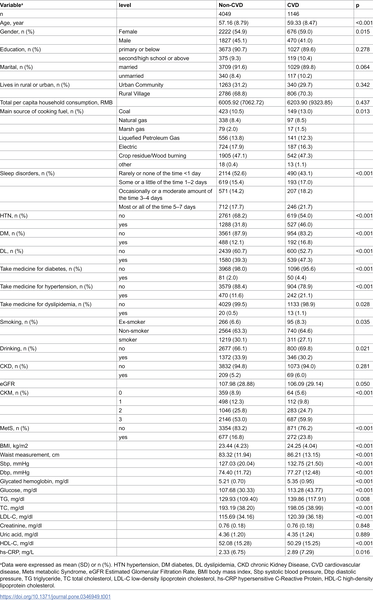

Air pollution is a well-known threat to heart health, but understanding exactly how different pollutants combine to affect vulnerable patients remains a challenge. Recent research sheds light on how mixtures of tiny particles and gases in polluted air increase the risk of cardiovascular disease in people with a complex condition called Cardiovascular-Kidney-Metabolic (CKM) syndrome. This syndrome links heart, kidney, and metabolic disorders, making patients especially sensitive to environmental risks.

> **TL;DR**
> - Exposure to common air pollutants—especially fine particulate matter (PM₁₀)—significantly raises cardiovascular disease risk in patients with early to moderate CKM syndrome.
> - Analyzing pollutant mixtures reveals combined effects beyond individual pollutants, emphasizing the importance of considering real-world air pollution exposures in health risk assessments.

Cardiovascular disease (CVD) remains a leading cause of death worldwide, and its risk is heightened in patients with overlapping metabolic and kidney disorders—a cluster now recognized as Cardiovascular-Kidney-Metabolic (CKM) syndrome. Air pollution, particularly particulate matter and nitrogen dioxide (NO₂), is a known contributor to heart disease. Yet, most studies focus on single pollutants, while people are exposed to complex mixtures daily. This study, conducted in China using a large, nationally representative cohort, explores how combined exposure to multiple air pollutants affects cardiovascular risk in patients at stages 0 to 3 of CKM syndrome, a range from no symptoms to early clinical signs.

Researchers analyzed data from 5,195 participants in the China Health and Retirement Longitudinal Study (CHARLS), tracking cardiovascular outcomes over nearly a decade. They linked participants’ residential locations to high-resolution air pollution data, including particulate matter of different sizes (PM₁, PM2.5, PM₁₀), nitrogen dioxide (NO₂), and ozone (O₃). Using advanced statistical models—such as Cox regression and weighted quantile sum (WQS) regression—they assessed both individual pollutant effects and the combined impact of pollutant mixtures on cardiovascular disease risk. The study adjusted for demographic, behavioral, and socioeconomic factors and performed sensitivity analyses to ensure robust findings.

The study found that increases in particulate matter (PM₁, PM2.5, PM₁₀) and NO₂ were each associated with a 30% to 52% higher risk of developing cardiovascular disease among CKM patients. Ozone showed no significant association. When examining pollutant mixtures, combined exposure was linked to a roughly 10–12% increased risk, with PM₁₀ identified as the dominant contributor. These results highlight that the health effects of air pollution cannot be fully understood by looking at pollutants individually, as their combined presence poses a greater threat, especially to vulnerable populations with CKM syndrome.

This research fills a critical gap by focusing on a high-risk clinical group and quantifying how real-world air pollution mixtures influence cardiovascular risk. The findings underscore the importance of protecting patients with CKM syndrome from air pollution exposure and inform public health strategies aimed at reducing pollution-related cardiovascular harm. By identifying PM₁₀ as the key pollutant driving risk, the study also points to targeted pollution control measures that could yield significant health benefits.

While the study uses robust data and sophisticated modeling, it relies on observational cohort data, which cannot prove causation definitively. Exposure estimates are based on residential location and may not capture individual variations in pollution exposure. Additionally, the study population is from China, and results may differ in other geographic or demographic contexts. Finally, the complexity of pollutant interactions means some effects may be difficult to isolate fully, warranting further research to confirm and expand these findings.

## Figures

*Table showing initial health traits of people, grouped by whether they developed heart disease or not.*

## Sources

- [The individual and combined effects of air pollution mixtures on the risk of cardiovascular diseases in patients with Cardiovascular-Kidney-Metabolic syndrome at stages 0–3](https://journals.plos.org/plosone/article?id=10.1371/journal.pone.0346949)
- DOI: [10.1371/journal.pone.0346949](https://doi.org/10.1371/journal.pone.0346949)
